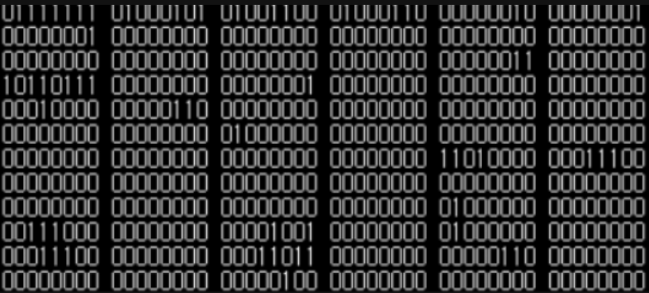
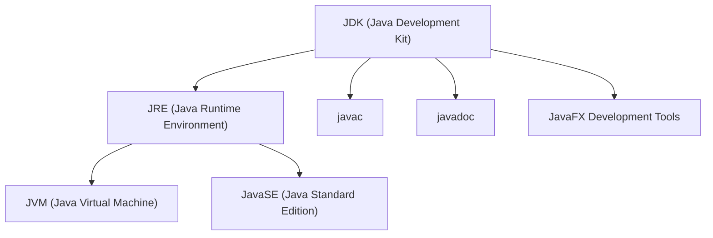
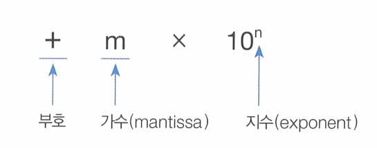
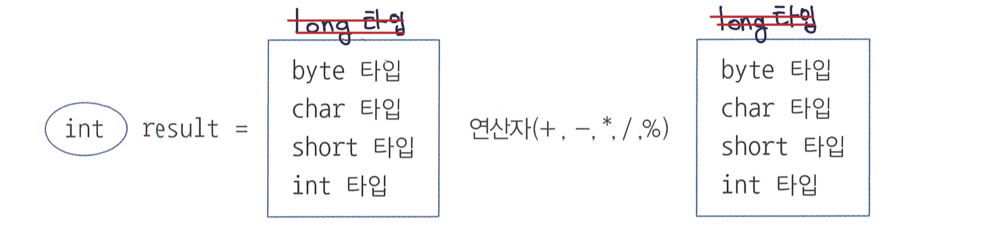
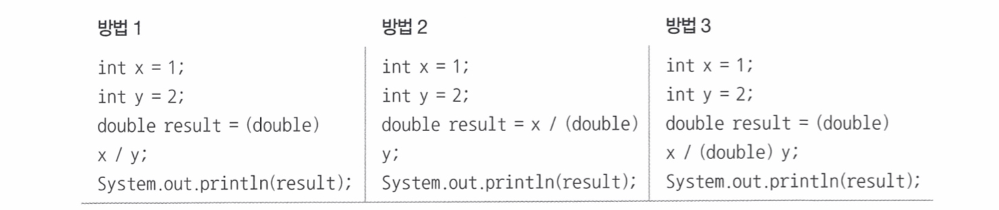

## 프로그래밍 언어란

> 사람과 컴퓨터가 대화하기 위해 필요한 언어

사람과 사람이 정보를 주고 받으려면 서로 알고 있는 약속된 언어가 필요합니다.
컴퓨터에게 정보를 줄 때도 마찬가지 입니다. 
컴퓨터에게 정보를 줄 때 언어가 필요하고 우린 그것을 `프로그래밍 언어`라고 합니다.

프로그래밍 언어는 고급언어와 저급언어로 나뉩니다.

<br/>

### 고급언어

 > 사람들이 이해할 수 있는 언어(ex : `Java`, `C`, `C#`, `python`등)

컴퓨터는 사람의 언어를 바로 이해할 수 없기 때문에 컴파일(compile)이라는 과정을 통해 컴퓨터가 이해할 수 있는 0과 1로 이루어진 기계어로 변환한 후 컴퓨터가 사용합니다.
<br/>
### 저급언어

> 컴퓨터가 직접 이해하고 실행할 수 있는 언어(ex : 기계어, 어셈블리어 등)

`기계어(mechine code)`란 0과 1의 명령어 비트로 이루어진 언어 입니다.

사진처럼 기계어는 오진 컴퓨터를 위해 만들어진 언어이기 때문에 사람은 그 의미를 이해하기 어렵습니다.

그래서 등장한 저급언어가 `어셈블리어(assembly languge)`입니다.
0과 1로 표현된 명렁어 비트로 이루어진 기계어를 읽기 편한 형태로 번역한 언어가 어셈블리어입니다.

<br/>

---

<br/>

## 바이트코드 파일과 자바 가상 머신

자바 소스 파일의 확장명은 `.java` 입니다. 
(텍스트 파일이므로 어떤 텍스트 에디터에서도 작성이 가능합니다.)

소스파일(`.java`)을 작성한 후에는 컴파일 과정이 필요합니다.
컴파일 결과는 확장명이 `.class`인 바이트코드파일로 생성됩니다.


바이트코드 파일(`.class`)은 운영체제와 상관없이 모두 동일한 내용으로 생성됩니다.

<br/>

### 자바 가상 머신(Java Virtual Machine, JVM)

> 바이트 코드 파일을 완전한 기계어로 번역하고 실행시키는 것


JVM은 운영체제에서 이해하는 기계어로 번역해야 하므로 운영체제 별로 다르게 설치되어야 합니다.
따라서, JVM은 JDK와 함께 설치되기 때문에 운영체제 별로 설치되는 JDK가 다른 것입니다.

<br/>

---

<br/>

## JDK, JRE, JavaSE란?

### JDK(Java Development Kit)

> 자바 개발을 위한 도구 모음입니다. 
 
즉, 개발자들을 위한 도구입니다.
자바 소스 코드를 작성하고, 컴파일하고, 실행할 수 있는 도구를 포함합니다.
JDK에는 JRE도 포함되어 있습니다. 따라서 JDK를 설치하면 JRE도 함께 설치됩니다.


<br/>

### JRE(Java Runtime Environment)

> 자바 애플리케이션을 실행하는 데 필요한 환경을 제공합니다.

자바 애플리케이션을 실행하기 위해 필요한 런타임 라이브러리, 가상 머신 등이 포함됩니다.
JRE는 개발 도구나 컴파일러는 포함하지 않습니다. 즉, 자바 애플리케이션을 실행하는 데만 필요한 것만 제공합니다.

<br/>

###  Java SE(Java Standard Edition)

> 자바의 기본이 되는 표준 라이브러리와 API를 정의합니다.

Java SE는 자바 프로그래밍 언어의 기본이 되는 모든 요소를 포함합니다.
JDK와 JRE는 Java SE 사양을 구현하는 구현체입니다. 
따라서, JDK와 JRE를 설치하면 Java SE의 모든 기능과 API를 사용할 수 있습니다.

<br/>

#### JavaSE API 예시
- `java.lang`: 기본 자료형, 문자열 처리, 예외 처리 등을 다루는 클래스 및 인터페이스를 제공합니다. `String`, `Integer`, `Object` 등이 여기에 속합니다.
- `java.util`: 다양한 유틸리티 및 데이터 구조 클래스를 포함합니다. `ArrayList`, `HashMap`, `Date` 등이 여기에 속합니다.
- `java.io`: 입출력 관련 기능을 다루는 클래스 및 인터페이스를 제공합니다. 파일 및 스트림 처리를 위한 클래스들이 여기에 속합니다.
- `java.net`: 네트워크 통신을 위한 클래스 및 인터페이스를 제공합니다. `URLConnection`, `Socket`, `ServerSocket` 등이 여기에 속합니다.


#### JavaSE 라이브러리 예시
-  `java.math`: 정밀 계산을 위한 클래스들을 제공합니다. `BigInteger`, `BigDecimal` 등이 여기에 속합니다.
- `java.security`: 보안 관련 기능을 다루는 클래스 및 인터페이스를 제공합니다. `MessageDigest`, `KeyPairGenerator`, `SecureRandom` 등이 여기에 속합니다.
- `java.awt`: 추상 윈도우 툴킷을 통해 그래픽 사용자 인터페이스를 구현하기 위한 클래스들을 제공합니다. `Button`, `Frame`, `Graphics` 등이 여기에 속합니다.
- `javax.swing`: 스윙 라이브러리를 통해 그래픽 사용자 인터페이스를 구현하기 위한 클래스들을 제공합니다. `JButton`, `JFrame`, `JPanel` 등이 여기에 속합니다.

<br/><br/>



## 변수(varialbe)

> 하나의 값을 저장할 수 있는 메모리 번지에 붙여진 이름.

자바의 변수는 다양한 타입의 값을 저장할 수 없습니다.
즉, 정수형 변수에는 정수값만 저장, 실수형 변수에는 실수값만 저장할 수 있어서 변수 선언 시 어떤 값을 저장하느냐에 따라 타입이 정해집니다.

<br/>

### 변수 선언

> 어떤 타입의 데이터를 저장할 것이고, 변수 이름은 무엇으로 할 건지 결정하는 것.

변수를 사용하기 위해서는 변수 선언이 필요합니다. 
변수 선언 자체는 저장되는 값의 타입과 이름만 결정한 것일 뿐 아직 메모리에 할당된 것은 아닙니다.

`변수 초기화`(변수에 최초로 값이 대입)가 될 때 메모리에 할당되고, `초기값`(해당 메모리에 값)이 저장된다.

```java
int value;  // 변수 value 선언 - 메모리에 할당 X

int result = value + 10;  
// 변수 value 값을 읽고 10을 더해서 변수 result에 저장

// Error : The local variable value may not have been initialized
```
  

```java
int value = 30;  // 변수 value 선언(초기화) - 메모리에 할당 O

int result = value + 10; 
// 변수 value 값(30)을 읽고 10을 더해서 변수 result에 저장
```


#### 변수 이름 규칙
* 첫 번째 글자는 문자여야한다.
* 중간부터는 문자, 숫자, `$`, `_`  사용가능
* 관례상 변수명은 첫문자는 소문자로 시작하되 캐멀 스타일로 작성한다.

<br/>

---


## 기본 타입과 값의 허용 범위

| 값의 분류 | 기본 타입 |
|:-----|:-----|
|정수|byte, char, short, int, long|
|실수|float, double|
|논리(true/false)|boolean|

<br/>

|타입|메모리 크기(bit)|저장되는 값의 허용 범위|
|:----|:-----|:--------|
|byte|1byte(8bit)|-128~127`[-2⁷ ~ (2⁷-1)]`|
|short|2byte(16bit)|-32,768 ~ 32,767`[-2¹⁵ ~ (2¹⁵-1)]`|
|char|2byte(16bit)|0 ~ 65535(유니코드)`[0 ~ (2¹⁶-1)]`|
|int|4byte(32bit)|-2,147,483,648 ~ 2,147,483,647`[-2³¹ ~ (2³¹-)]`|
|long|8byte(64bit)|-9,223,372,036,854,775,808 ~ 9,223,372,036,854,775,807`[-2⁶³ ~ (2⁶³-1)]`|

> 1byte = 8bit, bit는 0과 1이 저장되는 단위

<br/>

### 저장되는 값의 허용 범위를 넘는 경우

기본적으로 컴파일러는 정수 리터럴을 `int`타입으로 간주합니다.
int 타입의 허용 범위(-2,147,483,648 ~ 2,147,483,647)을 초과하는 리터럴은 뒤에 소문자 `l`이나 `L`을 붙여 long 타입 값임을 컴파일러에게 알려줘야합니다.

```java
long var1 = 10;
long var2 = 20L;
long var3 = 1000000000000;
// Error : The literal 1000000000000 of type int is out of range

long var4 = 1000000000000L;
```

<br/>

---

## 변수 사용 범위

> 중괄호 {} 블록 내에서 선언된 변수는 해당 중괄호 {} 블록 내에서만 사용 가능하다.

`main()` 메소드 블록에는 다른 중괄호 {} 블록들이 작성될 수 있다. 
중괄호 {} 블록 내에서 선언된 변수는 해당 중괄호 {} 블록 내에서만 사용 가능하고 밖에서는 사용할 수 없다.

```java
public static void main(String[] args){
	int var1;         // 메소드 블록에서 선언

	if(・・・) {
		int var2;     // if 블록에서 선언
		// var1, var2 사용 가능
	}
	
	for(・・・) {
		int var3;     // for 블록에서 선언
		// var1, var3은 사용 가능
		// var2 사용 불가
	}

	// var1 사용 가능
	// var2, var3 사용 불가
}  
```


<br/>

---

## 진수별 작성법


### 2진수
>`0b`또는 `0B`로 시작하고 0과 1로 작성

```java
int x = 0b1011;   
// 10진수 값 = 1x2³ + 0x2² + 1x2¹ + 1x2⁰ = 11
int y = 0B10100;
//10진수 값 = 1x2⁴ + 0x2³ + 1x2² + 0x2¹ + 0x2⁰ = 20
```

### 8진수
> `0`으로 시작하고 0 ~ 7 숫자로 작성

```java
int x = 013;
//10진수 값 = 1x8¹ + 3x8⁰ = 11
int y = 0206; 
//10진수 값 = 2x8² + 0x8¹ + 6x8⁰ = 134
```

### 10진수
> 소수점이 없는 0 ~ 9 숫자로 작성

```java
int x = 12; 
int y = 365;
```

### 16진수
> `0x`또는 `0X`로 시작하고 0 ~ 9 숫자나 A,B,C,D,E,F 또는 a,b,c,d,e,f로 작성

```java
int x = 0xB3; 
//10진수 값 = 11x16¹ + 3x16⁰ = 179 
int y = 0X2A0F; 
//10진수 값 = 2x16³ + 10x16² + 0x16¹ + 15x16⁰ = 10767
```

## 기본 타입

> 자바는 기본(primitive) 타입 8개를 제공한다.


| 값의 분류 | 기본 타입 |
|:-----|:-----|
|정수|byte, char, short, int, long|
|실수|float, double|
|논리(true/false)|boolean|


<br/>

---

## 정수타입

> `byte`, `char`, `short`, `int`, `long` 타입이 있다.

각 타입별 값의 종류와 허용 범위가 달라진다.

|타입|메모리 크기(bit)|저장되는 값의 허용 범위||
|:----|:-----|:--------|:------|
|byte|1byte(8bit)|-128~127|-2⁷ ~ (2⁷-1)|
|short|2byte(16bit)|-32,768 ~ 32,767|-2¹⁵ ~ (2¹⁵-1)|
|char|2byte(16bit)|0 ~ 65535(유니코드)|0 ~ (2¹⁶-1)|
|int|4byte(32bit)|-2,147,483,648 ~ 2,147,483,647|-2³¹ ~ (2³¹-)|
|long|8byte(64bit)|-9,223,372,036,854,775,808 ~ 9,223,372,036,854,775,807|-2⁶³ ~ (2⁶³-1)|

> 1byte = 8bit, bit는 0과 1이 저장되는 단위

<br/>

### 문자 타입

> 작은 따옴표`'`로 감싼 것을 문자 리터럴이라고 한다.

문자 리터럴은 유니코드로 변환되어 저장된다
(유니코드 : 세계 각국의 문자를 0 ~ 65535 숫자로 매핑한 국제 표준 규약)

자바는 이러한 유니코드를 저장할 수 있는 `char`타입을 제공한다.
```java
char var1 = 'A';     // 'A' 문자와 매핑되는 숫자 : 65로 대입
char var2 = '가';    // '가' 문자와 매핑되는 숫자 : 44032로 대입
char c = 65;        // 10진수 65와 매핑되는 문자 : 'A'
char c = 0x0041;    // 16진수와 0x0041과 매핑되는 문자 : 'A'
```

<br/>

`char`타입 변수를 빈 값으로 초기화 할 경우 `''`을 대입하면 컴파일 에러가 발생한다.
```java
char c = '';
// Error : Invalid character constant

char c = ' ';     // 공백(유니코드 : 32)
```
공백(유니코드 : 32)을 하나 포함해서 초기화해야한다. 

<br/>

---

## 실수 타입

> 실수 타입에는 `float`과 `double`이 있다.

|타입|메모리크기(bit)|저장되는 값의 허용 범위(양수 기준)|유효 소수 이하 자리|
|:---|:-----|:----------|:-----|
|float|4byte(32bit)|1.4x(10****-45) ~ 3.4x(10****38)|7자리|
|double|8byt(64bit)|4.9x(10****-324) ~ 1.8x(10****308)|15자리|

자바는 `float`과 `double` 타입의 값을 부동 소수점(floating-point)방식으로 메모리에 저장한다.
부호 + 기수 + 지수를 저장하여 `int`타입의 저장방식과는 달리 더 많은 수가 저장가능하다.




<br/>

---
## 논리 타입

> 참과 거짓을 의미하는 논리 리터럴은 `true`와 `false`로 boolean타입 변수에 대입할 수 있다.

boolean 타입 변수는 두 가지 상태값을 저장할 필요가 있을 경우 사용된다.
주로 상태값에 따라 조건문과 제어문의 실행 흐름을 변경하는데 사용된다.
연산식 중에서 비교 및 논리 연산의 산출값은 `true` 또는 `false` 이므로 boolean 타입 변수에 대입할 수 있다.

```java
int x = 10;
boolean result = (x == 20);
boolean result = (x != 20);
boolean result = (x > 20);
boolean result = (0 < x && x < 30);
boolean result = ( x < 0 || x > 200);
```

<br/>

---
## 문자열 타입

> 큰따옴표(`"`)로 감싼 여러 개의 문자들

자바에서는 문자열을 저장할 때 `String` 타입을 사용한다.
`String`타입은 자바 기본 타입에 속하지 않는 참조 타입이다.

`String` 변수에 특정 문자를 표현하려면 역슬래쉬(`\`)가 필요한데 이것을 이스케이프(escape)문자라고 한다.

| 이스케이프 문자 | 의미                     |
| --------------- | ------------------------ |
| `\"`            | `"`문자 포함             |
| `\'`            | `'`문자 포함             |
| `\\`            | `\`문자 포함             |
| `\t`            | 출력 시 탭만큼 띄움      |
| `\n`            | 출력 시 줄바꿈(라인피드) |

```java
String str = "나는 \"자바\"를 배웁니다.";
>> 나는 "자바"를 배웁니다.

str = "번호\t이름\t직업";
>> 번호    이름    직업

str = "나는\n";
str += "자바를\n";
str += "배웁니다.";
>> 나는
>> 자바를
>> 배웁니다.
```
<br/>

Java 13부터는 텍스트 블록(`"""` `"""`) 문법을 제공한다.
```java
String str = """
나는 자바를 \
학습합니다.
자바는 '이것이 자바다'
"""
>> 나는 자바를 학습합니다.
>> 자바는 '이것이 자바다'
```

Java 14부터는 `\`를 제공한다.
만약 줄바꿈을 하지 않고 다음 줄에 이어서 작성하고 싶다면 맨 끝에  `\`를 붙여주면된다.

<br/>

---
## 자동 타입 변환(promotion)

> 값의 허용 범위가 작은 타입이 허용 범위가 큰 타입으로 대입될 때 발생한다.

- 기본 타입의 허용 범위 
```
byte < short, char < int < long < float < double
```

<br/>

- int 타입이 byte 타입보다 허용 범위가 크기 때문에 자동 타입 변환이 가능하다
```java
byte byteValue = 10;
int intValue = byteValue;   // 자동 타입 변환
```

<br/>

- 정수 타입이 실수 타입으로 대입될 경우에는 무조건 자동 타입 변환이 된다. 실수 타입은 정수 타입보다 허용 범위가 크기 때문이다.

```java
long longValue = 5000000000L;
floate floateValue = longValue;    // 5.0E9f로 저장됨
double doubleValue = longValue;    // 5.0E9로 저장됨
```

<br/>

- char 타입의 경우 int 타입으로 자동 변환되면 유니코드 값이 int 타입에 대입된다.
```java
char charValue = 'A';
int intValue = charValue;     // 65가 저장됨
```

<br/>

예외) char 타입보다 허용 범위가 작은 byte 타입은 char 타입으로 자동 변환될 수 없다.
char 타입의 허용 범위는 음수를 포함하지 않는데, byte 타입은 음수를 포함하기 때문이다.
```java
byte byteValue = 65;
char charValue = byteValue;  // Error 
//Type mismatch: cannot convert from byte to char
```

<br/>

---
## 강제 타입 변환(casting)

> 큰 허용 범위 타입을 작은 허용 범위 타입으로 쪼개어서 저장하는 것

캐스팅 연산자로 괄호`()`를 사용하는데, 괄호 안에 들어가는 타입은 쪼개는 단위를 나타낸다.


강제 타입 변환 시 더 작은 허용 범위 타입으로 쪼개어지는 것이므로 작은 타입의 허용 범위 안에 있는 값만 원래 값을 보존할 수 있다.

### int → byte

int 타입은 byte 타입보다 더 큰 허용 범위를 가진다. 따라서 int 타입에서 byte 타입은 자동 타입 변환이 불가하고, 강제 타입 변환을 하더라고 byte의 허용 범위인 `-128 ~ 127`인 int 값만 원래 값을 보존할 수 있다.

```java
int intValue = 10;
byte byteValue = (byte)intValue;  // 강제 타입 변환
```

<br/>

### long → int

```java
long longValue = 300;
int intValue = (int) longValue; // 강제 타입 변환 후에 300이 그대로 유지
```

<br/>

### int → char

강제 타입 변환 시 char 타입의 허용 범위인 0 ~ 65535 사이의 값만 원래 값으로 유지된다.


```java
int intValue = 65;
char charValue = (char) intValue:
System.out.println(charValue);
>> A
```

<br/>

### 실수 → 정수

실수 타입(float, double)은 정수 타입(byte, short, int, long)보다 항상 큰 허용 범위를 가진다.
따라서 실수 타입을 정수 타입으로 강제 타입 변환하여야 하며, 이 경우 소수점 이하 부분은 버려지고, 정수 부분 저장된다.(`반올림 X`)
```java
double doubleValue = 3.64;
int intValue = (int) doubleValue;
>> 3
```

<br/>

---
## 연산식에서 자동 타입 변환

> int 타입보다 작은 byte, short 타입의 변수는 int 타입으로 자동 타입 변환되어 연산을 수행한다.

자바는 정수 리터럴의 연산인 경우 컴파일 단계에서 연산을 수행한다.
컴파일 단계에서 10 + 20을 미리 연산해 30을 만들고 result 변수에 30을 저장하도록 바이트 코드를 생성한다.

정수 리터럴이 아닌 변수가 피연산자로 사용되면 실행 시 연산을 수행한다.
정수 타입 변수가 산술 연산식에서 피연산자로 사용되면 int타입보다 작은 byte, short 타입의 변수는 int 타입으로 자동 타입 변환되어 연산을 수행한다.




```java
byte x = 10;
byte y = 20;
byte result = x + y;   // Error
// Type mismatch: cannot convert from int to byte
int result = x + y;
```

<br/>

int의 혀용 범위보다 큰 long 타입의 연산 결과는 long 타입 변수에 저장한다.


<br/>

실수 연산의 경우 피연산자가 동일한 실수 타입이라면 결과도 당연히 실수 타입으로 된다.

```java
float result = 1.2f + 3.4f;
// 컴파일 : floate result = 4.6f;
```

<br/>

하지만 피연산자 중 하나가 double 타입이면 다른 피연산자도 double 타입으로 변환되어 연산되고, 연산 결과 또한 double 타입이 된다.

```java
double result = 1.2f + 3.4;
```

<br/>

int타입과 double 타입을 연산하는 경우에도 int 타입 피연산자가 double 타입으로 자동 변환된다.
```java
int intValue = 10;
double doubleValue = 5.5;
double result = intValue + doubleValue;        // 10.0 + 5.5
int result = intValue + (int) doubleValue;     // 10 + 5
// int 타입으로 저장 시 double 타입을 int로 강제 타입 변환 후 가능
```

<br/>

정수 연산에서 연산 시 타입 변환을 하지 않으면 제대로 된 double 타입을 연산 결과를 얻을 수 없다. 
정수 연산의 결과는 항상 정수가 되기 때문이다.
```java
int x = 1;
int y = 2;
double result = x / y;
// 0.5가 아닌 0.0으로 출력
```

위 코드의 결과가 0.5가 되기 위해서는 x / y 부분을 정수 연산이 아닌 실수 연산으로 변경해야한다. x와 y 둘 중 하나 또는 둘 모두를 double 타입으로 변환하는 것이다.



<br/>

자바에서 `+`연산자는 
❶ 피연산자가 모두 숫자일 경우 덧셈 연산을 수행하고, 
❷ 피연산자 중 하나가 문자열일 경우에는 나머지 피연산자도 문자열로 자동 변환되어 문자열 결합 연산이 수행된다.
```java
int value = 3 +7;        // int value = 10;
String str = "3" + 7;    // String str = "37";
```

`+`연산자가 연이어 나오면 앞에서부터 순차적으로 `+` 연산을 수행한다.
```java
int value = 1 + 2 + 3;      // int value = 3 + 3 = 6
String str = 1 + 2 + "3";   // String str = 3 + "3" = "33"
String str = 1 + "2" + 3;   // String str = "12" + 3 = "123"
String str = "1" + 2 + 3    // String str = "12" + 3 = "123"
```

특정 부분을 우선 연산하고 싶다면 해당 부분을 괄호 `()`로 감싸면 된다.
```java
String str = "1" + (2 + 3);   // String str = "1" + 5; = "15"
```

<br/>

---
## 문자열 ⇆ 기본 타입

### 문자열 → 기본타입

| 변환 타입        | 사용 예                                                               |
|:---------------- |:--------------------------------------------------------------------- |
| String → byte    | String str = "10";<br/>byte value = `Byte.parseByte(str)`;            |
| String → short   | String str = "200";<br/>short value = `Short.parseShort(str)`;        |
| String → int     | String str = "300000";<br/>int value = `Integer.parseInt(str)`;       |
| String → long    | String str = "40000000000"<br/>long value = `Long.parseLong(str)`;    |
| String → float   | String str = "12.345";<br/>float value = `Float.parseFloat(str)`;     |
| String → double  | String str = "12.345";<br/>double value = `Double.parseDouble(str)`;  |
| String → boolean | String str = "true";<br/>boolean value = `Boolean.parseBoolena(str)`; |

### 기본타입 → 문자열
> `String.valueOf()`

```java
String str = String.valueOf(10);     // int → String
String str = String.valueOf(true);   // boolean → String
```
