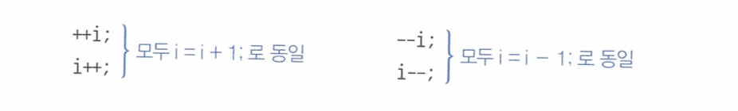
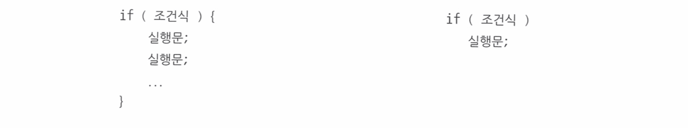

# 콘솔 I/O 

## 콘솔에 출력하기

> System.out.println("출력할 내용");

`println`이외에도 상황에 따라 적용가능한 다른 메소드들이 있다.

| 메소드 | 의미 |
| ---- | ---- |
| `println(내용);` | 괄호 안의 내용을 출력하고 행을 바꿔라. |
| `print(내용);` | 괄호 안의 내용을 출력하고 행은 바꾸지 마라. |
| `printf("형식문자열", 값1, 값2, ・・・);` | 형식 문자열에 맞추어 뒤의 값을 출력해라. |

### `printf()`의 형식문자열

``` java
printf("형식문자열", 값1, 값2, ・・・); // 값의 갯수는 정해져 있지 않음.
```

![[printf형식문자열.excalidraw|500]]

`%`와 `conversion`은 필수로 작성하고 그 외의 항목은 모두 생략할 수 있다.

`%`는 형식 문자열의 시작을 의미하고, 
`conversion`에는 제공되는 값의 타입에 따라 주로 `d`(정수), `f`(실수), `s`(문자열)가 온다.

| `conversion` | 출력형태                                             |
| -------- | ---------------------------------------------------- |
| %d       | 10진수 정수 형태로 출력(데이터에 소수점 작성시 에러) |
| %o       | 8진수 정수 형태로 출력                               |
| %x       | 16진수 정수 형태로 출력                              |
| %f       | 실수로 출력                                          |
| %s       | 문자열 출력(가장 많이 쓰임)                          |
| %c       | 문자(char타입) 출력                                  |

> `argument_index$` : 값의 순번

형식 문자열에 포함될 값이 두 개 이상일 경우에는 값의 순번(`argument_index$`)을 포함시켜야 한다. 예를 들어 `1$`는 첫 번째 값을, `2$`는 두 번째 값을 뜻한다.

```java
System.out.printf("이름: %1$s, 나이: %2$d", "김자바", 25);
>> 이름: 김자바, 나이: 25
```

> `flags` : 빈 공간을 채우는 방식 설정

생략되면 왼쪽이 공백으로 채워지고 `-`가 오면 오른쪽이 공백으로 채워진다. 
`0`은 공백 대신 `0`으로 채운다.

>`width`는 소수점을 포함한 전체 자릿수


>`.precison`은 소수점 이하 자릿수


#### [자주 사용되는 예시]

| 값의 타입 | 형식                               | 설명                                                                                                                                                    | 출력형태                                  |
| --------- | ---------------------------------- | ------------------------------------------------------------------------------------------------------------------------------------------------------- | ----------------------------------------- |
| 정수      | `%d`<br>`%6d`<br>`%-6d`<br>`%06d`  | 정수<br>6자리 정수. 왼쪽 빈자리 공백<br>6자리 정수. 오른쪽 빈자리 공백<br>6자리 정수. 왼쪽 빈자리 0 채움                                                | 123<br>\_\__123<br>123___<br>000123       |
| 실수      | `%10.2f`<br>`%-10.2f`<br>`%010.2f` | 정수 7자리+소수점+소수 2자리. 왼쪽 빈자리 공백<br>정수 7자리 +소수점+소수 2자리. 오른쪽 빈자리 공백<br>정수 7자리+소수점+소수 2자리. 왼쪽 빈자리 0 채움 | \_\_\__123.45<br>123.45____<br>0000123.45 |
| 문자열    | `%s`<br>`%6s`<br>`%-6s`            | 문자열<br>6자리 문자열. 왼쪽 빈자리 공백<br>6자리 문자열.오른쪽 빈자리 공백 | abc<br>\_\__abc<br>abc___                 |
| 특수 문자 | `\t`<br>`\n`<br>%%  | 탭(tab)<br>줄바꿈<br>% | <br><br>% |

## 콘솔에 입력하기

### `Scanner` 사용하기

```java
import java.util.Scanner;

Scanner scanner = new Scanner(System.in);
```
- `java.util` 패키지에서 `Scanner` 클래스를 임포트
- `System.in` : 키보드에서 사용자로부터 키 입력을 받기 위해 사용함(표준입력). 입력받은 값은 Byte 단위로 읽음.

 | 메소드       | 리턴 타입                                                                     |
 | ------------- | ------------------------------------------------------------------------ |
 | `next()`        | String타입으로 리턴                                                      |
 | `nextLine()`    | `\n`을 포함하는 한 라인을 읽고, `\n`을 버린 나머지만 String타입으로 리턴 |
 | `nextByte()`    | byte타입으로 리턴                                                        |
 | `nextShort()`   | short타입으로 리턴                                                       |
 | `nextInt()`     | int타입으로 리턴                                                         |
 | `nextLong()`    | long타입으로 리턴                                                        |
 | `nextFloat()`   | float타입으로 리턴                                                       |
 | `nextDouble()`  | double타입으로 리턴                                                      |
 | `hasNext()` | 현재 입력된 토큰이 있으면 true, 아니면 새로운 입력이 들어올 때까지 무한정 기다려서, 새로운 입력이 들어오면 그 때 `true`리턴.<br>`Crtl + D`(macOS) 또는 `Crtl+Z`(windowOS)를 사용하여 입력을 종료할 수 있어서 이러한 경우 `false`를 반환                                                     |
 | `close()`              | Scanner의 사용 종료                                                                        |


#### `next()`와 `nextLine()` 메소드의 차이

```java
public class Example { 
	public static void main(String[] args) { 
		Scanner scanner = new Scanner(System.in); 
		
		System.out.print("nextLine: ");
		String str1 = sc.nextLine();
		System.out.println(str1);

		System.out.print("next: ");
		String str2 = sc.next();
		System.out.println(str2);
	} 
}
```

```
nextLine: 안녕하세요 JAVA입니다.
안녕하세요 JAVA입니다.
next: 안녕하세요 JAVA입니다.
안녕하세요
```

`scanner.nextLine()`은 'Enter'키가 입력되기 전까지 블로킹(대기) 상태가 되며, 'Enter'키가 입력되면 지금까지 입력된 모든 내용을 문자열로 읽는다.

```java
import java.util.Scanner;

public class nextLine(){
	public static void main(String[] args){
		Scanner sc = new Scanner(System.in);

		System.out.println("입력 값: ");
		int input1 = sc.nextInt();

		System.out.println("입력 값: ");
		String input2 = sc.nextLine();

		System.out.println("출력 값: ");
		System.out.println(input1);

		System.out.println("출력 값: ");
		System.out.println(input2);
	}
}
```

```
입력 값: 
1
입력 값: 
출력 값: 
1
출력 값:
```

`next()`메소드는 공백 전까지 입력받은 문자열을 리턴하고,
`nextLine()` 메소드는 'Enter' 치기 전까지의 문자열을 모두 리턴한다.

`next()` 이후에 `nextLine()`메소드를 사용하면 'Enter' 치기 전의 모든 문자열을 받아서
첫 번째 입력 값 작성 후 'Enter' 를 치면 두 번째 입력 값은 입력하지도 못한 채 모든 입력이 종료되고 
위와 같은 결과물만 출력한다.

따라서, `next()` 이후에 `nextLine()`을 사용할 시 줄바꿈을 따로 처리해 줘야 한다.

```java
import java.util.Scanner;

public class nextLine(){
	public static void main(String[] args){
		Scanner sc = new Scanner(System.in);

		System.out.println("입력 값: ");
		int input1 = sc.nextInt();

		System.out.println("입력 값: ");
		sc.nextLine(); // 줄바꿈 처리
		String input2 = sc.nextLine();

		System.out.println("출력 값: ");
		System.out.println(input1);

		System.out.println("출력 값: ");
		System.out.println(input2);
	}
}
```

```
입력 값: 
1
입력 값: 
2
출력 값: 
1
출력 값: 
2
```


<br>

---

# 연산자
## 부호/증감 연산자

| 연산식(피연산자) | 설명 |
| :--- | ---- |
| + | 피연산자의 부호 유지 |
| - | 피연산자의 부호 변경 |

> 정수 타입(byte, short, int) 연산의 결과는 Int 타입이다.

따라서, 부호를 변경하는 것도 연산이므로 int타입 변수에 대입해야 한다.

```java
byte b = 100;
byte result = -b;   // Error
int result = -b;
```

<br>

> 증감 연산자(`++`, `--`)는 변수의 값을 1 증가시키거나 1 감소하는 연산자이다.

변수 단독으로 증감 연산자가 사용되면 결과는 똑같지만,
연산식에서는 증감 연산자의 위치에 따라 연산 결과가 달라진다.



```java
int x = 1;
int y = 1;
int reuslt1 = ++x + 10;     // 연산 순서 : x를 1 증가 → 2 + 10
int result2 = y++ + 10;     // 연산 순서 : 1 + 10 → y를 1 증가
>> result1 = 12, result2 = 11, x = 2, y = 2 
```

<br>

---
## 산술 연산자

> 더하기(+), 빼기(-), 곱하기(*), 나누기(/), 나머지(%)

산술 연산의 특징
- 피연산자가 정수 타입(byte, short, char, int)이면 연산의 결과는 int 타입이다.
- 피연산자가 정수 타입이고 그중 하나가 long 타입이면 연산의 결과는 long 타입이다.
- 피연산자 중 하나가 실수 타입이면 연산의 결과는 실수 타입이다.

<br>

---
## 오버플로우와 언더플로우

> 타입이 허용하는 최대값, 최소값을 벗어나는 것

short, byte, int, long 타입 연산에서 오버플로우 또는 언더플로우가 발행되면 실행 에러가 발생하지 않고, 해당 정수 타입의 최소값 또는 최대값으로 돌아간다.

<br>

---
## 정확한 계산은 정수 연산으로

> 산술 연산을 정확하게 계산하고 싶다면 실수 타입을 사용하지 않는 것이 좋다.

```java
int a = 1;
double p = 0.1;
int num = 7;

double result = a - num * p;
>> 0.299999999999993
```

출력된 결과는 우리가 기대한 0.3이 되지 않는다
실수 타입은 부동 소수점 방식을 사용하므로 정확한 계산이 필요하면 정수 연산으로 변경해서 계산하는 것이 좋다.

```java
int a = 1;
int t = a * 10;
int num = 7;

int result = t - num;         // 3
int result2 = result / 10.0;  //0.3
```

>부동 소수점(floating-point)
>부호 + 가수 + 지수를 저장(int와 저장 방식이 달라서 더 많은 수를 저장할 수 있음.)

![[부동소수점.excalidraw|300]]

<br>

---
## 나눗셈 연산 후 NaN과 Infinity 처리

나눗셈(/) 또는 나머지(%) 연산에서 분모가 0일 경우 예외(`ArithmeticException)`가 발생한다.
```java
int x = 5;
int y = 0;
int result = x / y;  
//  java.lang.ArithmeticException: / by zero at LogicTest
```

실수 연산의 경우 분모가 0인 경우 예외가 발생하지 않고 연산 결과는 `Infinity(무한대)` 또는 `NaN(Not a Number)`가 된다.
```java
5 / 0.0     // Infinity
5 % 0.0     // NaN
```

이 상태에서 계속해서 연산을 수행하면 어떤 연산을 하더라고 결과는 계속 `Infinity(무한대)` 또는 `NaN(Not a Number)`가 되므로 연산을 수행하면 안된다.
```java
Infinity + 2    // Infinity
NaN + 2         // NaN
```

따라서, `/`, `%`의 연산인 경우 `Infinity` 또는 `Nan`인지 먼저 확인하고 다음 연산을 수행하는게 좋다.
확인을 위해서는 `Double.isInfinite()`와 `Double.isNaN()`을 사용한다.
```java
int x = 5;
double y = 0.0;
double z = x / y;
// System.out.println(z + 2)    >>  Infinity

if(Double.isInfinite(z) || Double.isNaN(z)){
	System.out.println("값 산출 불가");
}else{
	System.out.println(z + 2);   // Infinity나 NaN이 아닐 경우에만 연산
}
```

<br>

---
## 비교 연산자

> 동등(`==`, `!=`) 또는 크기(`<`, `<=`, `>`, `>=`)를 평가해서 boolean 타입인 true/false를 산출한다.

피연산자의 타입이 다를 경우 비교 연산을 수행하기 전에 타입을 일치 시킨다.
```java
'A' == 65  // true('A'가 int타입으로 변환되어 65가 된 다음 65 == 65 비교)
3 == 3.0   // true(3을 double타입인 3.0으로 변환한 다음 3.0 == 3.0으로 비교)
```

예외적으로 float 타입의 경우 부동 소수점 상식을 사용하여 강제 타입 변환 후에 비교 연산하는 것이 좋다.
```java
0.1f == 0.1          // false
0.1f == (float)0.1   // true
```

문자열을 비교할 때에는 동등(`==`, `!=`) 연산자 대신 `euqals()`와 `!equals()`를 사용한다. - 대소문자 구분 O
```java
boolean reuslt = str1.equals(str2)  // str1과 str2가 같은 문자열인지 비교
boolean result = !str1.equals(str2) // str1과 str2가 다른 문자열인지 비교

```

<br>

---
## 논리 연산자

> 논리곱(`&&`), 논리합(`||`), 배타적 논리합(`^`), 논리 부정(`!`)

| 구분 | 연산식 | - | - | 결과 | 설명 |
| ---- | ---- | :--: | ---- | ---- | ---- |
| AND<br>(논리곱) | true<br>true<br>false<br>false | <br>`&&`<br>또는<br>`&` | true<br>false<br>true<br>false | true<br>false<br>false<br>false | 피연산자 모두가 true일 경우에만 연산 결과가 true |
| OR<br>(논리합) | true<br>true<br>false<br>false | <br>\|\|<br>또는<br>\| | true<br>false<br>true<br>false | true<br>true<br>true<br>false | 피연산자 중 하나만 true이면 연산 결과는 true |
| XOR<br>(배타적 논리합) | true<br>true<br>false<br>false | <br><br>`^` | true<br>false<br>true<br>false | false<br>true<br>true<br>false | 피연산자가 하나는 true이고 다른 하나가 false일 경우에만 연산 결과가 true |
| NOT<br>(논리 부정) |  | <br>`!` | true<br>false | false<br>true | 피연산자의 논리값을 바꿈 |

`&&`와 `&`는 산출 결과는 같지만 연산 과정이 조금 다르다.
- `&&`는 앞의 피연산자가 false이면 뒤의 피연산자는 평가하지 않고 바로 false를 산출한다.
- `&`는 두 피연산자 모두를 평가해서 산출 결과를 낸다
- `||`와 `|`도 마찬가지이다.

<br>

---
## 대입 연산자

> 우측 피연산자의 값을 좌측 피연자인 변수에 대입한다.

```java
int result = 0;
result += 10;     // 10
result -= 5;      // 5
result *= 3;      // 15
result /= 5;      // 3
result %= 3;      // 0
```

<br>

---
## 삼항(조건) 연산자

> `피연산자` ? `피연산자` : `피연산자`

![[2-7.png]]

```java
int score = 85;
char grade = (score > 90) ? 'A' :((score >80)? 'B' : 'C');
>> B
```

<br>

---
## 연산의 우선순위

> 우선순위 높은 순

| 연산자 | 우선순위 |
| ---- | ---- |
| 증감(`++`, `--`), 부호(`+`, `-`), 비트(`~`), 논리(`!`) | 높음 |
| 산술(`*`, `/`, `%`) |  |
| 산술(`+`, `-`) |  |
| 쉬프트(`<<`, `>>`, `>>>`) |  |
| 비교(`<`, `>`, `<=`, `>=`, `instanceof`) |  |
| 비교(`==`, `!=`) |  |
| 논리(`&`) |  |
| 논리(`^`) |  |
| 논리(\|) |  |
| 논리(`&&`) |  |
| 논리(\|\|) |  |
| 조건(`?:`) |  |
| 대입(`=`, `+=`, `-=`, `*=`, `/=`, `%=`, `&=`, `^=`, `!=`, `<<=`, `>>=`, `>>>=`) | 낮음 |
먼저 처리해야 할 연산은 괄호`()`를 사용하는 것이 좋다.

<br>

---
# 조건문과 반복문

| 조건문 | 반복문 |
| ---- | ---- |
| if 문, switch 문 | for 문, while 문, do-while 문 |

## if 문

> 조건식의 결과에 따라 블록 실행 여부가 결정된다.

![[../img/2nd-week/2-2.jpeg|500]]

중괄호`{}` 블록 내에 실행문이 하나밖에 없다면 중괄호를 생략할 수 있다. 

하지만, 코드의 `가독성`과 `유지보수` 측면을 고려하여 이러한 경우에도 중괄호`{}`를 사용하는 것을 권장한다.

if문은 else 블록과 함께 사용되어 조건식의 결과에 따라 실행 블록을 선택할 수 있다.
If 문의 조건식이 true이면 if 문 블록이 실행되고, false이면 else 블록이 실행된다. 
![[../img/2nd-week/2-4.jpeg|500]]

조건이 여러 개인 if문인 경우 else if를 사용한다. else if는 상위 조건 식이 false일 경우 판단되며, else if가 true이면 해당 블록이 실행된다. else if 의 수는 제한이 없다.

![[다중조건식.excalidraw|300]]

```java
int score = 75;

if(score>=90){
	System.out.println("점수가 100-90입니다.");
	System.out.println("등급은 A입니다."
} else if(score>=80) {
	System.out.println("점수가 80-89입니다.");
	System.out.println("등급은 B입니다.");
} else if(score>=70) {
	System.out.println("점수가 70-79입니다.");
	System.out.println("등급은 C입니다.");
} else{
	System.out.println("점수가 70 미만입니다.");
	System.out.println("등급은 D입니다.");
}
					   
>> 점수가 70-79입니다.
>> 등급은 C입니다.
```

if문은 중첩으로 사용 가능하다
![[../img/2nd-week/2-6.jpeg|500]]