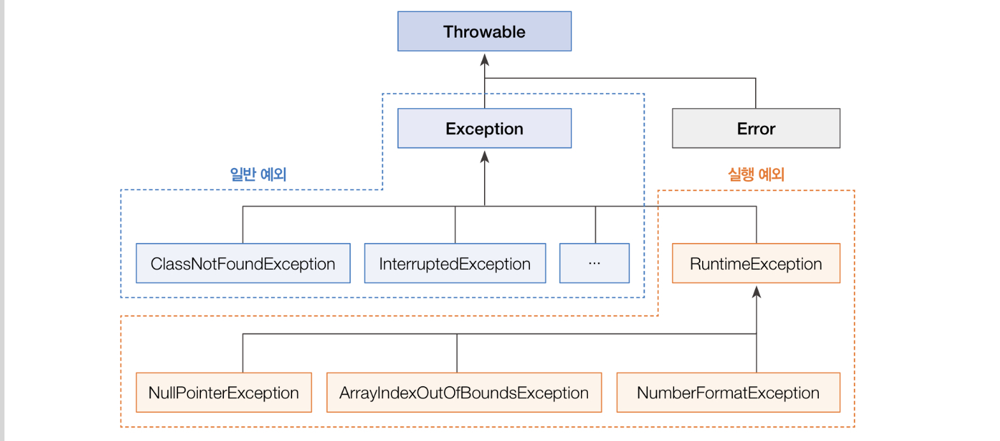
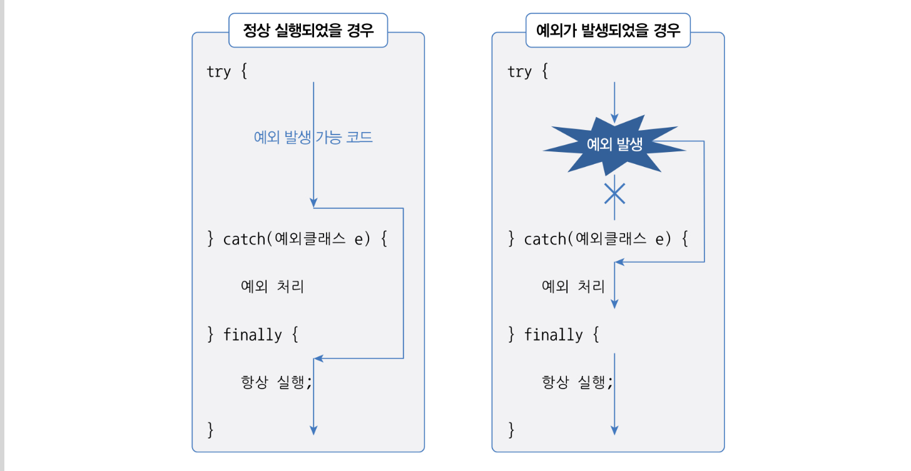
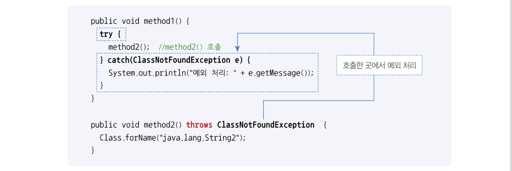
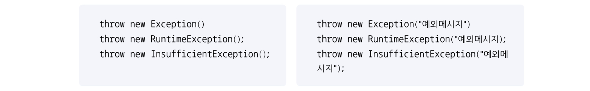
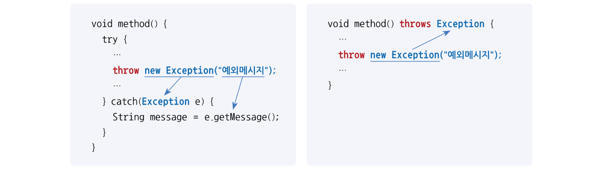

# 예외와 예외 클래스

> 예외에는 `일반 예외`와 `실행 예외`가 있다.
- `일반 예외(Exception)` 
  : 컴파일러 예외라고도 하며, 컴파일러가 예외 처리 코드 여부를 검사하는 예외를 말한다.
- `실행 예외(Runtime Exception)` 
  : 컴파일러가 예외 처리 코드 여부를 검사하지 않는 예외. 프로그램이 실행되어야 발생하는 예외이다.


> 💡 `오류` • `에러` • `예외`
> `오류` : 에러(Error)와 예외(Exception)
> `에러` : 컴퓨터 하드웨어의 고장으로 인해 응용프로그램 실행 오류가 발생하는 것
> `예외` : 잘못된 사용 또는 코딩으로 인한 오류
 

- 자바는 예외가 발생하면 예외 클래스로부터 객체를 생성한다. 이 객체는 예외 처리시 사용된다.
- 자바의 모든 에러와 예외 클래스는 `Throwable`을 상속받아 만들어지고, 추가적으로 예외 클래스는 `java.lang.Exception` 클래스를 상속받는다.	


---
# 예외 처리 코드

> 예외가 발생했을 때 프로그램의 갑작스러운 종료를 막고 정상 실행을 유지할 수 있도록 처리하는 코드를 예외 처리 코드라고한다.

예외 처리 코드는 `try-catch-finally` 블록으로 구성된다. 이 블록은 `생성자 내부`와 `메소드 내부`에서 작성된다.


- try 블록에서 작성한 코드가 예외 없이 정상 실행되면 catch 블록은 실행되지 않고 finally 블록이 실행된다.
- try 블록에서 예외가 발생하면 catch 블록이 실행되고 연이어 finally 블록이 실행된다.
- 예외 발생 여부와 상관없이 finally 블록은 항상 실행된다.
- 심지어 try 블록과 catch 블록에서 return 문(메소드 종료)을 사용하더라고 finally 블록은 항상 실행된다.
- finally 블록은 옵션으로 생략 가능하다.


---
# 예외 종류에 따른 처리

> try 블록에는 다양한 종류의 예외가 발생할 수 있는데 다중 catch를 사용하면 발생하는 예외에 따라 예외 처리 코드를 다르게 작성할 수 있다.

- catch 블록이 여러 개라 할지라도 catch 블록은 단 하나만 실행된다. 
  → try 블록에서 동시 다발적으로 예외가 발생하지 않으며, 하나의 예외가 발생하면 즉시 실행을 멈추고 해당 catch 블록으로 이동하기 때문이다.

```java
public class ExceptionHandlingExample {
	public static void main(Strint[] args){
		String[] array = {"100", "1oo"};

		for(int i=0; i<=array.length; i++){
			try{
				int value = Integer.parseInt(array[i]);
				System.out.println("array[" + i + "]: " + value);
			} catch(ArrayIndexOutOfBoundsException e){
				System.out.println("배열 인덱스가 초과됨: " + e.getMessage());
			} catch(NumberFormatException e) {
				System.out.println("숫자로 변환할 수 없음: " + e.getMessage());
			}
		}
	}
}
```
`[실행 결과]`
```
array[0]: 100
숫자로 변환할 수 없음: For input string: "1oo"
배열 인덱스가 초과됨: Index 2 out of bounds for length 2
```

- 처리해야 할 예외 클래스들이 상속 관계에 있을 때는 하위 클래스 catch 블록을 먼저 작성하고 상위 클래스 catch 블록을 나중에 작성해야 한다. 
  → 예외가 발생하면 catch 블록은 위에서부터 차례대로 검사 대상이 되는데, 하위 예외도 상위 클래스 타입이므로 상위 클래스 catch 블록이 먼저 검사 대상이 되면 하위 예외 catch 블록까지 도달하지 못하고 예외를 처리하게 된다.


---
# 리소스 자동 닫기

> `리소스(Resource)`란 데이터를 제공하는 객체를 말한다.

리소스를 사용하기 위해 열어야(open)하며, 사용이 끝난 다음에는 닫아야(close)한다. 예를 들어 파일 내용을 읽기 위해서는 파일을 열어야 하며, 다 읽고 난 후에는 닫아야 다른 프로그램에서 사용할 수 있다.

- 리소스를 사용하다가 예외가 발생될 경우에도 안전하게 닫는 것이 중요하다.
```java
FileInputStream fis = null;
try{
	fis = new FileInputStream("file.txt");   //파일 열기
	...
} catch(IOException e) {
	...
} finally {
	fis.close();
}
```

- 좀 더 쉽게 `try-with-resources` 블록을 사용하면 예외 발생 여부와 상관없이 리소스를 자동으로 닫아준다.
  → try 괄호에 리소스를 여는 코드를 작성하면 try 블록이 정상적으로 실행을 완료했거나 도중에 예외가 발생하면 자동으로 리소스의 close() 메소드가 호출된다.
```java
// 하나의 리소스 사용
try(FileInputStream fis = new FileInputStream("file.txt")){
	...
} catcht(IOException e){
	...
}
// 여러 리소스 사용
try(
	FileInputStream fis1 = new FileInputStream("file1.txt");
	FileInputStream fis2 = new FileInputStream("file2.txt")
){
	...
} catcht(IOException e){
	...
}
```

- `try-with-resources` 블록을 사용하기 위해서 리소스는 `java.lang.AutoCloseable` 인터페이스를 구현해서 `AutoClaseable` 인터페이스의 `close()` 메소드를 재정의해야 한다.
```java
public class FileInputStream implements AutoCloseable {
	...

	@Override
	public void close() throws Exception{
		System.out.println("[MyResource(" + name + ") 닫기]");
	}
}
```

- Java  8 이전 버전은 try 괄호 안에서 리소스 변수를 반드시 선언해야 했지만
- Java 9 이후부터는 외부 리소스 변수를 사용할 수 있다.
```java
FileInputStream fis1 = new FileInputStream("file1.txt");
FileInputStream fis2 = new FileInputStream("file2.txt");
try(fis1;fis2){
	...
} catcht(IOException e){
	...
}
```


---
# 예외 떠넘기기

> `try-catch` 블로으로 예외를 처리하는 것 이외에도 `throws`를 메소드 선언부 끝에 작성하고 메소드를 호출한 곳으로 예외를 떠넘길 수도 있다.

```java
리턴타입 메소드명(매개변수, ・・・) throws 예외클래스1, 예외클래스2, ・・・ {
}
```

- throws 키워드가 붙어 있는 메소드에서 해당 예외를 처리하지 않고 떠넘겼기 때문에 이 메소드를 호출하는 곳에서 예외를 받아 처리해야 한다.


- 나열해야 할 예외 클래스가 많을 경우에는 `throws Exception` 또는 `throws Throwable` 만으로 모든 예외를 간단히 떠넘길 수 있다.


---
# 사용자 정의 예외

> 표준 라이브러리에는 존재하지 않기 때문에 직접 예외 클래스를 정의해서 사용해야 하는 것을 사용자 정의 예외라고 한다.

## 사용자 정의 예외

- 사용자 정의 예외는 컴파일러 예외, 실행 예외 둘다 선언이 가능하지만, 통상적으로는 일반 예외는 Exception의 자식 클래스로 선언하고, 실행 예외는 RuntimeException의 자식 클래스로 선언한다.

- 사용자 정의 예외 클래스에는 기본 생성자와 예외 메시지를 입력받는 생성자를 선언해준다. 예외 메시지는 부모 생성자 매개값으로 넘겨주는데, 그 이유는 예외 객체의 공통 메소드인 `getMessage()`의 리턴값으로 사용하기 위해서이다.
```java
public class InsufficientException extends Exception {
	public InsufficientException() {
	}

	public InsufficientException(String message) {
		super(message);
	}
}
```


## 예외 발생 시키기

- 사용자 정의 예외를 직접 코드에서 발생시키려면 `throw` 키워드와 함께 예외 객체를 제공하면 된다. 예외의 원인에 해당하는 메시지를 제공하고 싶다면 생성자 매개값으로 전달한다.


- throw된 예외는 직접 `try-catch`블록으로 예외를 처리할 수도 있지만, 대부분은 메소드를 호출한 곳에서 예외를 처리하도록 throws 키워드로 예외를 떠넘긴다.



