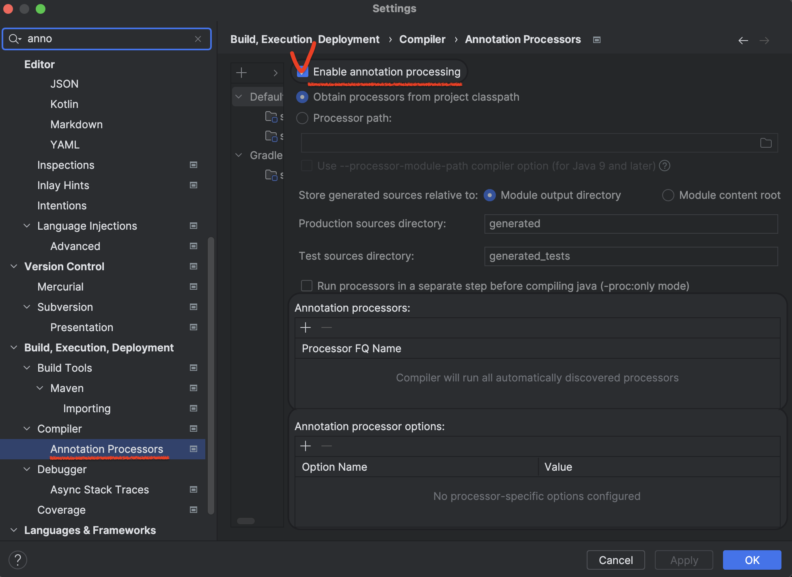
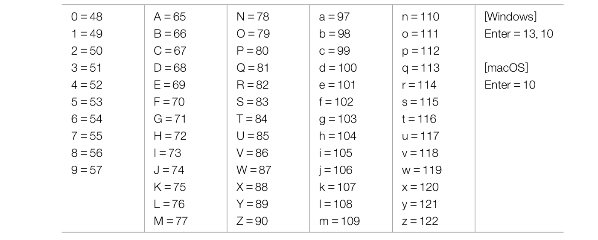
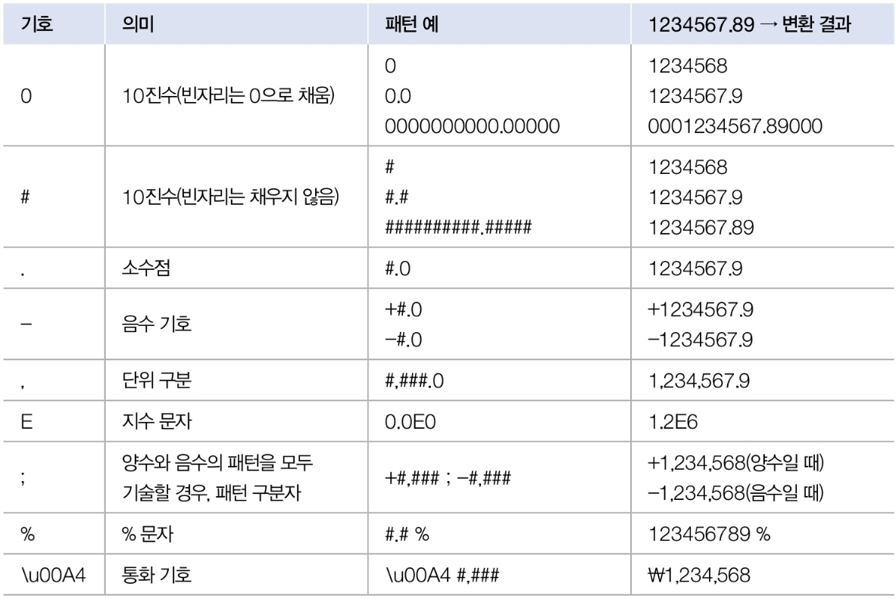
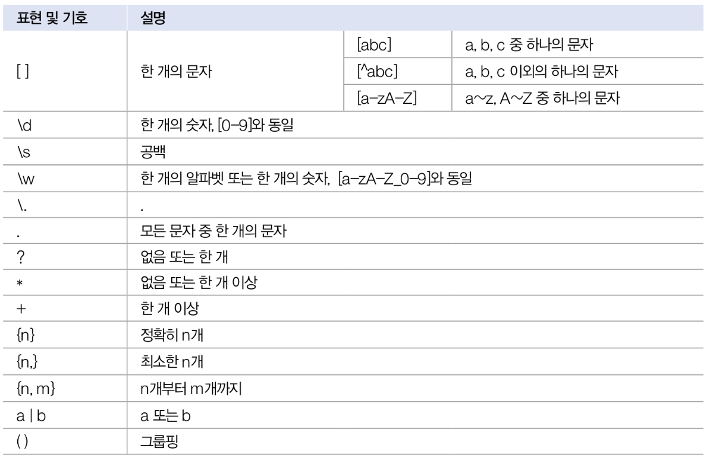

# API 도큐먼트

> [API 도큐먼트](https://docs.oracle.com/en/java/javase/index.html)

자바 표준 모듈에서 제공하는 라이브러리가 방대하여 쉽게 찾아서 사용하도록 도와주는 API 도규먼트가 있다. 라이브러리가 클래스와 인터페이스의 집합이라면 API 도큐먼트는 이를 사용하기 위한 방법을 기술한 것이다.


---
# java.base 모듈

`java.base`는 모든 모듈이 의존하는 기본 모듈로, 모듈 중 유일하게 requires하지 않아도 사용할 수 있다.

- `java.base` 모듈에 포함된 주요 패키지와 용도

| 패키지         | 용도                                      |
| ----------- | --------------------------------------- |
| `java.lang` | 자바 언어의 기본 클래스를 제공                       |
| `java.util` | 자료 구조와 관련된 컬렉션 클래스를 제공                  |
| `java.text` | 날짜 및 숫자를 원하는 형태의 문자열로 만들어 주는 포맷 클래스를 제공 |
| `java.time` | 날짜 및 시간을 조작하거나 연산하는 클래스                 |
| `java.io`   | 입출력 스트림 클래스를 제공                         |
| `java.net`  | 네트워크 통신과 관련된 클래스를 제공                    |
| `java.nio`  | 데이터 저장을 위한 Buffer 및 새로운 입출력 클래스 제공      |

- `java.lang`은 자바 언어의 기본적인 클래스를 담고 있는 패키지로, 이패키지에 있는 클래스와 인터페이스는 `Import` 없이 사용할 수 있다.

| 클래스                                                                  | 용도                                                                                                              |
| -------------------------------------------------------------------- | --------------------------------------------------------------------------------------------------------------- |
| `Object`                                                             | - 자바 클래스의 최상위 클래스로 사용                                                                                           |
| `System`                                                             | - 키보드로부터 데이터를 입력받을 때 사용<br>- 콘솔로 출력하기 위해 사용<br>- 프로세스를 종료시킬 때 사용<br>- 진행 시간을 읽을 때 사용<br>- 시스템 속성(프로퍼티)을 읽을 때 사용 |
| [문자열 관련] - `String`                                                  | - 문자열을 저장하고 조작할 때 사용                                                                                            |
| [문자열 관련] - `StringBuilder`                                           | - 효율적인 문자열 조작 기능이 필요할 때 사용                                                                                      |
| [문자열 관련] - `java.util.StringTokenizer`                               | - 구분자로 연결된 문자열을 분리할 때 사용                                                                                        |
| [포장 관련] - Byte, Short, Character, Integer,<br>Float, Double, Boolean | - 기본 타입의 값을 포장할 때 사용<br>- 문자열을 기본 타입으로 변환할 때 사용                                                                 |
| `Math`                                                               | - 수학 계산이 필요할 때 사용                                                                                               |
| `Class`                                                              | - 클래스의 메타 정보(이름, 구성 멤버)등을 조사할 때 사용                                                                              |


---
# Object 클래스

> 자바의 모든 클래스는 `Object`의 자식이거나 자손 클래스이다.

- `Object`가 가진 주요 메서드

| 메소드                          | 용도                  |
| ---------------------------- | ------------------- |
| `boolean equlas(Object obj)` | 객체의 번지를 비교하고 결과를 리턴 |
| `int hashCode()`             | 객체의 해시코드를 리턴        |
| `String toString()`          | 객체의 문자정보를 리턴        |

## 객체 동등 비교

>`Object`의 `equals()`메소드는 객체의 번지를 비교하고 boolean 값을 리턴한다.

```java
public boolean equals(Object obj)
```

- `equals()` 메소드의 매개변수 타입이 `Object`이므로 자동 타입 변환에 의해 모든 객체가 매개값으로 대입될 수 있다. 
- `equals()` 메소드는는 비교 연산자인 `==`과 동일한 결과를 리턴한다.
- 두 객체가 동일한 객체라면 `true`를 리턴, 그렇지 않으면 `false`를 리턴한다.
```java
Object obj1 = new Object();
Object obj2 = obj1;
boolean result = obj1.equals(obj2);
boolean result = (obj1 == obj2);     // 위 코드와 결과 동일
```


## 객체 해시코드

> 객체 해시코드란 객체를 식별하는 정수를 말한다.

```java
public int hashCode()
```
- Object의 `hashCode()` 메소드는 객체의 메모리 번지를 이용해 해시코드를 생성하기 때문에 객체마다 다른 정수값을 리턴한다.
- `hashCode()`의 사용 용도는 `equals()` 메소드와 비슷한데, 두 객체가 동등한지를 비교할 때 주로 사용한다.
- `hashCode()` 메소드도 `equals()` 메소드와 마찬가지로 객체의 데이터를 기준으로 재정의해서 새로운 정수값을 리턴하도록 사용한다. 객체가 다르다 할지라도 내부 데이터가 동일하다면 같은 정수값을 리턴하기 위함이다.

`Student.java`
```java
public class Student {
	private int no;
	private String name;

	public Student(int no, String name){
		this.no = no;
		this.name = name;
	} 

	public int getNo(){return no;}
	public String getName(){return name;}

	@Override
	public int hashCode(){
	//hashCode 메소드를 재정의해서 학생번호와 이름이 같으면 동일한 해시코드가 생성되게 함.
		int hashCode = no + name.hashCode();
		return hashCode;
	}

	@Override
	public boolean equals(Object obj){
		if(obj instanceof Student target){ 
			if(no == target.getNo() && name.equals(target.getName())){
				return true;
			}
		}
		return false;
	}
}
```
`HashCodeExample.java`
```java
public class HashCodeExample{
	public static void main(String[] args){
		Student s1 = new Student(1, "나나");
		Student s2 = new Student(1, "나나");

		if(s1.hashCode() == s2.hashCdoe()){ // hashCode()가 같은지 확인
			if(s1.equals(s2)){
				System.out.println("동등 객체이다");
			}else{
				System.out.println("동등 객체 아니다");
			}
		}else{
			System.out.println("해시 코드가 다르다");
		}
	}
}
```
`[실행결과]`
```
동등 객체이다
```


### `HashSet` :  동등 객체를 중복 저장하지 않는다.

`HashSetExample.java`
```java
import java.util.HashSet;

public class HashSetExample{
	public static void main(String[] args){
		HashSet hashSet = new HashSet();  // HashSet 컬렉션 생성

		Student s1 = new Student(1, "홍길동");
		hashSet.add(s1);
		System.out.println("저장된 객체 수 : " + hashSet.size());
		
		Student s2 = new Student(1, "홍길동");
		hashSet.add(s2);
		System.out.println("저장된 객체 수 : " + hashSet.size());
		
		Student s3 = new Student(2, "홍길동");
		hashSet.add(s3);
		System.out.println("저장된 객체 수 : " + hashSet.size());
	}
}
```
`[실행결과]`
```
저장된 객체 수 : 1
저장된 객체 수 : 1
저장된 객체 수 : 2
```

`hashCode()`를 재정의하지 않으면 객체 번지로 해시코드를 생성하므로 객체가 다를 경우 해시코드도 달라진다. 

```java
/*
@Override  
public int hashCode(){  
    //hashCode 메소드를 재정의해서 학생번호와 이름이 같으면 동일한 해시코드가 생성되게 함.  
    int hashCode = no + name.hashCode();  
    return hashCode;  
}
*/
```
`[실행결과]`
```
저장된 객체 수 : 1
저장된 객체 수 : 2
저장된 객체 수 : 3
```


## 객체 문자 정보

> Object의 `toString()` 메소드는 객체의 문자 정보를 리턴한다. 객체의 문자 정보란 객체를 무자열로 표현한 값을 말한다.

- Object의 `toString()` 메소드는 기본적으로 `클래스명@16진수해시코드`로 구성된 문자열을 리턴한다.
- 객체의 문자 정보가 중요한 경우 Object의 `toString()` 메서드를 재정해서 유익한 정보를 리턴하도록 한다.

`SmartPhone.java`
```java
pulbic class SmartPhone{
	private String company;
	private String os;
	
	public SmartPhon(String company, String os){
		this.company = company;
		this.os = os;
	}

	@Override
	public String toString(){
		return company + "," + os;
	}
}
```
`ToStringExample.java`
```java
public class ToStringExample{
	public static void main(String[] args){
		SmartPhone myPhone = new SmartPhone("삼성전자", "안드로이드");

		String strObj = myPhone.toString();
		System.out.println(strObj);
		System.out.println(myPhone); //toString() 메서드 호출
	}
}
```
`[실행결과]`
```
삼성전자,안드로이드
삼성전자,안드로이드
```

> 💡 `System.out.println()`메소드는 매개값이 기본 타입(int, byte, ...)이거나 문자열일 경우 해당 값을 그대로 출력한다. 만약 `myPhone`처럼 매개값이 객체가 되면 객체의 `toString()` 메소드를 호출해서 리턴값을 출력한다.


## 레코드 선언

> 데이터 전달을 위한 DTO(Data Transfer Object)를 작성할 때 반복적으로 사용되는 코드를 줄이기 위해 Java14부터 레코드(record)가 도입되었다.

`Person.java`
```java
public class Person{
	private final String name;
	private final int age;

	public Person(String name, int age){
		this.name = name;
		this.age = age;
	}

	public String name(){return this.name;}
	public int age(){return this.age;}

	@Override
	public int hashCode(){ ... }
	
	@Override
	public boolean equals(Object obj){ ... }
	
	@Override
	public String toString(){ ... }
}
```

- 레코드 선언 방법 : `class`키워드 대신 `record`로 대체하고 클래스 이름 뒤에 괄호를 작성해서 저장할 데이터의 종류를 변수로 선언
```java
public record Person(String name, int age){
}
```
- 이렇게 레코드로 선언되면 `private final` 필드가 자동 생성되고, 생성자 및 Getter 메소드가 자동 추가된다. `hashCode()`, `equals()`, `toString()` 메소드를 재정의한 코드도 자동으로 추가된다.

`Member.java`
```java
public record Member(String id, String name, int age) {  
}
```
`RecordExample.java`
```java
public class RecordExample {  
    public static void main(String[] args) {  
        Member m1 = new Member("winter", "눈", 14);  
        System.out.println(m1.id());
        System.out.println(m1.name());
        System.out.println(m1.age());
        System.out.println(m1);  
    }  
}
```
`[실행결과]`
```
winter
눈
14
Member[id=winter, name=눈송이, age=25]
```


## 롬북 사용하기

> 롬북은 레코드와 마찬가지로 DTO클래스를 작성할 때 Getter, Setter, hashCode(), equals(), toString()메소드를 자동생성해 코드 양을 줄여준다.


### eclipce 롬북 적용
1.  [롬북 설치](https://projectlombok.org/download)
2. 다운받은 `lombok.jar` 파일이 있는 곳으로 이동해 관리자 권한으로 명령 프롬프트를 실행한 뒤 다음 명령어 작성
	```powershell
	java -jar lombok.jar
	```
3. 롬북을 설치할 이클립스 실행파일을 찾은 후 `Install/Update`클릭

### intelliJ 롬북적용
1. 설정(Setting) - plugins에서 lombok 검색 후 설치
2. 설정(Setting) - Annotation Processors에서 `Enable annotation processing` 체크
	


### 롬북 Annotation

| 어노테이션                      | 설명                                                                              |
| -------------------------- | ------------------------------------------------------------------------------- |
| `@Data`                    | 기본 생성자, Getter, Setter, hashCode(), equals(), toString() 메소드 자동 생성 Annotation   |
| `@NoArgsConstructor`       | 기본(매개변수가 없는) 생성자 포함                                                             |
| `@AllArgsConstructor`      | 모든 필드를 초기화시키는 생성자 포함                                                            |
| `@RequiredArgsConstructor` | 기본적으로 매개변수가 없는 생성자 포함. 만약 `final` 또는 `@NonNull`이 붙은 필드가 있다면 이 필드만 초기화시키는 생성자 포함 |
| `@Getter`                  | Getter 메소드 포함                                                                   |
| `@Setter`                  | Setter 메소드 포함                                                                   |
| `@EqualsAndHashCode`       | equals()와 hashCode() 메소드 포함                                                     |
| `@ToString`                | toString() 메소드 포함                                                               |

>💡 `final`과 `@NonNull`의 차이점
> - `final`필드는 값을 변경할 수 없지만(Setter가 만들어지지 않음), `@NonNull`은 null이 아닌 다른 값으로 Setter를 통해 변경할 수 있다.


# System 클래스

자바 프로그램은 운영체제상에서 바로 실행되는 것이 아니라 자바 가상 머신(JVM) 위에서 실행되므로 운영체제의 모든 기능을 자바 코드로 직접 접근하기 어렵다. 하지만 `java.lang` 패키지에 속하는 `System`클래스를 이용하면 운영체제의 일부 기능을 이용할 수 있다.

- `System` 클래스의 정적 필드와 메소를 이용하여 프로그램 종룍, 키보드 입력, 콘솔(모니터) 출력, 현재 시간 읽기, 시스템 프로퍼티 읽기 등이 가능하다.

| 필드    | 용도                |
| ----- | ----------------- |
| `out` | 콘솔(모니터)에 문자 출력    |
| `err` | 콘솔(모니터)에 에러 내용 출력 |
| `in`  | 키보드 입력            |

| 메소드                   | 용도                         |
| --------------------- | -------------------------- |
| `exit(int status)`    | 프로세스 종료                    |
| `currentTimeMillis()` | 현재 시간을 밀리초 단위의 long 값으로 리턴 |
| `nanoTime()`          | 현재시간을 나노초 단위의 long 값으로 리턴  |
| `getProperty()`       | 운영체제와 사용자 정보 제공            |
| `getenv()`            | 운영체제의 환경 변수 정보 제공          |

### 키보드 입력

```java
int keyCode = System.in.read();
```

in필드를 이용해 read() 메소드를 호출하면 입력된 키의 코드값을 얻을 수 있다.
키 코드는 각 키에 부여되어 있는 번호이다.


- `read()`메소드는 Enter 키를 누르면 입력했던 키들을 하나씩 읽기 시작한다.
- `read()` 메소드는 `IOException`을 발생할 수 있는 코드이므로 예외 처리가 필요하다.


### 프로세스 종료

자바 프로그램을 시작하면 JVM 프로세스가 생성되고, 이 프로세스가 `main()` 메소드를 호출한다. 프로세스를 강제로 종료하고 싶다면 `System.exit()` 메소드를 사용한다.
```java
System.exit(int status)
```

- `exit()`메소드는 int 매개값이 필요한데, 이 값을 종료 상태값이라고 한다.
- 종료 상태값으로 어떤 값을 주더라고 프로세스는 종료되는데 
	- 정상 종료 : `0`
	- 비정상 종료 : `1` 또는 `-1`


### 진행시간 읽기

> System 클래스의 `currentTimeMillis()`, `nanoTime()` 메소드는 1970년 1월 1일 0시부터 시작해서 현재까지 진행된 시간을 리턴한다.

| 메소드                        | 용도                      |
| -------------------------- | ----------------------- |
| `long currentTimeMillis()` | 1/1000 초 단위로 진행된 시간을 리턴 |
| `long nanoTime()`          | 1/10⁹ 초 단위로 진행된 시간을 리턴  |


### 시스템 프로퍼티 읽기

> 시스템 프로퍼티(System Property)란 자바 프로그램이 시작될 때 자동 설정되는 시스템의 속성을 말한다. 

| 속성 이름(key)                   | 설명            | 값(value)                                           |
| ---------------------------- | ------------- | -------------------------------------------------- |
| `java.specification.version` | 자바 스펙 버전      | 17                                                 |
| `java.home`                  | JDK 디렉토리 경로   | C:\Program Files\Java\ <br> jdk-17.0.3             |
| `os.name`                    | 운영체제          | Windows 10                                         |
| `user.name`                  | 사용자 이름        | xxx                                                |
| `user.home`                  | 사용자 홈 디렉토리 경로 | C:\Users\xxx                                       |
| `user.dir`                   | 현재 디렉토리 경로    | C:\ThisIsJavaSecondEdition<br>\workspace\thisijava |


<br>

---
# 문자열 클래스

| 클래스               | 설명                       |
| ----------------- | ------------------------ |
| `String`          | 문자열을 저장하고 조작할 때 사용       |
| `StringBuilder`   | 효율적인 문자열 조작 기능이 필요할 때 사용 |
| `StringTokenizer` | 구분자로 연결된 문자열을 분리할 때 사용   |

## String 클래스

문자열을 byte 배열로 변환시키고 다시 문자열로 복원하는 방법
```java
// 기본 문자셋으로 byte 배열을 디코딩해서 String 객체로 생성
String str = new String(byte[] bytes);

//특정 문자셋으로 byte 배열을 디코딩해서 String 객체로 생성
String str = new String(byte[] bytes, String charsetName);
```
`BytesToStringExample.java`
```java
public class BytesToStringExample{  
    public static void main(String[] args) throws Exception{  
        String data = "자바";  
  
        //String -> byte 배열(기본 : UTF-8 인코딩)  
        //byte[] arr1 = data.getBytes("UTF-8");        
        byte[] arr1 = data.getBytes();  
        System.out.println("arr1 : " + Arrays.toString(arr1));  
  
        //String -> byte 배열(기본 : UTF-8 인코딩)  
        //String str1 = new String(arr1, "UTF-8");        
        String str1 = new String(arr1);  
        System.out.println("str1 : " + str1);  
  
        //String -> byte 배열(기본 : UTF-8 인코딩)  
        byte[] arr2 = data.getBytes("EUC-KR");  
        System.out.println("arr2 : " + Arrays.toString(arr2));  
  
        //String -> byte 배열(기본 : UTF-8 인코딩)  
        String str2 = new String(arr2,"EUC-KR");  
        System.out.println("str2 : " + str2);  
    }  
}
```
`[실행결과]`
```
arr1 : [-20, -98, -112, -21, -80, -108]
str1 : 자바
arr2 : [-64, -38, -71, -39]
str2 : 자바
```

>💡 한글 1글자를 "UTF-8"로 인코딩하면 3바이트가 되고, "EUC-KR"로 인코딩하면 2바이트가 된다.


### StringBuilder 클래스

String은 내부 문자열을 수정할 수 없다. 
```java
String data = "ABC";
data += "DEF";
```
위 코드는 다른 문자열을 결합해서 내부 문자열을 변경하는 것처럼 보이지만 'ABCDEF'라는 새로운 String 객체를 생성하는 것이다. 그리고 data 변수는 새로 생성된 String 객체를 참조한다.

- `String` 객체의 `+`연산은 이전 객체는 계속 버려지기 때문에 효율성이 좋지 않다. 잦은 문자열 변경 작업을 해야한다면 `StringBuilder`를 사용하는 것이 좋다.
- `StringBuilder`는 내부 버퍼(데이터를 저장하는 메모리)에 문자열을 저장해두고 그 안에서 추가, 수정, 삭제 작업을 하도록 설계되어 있다. 따라서 String처럼 새로운 객체를 만들지 않도고 문자열을 조작할 수 있다.

| 리턴 타입           | 메소드(매개변수)                   | 설명             |
| --------------- | --------------------------- | -------------- |
| `StringBuilder` | `append(기본값 \| 문자열)`        | 문자열을 끝에 추가     |
| `StringBuilder` | `insert(위치, 기본값 \| 문자열)`    | 문자열을 지정 위치에 추가 |
| `StringBuilder` | `delete(시작위치, 끝 위치)`        | 문자열 일부를 삭제     |
| `StringBuilder` | `replace(시작 위치, 끝 위치, 문자열)` | 문자열 일부를 대체     |
| `String`        | `toString()`                | 완성된 문자열을 리턴    |

toString()을 제외한 다른 메소드는 StringBuilder를 다시 리턴하기 때문에 연이어서 다른 메소드를 호출할 수 있는 메소드 체이닝(chaining)패턴을 사용할 수 있다.
`StringBuilderExample.java`
```java
public class StringBuilderExample{
	public static void main(String[] args){
		String data = new StringBuilder()
			.append("DEF")
			.insert(0, "ABC")
			.delete(3, 4)
			.toString();
		System.out.println(data);
	}
}
```
`[실행결과]`
```
ABCEF
```


### StringTokenizer 클래스

문자열이 구분자(delimiter)로 연결되어 있을 경우, 구분자를 기준으로 문자열을 분리하려면
	①String의 `split()` 메소드를 사용하거나
	②java.util 패키지의 `StringTokenizer` 클래스를 이용할 수 있다.

`split()`은 정규 표현식으로 구분하고, `StringTokenizer`는 문자로 구분 가능하다.

```java
String data = "홍길동&이수홍,박연수,김자바-최명호";
String[] names = data.split("&|,|-");
```
```java
String data = "홍길동/이수홍/박연수";
StringTokenizer st = new StringTokenizer(data, "/");
```

| 리턴 타입     | 메소드(매개변수)         | 설명                |
| --------- | ----------------- | ----------------- |
| `int`     | `countTokens()`   | 분리할 수 있는 문자열의 총 수 |
| `boolean` | `hasMoreTokens()` | 남아 있는 문자열이 있는 여부  |
| `String`  | `nextToken()`     | 문자열을 하나씩 가져옴      |
`nextToken()` 메소드는 분리된 문자열을 하나씩 가져오고, 더 이상 가져올 문자열이 없다면 에외를 발생시킨다. 그래서 `nestToken()`을 사용하기 전에 `hasMoreTokens()` 메소드로 가져올 문자열이 있는지 먼저 조사하는 것이 좋은 방법이다.
`StringTokenizerExample.java`
```java
public class StringTokenizerExample{
	public static void main(String[] args){
		String data1 = "홍길동&이수홍,박연수";
		String[] arr = data1.split("&|,");
		for(String token : arr){
			System.out.println(token);
		}
		System.out.println();

		String data2 = "홍길동/이수홍/박연수";
		StringTokenizer st = new StringTokenizer(data2, "/");
		while(st.hasMoreTokens()){
			String token = st.nextToken();
			System.out.println(token);
		}
	}
}
```
`[실행결과]`
```
홍길동
이수홍
박연수

홍길동
이수홍
박연수
```

<br>

---
# 포장 클래스

> 기본 타입(byte, char, short, int, long, float, double, boolean)의 값을 갖는 객체를 포장(wrapper) 객체라고 한다.

| 기본 타입   | 포장 클래스    |
| ------- | --------- |
| byte    | Byte      |
| char    | Character |
| short   | Short     |
| int     | Integer   |
| long    | Long      |
| float   | Float     |
| double  | Double    |
| boolean | Boolean   |
- 포장 클래스는 `java.lang`패키지에 포함되어 있다. 
- 포장 객체는 포장하고 있는 기본 타입은 변경이 불갛고 단지 객체로 생성하는데 목정이 있다.
- 포장 객체가 필요한 이유는 컬렉션 객체 때문이다. 컬렉션 객체는 기본 타입의 값을 저장할 수 없고, 객체만 저장할 수 있다.


## 박싱과 언박싱

> 박싱(boxing) : 기본 타입의 값을 포장 객체로 만드는 과정
> 언박싱(unboxing) : 포장 객체에서 기본 타입의 값을 얻어내는 과정

```java
//Boxing
Integer obj = 100;
System.out.println(obj.intValue());    // 100

//Unboxing
int value = obj;
System.out.println(value);       //100

//연산 시 Unboxing
int result = obj + 100;  // 언박싱 후 연산
System.out.println(result);      //200
```
- `.intValue()` : Integer 객체 내부의 int 값을 리턴한다.


## 문자열을 기본 타입 값으로 변환

> `parse+기본타입` : 정적(static)메소드. 문자열을 해당 기본 타입 값으로 변환한다.


## 포장 값 비교

일반적으로 포장 객체는  `==`, `!=` 연산자로 내부의 값을 비교할 수 없다. `==`, `!=`는 내부의 값이 아니라 포장 객체의 번지를 비교한다. 예외적으로 다음 범위를 갖는 포장 객체는 효율적 사용을 위해 공유되어  `==`, `!=` 연산자로 비교할 수 있다. 이 경우에도 내부 값이 아니라 객체 번지를 비교하는 것이다.

| 타입               | 값의 범위             |
| ---------------- | ----------------- |
| boolean          | true, false       |
| char             | \\u0000 ~ \\u007f |
| byte, short, int | -128 ~ 127        |

포장 클래스는 `equalas()`로 내부의 값을 비교할 수 있다.

```java
//-128 ~ 127 초과값일 경우
Integer obj1 = 300;
Integer obj2 = 300;
System.out.println(obj1 == obj2);       // false
System.out.println(obj1.equals(obj2));  // true

//-128 ~ 127 범위값일 경우
Integer obj3 = 10;
Integer obj4 = 10;
System.out.println(obj3 == obj4);       // true
System.out.println(obj3.equals(obj4));  // true
```

<br>

---
# 수학 클래스

> Math 클래스는 수학 계산에 사용할 수 있는 메소드를 제공한다. Math 클래스가 제공하는 메소드는 모두 정적(static)이다.

| 구분   | 코드                                                            | 리턴값                   |
| ---- | ------------------------------------------------------------- | --------------------- |
| 절대값  | int v1 = Math.abs(-5);<br>double v2 = Math.abs(-3.14);        | v1 = 5 <br>v2 = 3.14  |
| 올림값  | double v3 = Math.ceil(5.3);<br>double v4 = Math.ceil(5.3);    | v3 = 6.0<br>v4 = -5.0 |
| 버림값  | double v5 = Math.floor(5.3);<br>double v6 = Math.floor(-5.3); | v5 = 5.0<br>v6 = -6.0 |
| 최대값  | int v7 = Math.max(5, 9);<br>double v8 = Math.max(5.3, 2.5);   | v7 = 9<br>v8 = 5.3    |
| 최소값  | int v9 = Math.min(5, 9);<br>double v10 = Math.min(5.3, 2.5);  | v9 = 5<br>v10 = 2.5   |
| 랜덤값  | double v11 = Math.random();                                   | 0.0 <= v11 < 1.0      |
| 반올림값 | long v14 = Math.round(5.3);<br>long v15 = Math.round(5.7);    | v14 = 5<br>v15 = 6    |

- `random()` 메소드는 0.0과 1.0 사이의 double 타입의 난수를 리턴한다. 다음 코드를 이용해 start부터 시작하는 n개의 정수(start<= ... <(start+n)) 중 하나의 정수를 얻을  수 있다.

```java
int num = (int) (Math.random() * n) + start;
```

- `java.util.Random`클래스를 이용해 난수를 얻을 수 있다. boolean, int, double 타입의 난수를 얻을 수 있다.

| 객체 생성             | 설명                        |
| ----------------- | ------------------------- |
| Random()          | 현재 시간을 이용해서 종자값을 자동 설정한다. |
| Random(long seed) | 주어진 종자값을 사용한다.            |
`종자값(seed)`란 난수를 만드는 알고리즘에 사용되는 값으로, 종자값이 같으면 같은 난수를 얻는다.

| 리턴값     | 메소드(매개변수)      | 설명                                 |
| ------- | -------------- | ---------------------------------- |
| boolean | nextBoolean()  | boolean 타입의 난수를 리턴                 |
| double  | nextDouble()   | double 타입의 난수를 리턴(0.0 <= ~ < 1.0)  |
| int     | nextInt()      | int 타입의 난수를 리턴(-2³² <= ~ <= 2³²-1) |
| int     | nextInt(int n) | int 타입의 난수를 리턴(0 <= ~ < n)         |

<br>

---
# 날짜와 시간 클래스

> 컴퓨터의 날짜 및 시각을 읽을 수 있도록 java.util 패키지에서 Date와 Calendar 클래스를 제공하고 있다. 날짜와 시간을 조작할 수 있도록 java.time 패키지에서 LocalDateTime 클래스를 제공한다.

| 클래스           | 설명                        |
| ------------- | ------------------------- |
| Date          | 날짜 정보를 전달하기 위해 사용         |
| Calender      | 다양한 시간대별로 날짜와 시간을 얻을 때 사용 |
| LocalDateTime | 날짜와 시간을 조작할 때 사용          |

## Date 클래스

> Date는 날짜를 표현하는 클래스로 객체 간에 날짜 정보를 주고받을 때 사용된다.

```java
Date now = new Date();
String strNow1 = now.toString();
System.out.println(strNow1);      //Sun Nov 12 19:29:51 KST 2023

SimpleDateFormat sdf = new SimpleDateFormat("yyyy.MM.dd HH:mm:ss");
String strNow2 = sdf.format(now);
System.out.println(strNow2);      // 2023.11.12 19:29:51
```


## Calendar 클래스

> Calendar 클래스는 달력을 표현하는 추상 클래스이다.

- Calendar 클래스의 정적 메소드인 `getInstance()` 메소드를 이용하면 컴퓨터에 설정되어 있는 시간대(TimeZone)를 기준으로 Calendar 하위 객체를 얻을 수 있다.
- Calendar가 제공하는 날짜와 시간에 대한 정보를 얻기 위해서는 `get()`메소드를 이용한다. 매개값으로 Calendar에 정의된 상수를 주면 상수가 의미하는 값을 리턴한다.

```java
Calendar now = Calendar.getInstance();

int year = now.get(Calendar.YEAR);       // 년도를 리턴
int month = now.get(Calendar.MONTH) + 1;       // 월을 리턴
int day = now.get(Calendar.DAY_OF_MONTH);       // 일을 리턴
int week = now.get(Calendar.DAY_OF_WEEK);       // 요일을 리턴
int amPm = now.get(Calendar.AM_PM);       // 오전/오후를 리턴
int hour = now.get(Calendar.HOUR);       // 시를 리턴
int minute = now.get(Calendar.MINUTE);       // 분을 리턴
int second = now.get(Calendar.SECOND);       // 초를 리턴
```

- Calendar 클래스의 오버로딩된 다른 `getInstance()`메소드를 이용하면 다른 나라 시간대의 Calendar 를 얻을 수 있다.
```java
TimZone timeZone = TimeZone.getTimeZone("America/Los_Angeles");
Calendar now = Calendar.getInstance(timeZone);
```

<br>

---
# 형식 클래스

> Format(형식) 클래스는 숫자 또는 날짜를 원하는 형태의 문자열로 변환해주는 기능을 제공한다.

## `DecimalFormat`

> 숫자를 형식화된 문자열로 변환


	

## `SimpleDateFormat`

> 날짜를 형식화된 문자열로 변환


<br>

---
# 정규 표현식 클래스



## Pattern 클래스로 검증

> `java.util.regex` 패키지의 Pattern 클래스는 정규 표현식으로 문자열을 검증하는 `matches()` 메소드를 제공한다. 첫 번째 매개값은 정규 표현식이고, 두 번째 매개값은 검증할 문자열이다. 결과는 boolean 타입으로 리턴된다.

```java
boolean result = Pattern.matches("정규식", "검증할 문자열");
```

<br>

---
# 리플렉션

> 메타 정보를 프로그램에서 읽고 수정하는 행위를 리플렉션(reflection)이라고 한다.

자바는 클래스와 인터페이스의 메타 정보를 Class 객체로 관리한다. 메타 정보란 패키지 정보, 타입 정보, 멤버(생성자, 필드, 메서드) 정보 등을 말한다. 

- Class 객체 얻는 방법 3가지
	- ①, ② - 클래스로부터 얻는 방법
	- ③ - 객체로부터 얻는 방법

```java
① Class clazz = 클래스이름.class;
② Class clazz = Class.forName("패키지 ... 클래스이름");
③ Class clazz = 객체참조변수.getClass();
```

## 패키지와 타입 정보 얻기

- `Package getPackage()` : 패키지 정보 읽기
- `String getSimpleName()` : 패키지를 제외한 타입 이름
- `String getName()` : 패키지를 포함한 전체 타입 이름

```java
//방법 1
Class clazz = Car.class;

// 방법2
// Class clazz = Class.forName("ch12.sec11.exam01.Car");
// 방법3
// Car car = new Car();
//Class clazz = car.getClass();

System.out.println(clazz.getPackage().getName());  // ch12.sec11.exam01
System.out.println(clazz.getSimpleName());         // Car
System.out.println(clazz.getName());               // ch12.sec11.exam01.Car
```


## 멤버 정보 얻기

- `Constructor[] getDeclaredConstructors()` : 생성자 정보 읽기
- `Field[] getDeclaredFields()` : 필드 정보 읽기
- `Method[] getDeclaredMethods()` : 메소드 정보 읽기


## 리소스 경로 얻기

- `URL getResource(String name)` : 리소스 파일의 URL 리턴
- `InputStream getResourceAsStream(String name)` : 리소스 파일의 InputStream 리턴

```
C:\app\bin
		| - Car.class
		| - photo1.jpg
		| - images
				| - photo2.jpg
```

```java
Class clazz = Car.class;

String photo1Path = clazz.getResource("photo1.jpg").getPath();
//.../workspace/thisisjava/bin/ch12/sec11/exam01/photo1.jpg
String photo2Path = clazz.getResource("images/photo2.jpg").getPath();
//.../workspace/thisisjava/bin/ch12/sec11/exam01/images/photo2.jpg
```

<br>

---
# 어노테이션

> 어노테이션(Annotation)은 클래스 또는 인터페이스를 컴파일하거나 실행할 때 어떻게 처리해야 할 것인지를 알려주는 설정 정보이다.

- 어노테이션의 용도
	1. 컴파일 시 사용하는 정보 전달
	2. 빌드 툴이 코드를 자동으로 생성할 때 사용하는 정보 전달
	3. 실행 시 특정 기능을 처리할 떄 사용하는 정보 전달

## 어노테이션 타입 정의와 적용

#### 어노테이션 정의
`@interface` 뒤에 사용할 어노테이션 이름이 온다. 

```java
public @interface AnnotationName{}
```

이렇게 정의된 어노테이션은 `@AnnotationName`으로 사용된다.

#### 어노테이션 속성 정의
속성은 타입과 이름으로 구성되며, 이름 뒤에 괄호를 붙인다. 속성의 기본값은 `default` 키워드로 지정할 수 있다.

```java
public @interface AnnotationName{
	String prop1();
	int prop2() default 1;
}
```

prop1은 기본값이 없기 때문에 반드시 값을 기술해야 하고, prop2는 기본값이 있기 때문에 생략 가능하다.
```java
@AnnotationName(prop1 = "값");
@AnnotationName(prop1 = "값", prop2=3);
```


#### value()
어노테이션은 기본 속성인 `value`를 가질 수 있다.
```java
public @interface AnnotationName{
	String value();
	int prop2() default 1;
}
```
value 속성을 가진 어노테이션은 값만 기술하면 자동으로 `value` 속성에 대입된다.
```java
@AnnotationName("값")
// 다른 속성과 동시에 값을 줄때는 명시를 해야한다.
@AnnotationName(value="값", prop2=3);
```

## 어노테이션 적용 대상

정의한 설정 정보를 어떤 대상에 적용할 것인지 명시해야한다. 적용할 수 있는 대상의 종류는 ElementType 열거 상수로 정의되어 있다.

| ElementType 열거 상수 | 적용 요소             |
| ----------------- | ----------------- |
| TYPE              | 클래스, 인터페이스, 열거 타입 |
| ANNOTATION_TYPE   | 어노테이션             |
| FIELD             | 필드                |
| CONSTRUCTOR       | 생성자               |
| METHOD            | 메소드               |
| LOCAL_VARIABLE    | 로컬 변수             |
| PACKAGE           | 패키지               |

적용 대상을 지정할 때는 `@Target` 어노테이션을 사용한다. `@Target`의 기본 속성인 `value`는 ElementType 배열을 값으로 가져서 적용대상을 복수개로 지정할 수 있다.
```java
// 해당 어노테이션은 클래스, 필드, 메소드에 적용할수 있다.
@Target({ElementType.TYPE, ElementType.Field, ElementType.METHOD})
public @interface AnnotationName{}
```

## 어노테이션 유지 정책

`@Retention` 어노테이션으로 해당 어노테이션을 언제까지 유지할 지 정의할 수 있다. `@Retention`의 기본 속성인 `value`는 `RetentionPolicy` 열거 상수 값을 가진다. 

| RetentionPolicy 열거상수 | 어노테이션 적용 시점   | 어노테이션 제거 시점     |
| -------------------- | ------------- | --------------- |
| SOURCE               | 컴파일할 때 적용     | 컴파일된 후에 제거됨     |
| CLASS                | 메모리로 로딩할 때 적용 | 메모리로 로딩된 후에 제거됨 |
| RUNTIME              | 실행할 때 적용      | 계속 유지됨          |

```java
@Target({ElementType.TYPE, ElementType.Field, ElementType.METHOD})
@Retention(RetentionPolicy.RUNTIME)
public @interface AnnotationName{}
```

## 어노테이션 설정 정보 이용

리플렉션을 이용해서 적용 대상으로부터 어노테이션의 정보를 얻어낼 수 있다.

| 리턴타입         | 메소드명(매개변수)                                  | 설명                                                       |
| ------------ | ------------------------------------------- | -------------------------------------------------------- |
| boolean      | `isAnnotationPresent`(AnnotationName.class) | 지정한 어노테이션이 적용되었는지 여부                                     |
| Annotation   | `getAnnotation`(AnnotationName.class)       | 지정한 어노테이션이 적용되어 있으면 <br>어노테이션을 리턴하고, 그렇지 않다면<br>null을 리턴 |
| Annotation[] | `getDeclaredAnnotations()`                  | 적용된 모든 어노테이션을 리턴                                         |

`PrintAnnotation.java`
```java
package annotation;

import java.lang.annotation.ElementType;
import java.lang.annotation.Retention;
import java.lang.annotation.RetentionPolicy;
import java.lang.annotation.Target;

@Target({ElementType._METHOD})
@Retention(RetentionPolicy.RUNTIME)
public @interface PrintAnnotation {
	String value() default "-";
	int number() default 15;
}
```

`Service.java`
```java
package annotation;

public class Service {

	@PrintAnnotation
	public void method1() {
		System.out.println("실행 내용1");
	}

	@PrintAnnotation("*")
	public void method2() {
		System.out.println("실행 내용2");
	}
	
	@PrintAnnotation(value="#", number=20)
	public void method3() {
		System.out.println("실행 내용3");
	}
}
```

`PrintAnnotationExample.java`
```java
package annotation;

import java.lang.reflect.Method;

public class PrintAnnotationExample {
	public static void main(String[] args) throws Exception{
		Method[] declaredMethods = Service.class.getDeclaredMethods();
		for(Method method : declaredMethods) {
			//PrintAnnotation 얻기
			PrintAnnotation printAnnotation = method.getAnnotation(PrintAnnotation.class);
			
			//설정 정보를 이용해서 선 출력
			printLine(printAnnotation);
			
			//메소드 호출
			method.invoke(new Service());
			
			//설정 정보를 이용해서 선 출력 
			printLine(printAnnotation);
		}
	}

	private static void printLine(PrintAnnotation printAnnotation) {
		if(printAnnotation != null) {
			//number 속성값 얻기
			int number  = printAnnotation.number();
			for(int i=0; i<number;i++) {
				//value 속성값 얻기
				String value = printAnnotation.value();
				System.out.print(value);
			}
			System.out.println();
		}
	}
}
```
`[실행결과]`
```
---------------
실행 내용1
---------------
***************
실행 내용2
***************
####################
실행 내용3
####################
```


