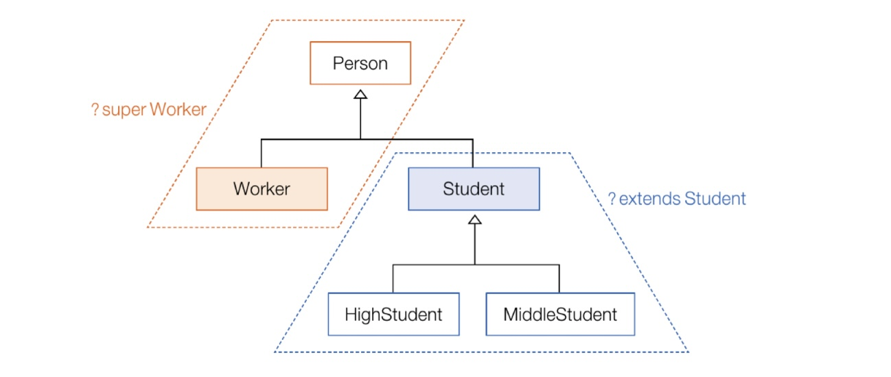

## 제네릭이란

> 제네릭(Generic)이란 결정되지 않은 타입을 파라미터로 처리하고 실제 사용할 때 파라미터를 구체적인 타입으로 대체시키는 기능이다.

`Box.java`
```java
pulbic class Box<T> {
	public T content;
}
```

`GenericExample.java`
```java
public class GenericExample{
	public static void main(String[] args){
		Box<String> box1 = new Box<>();   // T대신 String으로 대체
		box1.content = "안녕하세요";

		Box<Integer> box1 = new Box<>();   // T대신 Integer으로 대체
		box1.content = 100;

	}
}
```


## 제네릭 타입

> 제네릭 타입은 결정되지 않은 타입을 파라미터로 가지는 클래스와 인터페이스를 말한다. 선언부에 `<>`부호가 붙고 그 사이에 타입 파라미터들이 위치한다.

```java
public class 클래스명<A, B, ...> {...}
public interface 인터페이스명<A, B, ...> {...}
```

타입 파라미터는 일반적으로 대문자 알파벳 한 글자로 표현한다. 
외부에서 제네릭 타입을 사용하려면 타입 파라미터에 구체적인 타입을 지정해야한다.
만약 지정하지 않으면 `Object` 타입이 암묵적으로 사용된다.

`Product.java`
```java
public class Product<K, M>{
	private K kind;
	private M model;

	public K getKind(){return this.kind;}
	public M getModel(){return this.model;}
	public void setKind(K kind){return this.kind = kind;}
	public void setModel(M model){return this.model = model;}
}
```
`GenericExample.java`
```java
public class GenericExample{
	public static void main(String[] args){
		Product<Tv, String> product1 = new Product<>();

		product1.setKind(new Tv());
		product1.setModel("스마트Tv");

		Tv tv = product1.getKind();
		String tvModel = product1.getModel();
	}
}
```


## 제네릭 메소드

> 제네릭 메소드는 타입 파라미터를 가지는 메소드를 말한다.

`Box.java`
```java
Pulbic class Box<T>{
	private T t;

	public T get(){
		return t;
	}

	public void set(T t){
		this.t = t;
	}
}
```
`GenericExample.java`
```java
public class GenericExample{
	public static <T> Box<T> boxing(T t){
		Box<T> = new Box<T>();
		box.set(t);
		return box;
	}

	public static void main(String[] args){
		Box<Integer> box1 = boxing(100);
		int intValue = box1.get();
	}
}
```


## 제한된 타입 파라미터

> 제한된 타입 파라미터(bounded type parameter)는 모든 타입으로 대체할 수 없고, 특정 타입과 자식 또는 구현 관계에 있는 타입만 대체할 수 있는 타입 파라미터를 의미한다.

```java
public <T extends 상위타입> 리턴타입 메소드(매개변수, ...){ ... }
```

여기서 `상위타입`은 클래스뿐만 아니라 인터페이스도 가능하다. 인터페이스라고 `implements`를 사용하지는 않는다.

`GenericExample.java`
```java
public class GenericExample{
	public static <T extends Number> boolean compare(T t1, T t2){
		double v1 = t1.doubleValue();
		double v2 = t2.doubleValue();
		return (v1 == v2);
	}

	public static void main(String[] args){
		boolean result1 = compare(10, 20);
		System.out.println(result1);     // false

		boolean result2 = compare(4.5, 4.5);
		System.out.println(result2);     // true
	}
}
```


## 와일드카드 타입 파라미터

> 타입 파라미터로 `?(와일드 카드)`를 사용할 수 있는데, `?`는 모든 타입으로 대체할 수 있다는 표시이다.


타입 파라미터의 데체 타입으로 Student와 자식 클래스인 HighStudent와 MiddleStudent만 가능하도록 매개변수를 선언할 수 있다.
```java
리턴타입 메소드명(제네릭타입<? extends Student> 변수){...}
```

반대로 Worker와 부모 클래스인 Person만 가능하도록 매개변수를 다음과 같이 선언할 수 있다.
```java
리턴타입 메소드명(제네릭타입<? super Worker> 변수){...}
```

어떤 타입이든 가능하도록 매개변수를 선언할 수도 있다.
```java
리턴티입 메소드명(제네릭타입<?> 변수){...}
```


