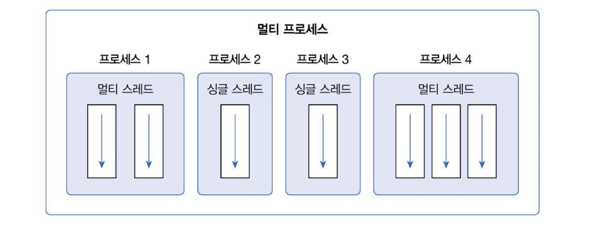

## 멀티 스레드 개념

> 스레드(thread)는 코드의 실행 흐름을 말한다. 



멀티 프로세스들은 서로 독립적이므로 하나의 프로세스에서 오류가 발생해도 다른 프로세스에게 영향을 미치지 않는다. 
하지만 멀티 스레드는 프로세스 내부에 생성되기 때문에 하나의 스레드가 예외를 발생시키면 프로세스가 종료되므로 다른 스레드에게 영향을 미친다.


## 메인 스레드

> 모든 자바 프로그램은 메인 스레드(main thread)가 main() 메소드를 실행하면서 시작된다.


싱글 스레드에서는 메인 스레드가 종료되면 프로세스도 종료된다.
멀티 스레드에서는 실행중인 스레드가 하나라도 있다면 프로세스는 종료되지 않는다. 메인 스레드가 작업 스레드보다 먼저 종료되더라도 작업 스레드가 계속 실행 중이라면 프로세스는 종료되지 않는다.


## 작업 스레드 생성과 실행

멀티 스레드로 실행하는 프로그램을 개발하려면 먼저 몇 개의 작업을 병렬로 실행할지 결정하고 각 작업별로 스레드를 생성해야 한다.

자바는 작업 스레드도 객체로 관리하므로 클래스가 필요하다. Thread 클래스로 직접 객체를 생성해도 되지만, 하위 클래스를 만들어 생성할 수도 있다.

### Thread 클래스로 직접 생성

`java.lang` 패키지에 있는 Thread 클래스로부터 작업 스레드 객체를 직접 생성하려면 다음과 같이 `Runnable` 구현 객체를 매개값으로 갖는 생성자를 호출하면된다.

```java
Thread thread = new Thread(Runnable target);
```

#### [방법 1]. `Runnable` 구현 클래스 생성
`Runnable`은 스레드가 작업을 실행할 때 사용하는 인터페이스이다. `Runnable`에는 `run()`메소드가 정의되어 있는데, 구현 클래스는 `run()`을 재정의해서 스레드가 실행할 코드를 가지고 있어야 한다.
```java
class Task implements Runnable{
	@Override
	public void run(){
		//스레드가 실행할 코드
	}
}
```

`Runnable` 구현 클래스는 작업 내용을 정의한 것이므로, 스레드에게 전달해야 한다. `Runnable`구현 객체를 생성한 후 `Thread` 생성자 매개값으로 `Runnable` 객체를 전달하면된다.
```java
Runnable task = new Task();
Thread thread = new Thread(task);
```

#### [방법 2]. Thread 생성자 호출시 `Runnable` 익명 구현 객체로 사용
명시적으로 `Runnable` 구현 클래스를 작성하지 않고 `Thread` 생성자를 호출할 때 `Runnable` 익명 구현 객체를 매개값으로 사용할 수 있다. 이 방법이 더 많이 사용된다.
```java
Thread thread = new Thread(new Runnable(){
	@Override
	public void run(){
		// 스레드가 실행할 코드
	}
})
```


작업 스레드 객체가 생성되었다고 해서 바로 작업 스레드가 실행되지는 않는다. 작업 스레드를 실행하려면 스레드 객체의 start() 메소드를 호출해야해한다.
```java
thread.start();
```

`start()` 메소드가 호출되면, 작업 스레드는 매개값으로 받은 `Runnable`의 run() 메소드를 실행하면서 작업을 처리한다. 


`BeepPrintExample.java`
```java
public class BeepPrintExample {  
    public static void main(String[] args) {  
        Toolkit toolkit = Toolkit.getDefaultToolkit();  
        for(int i=0; i<5; i++){  
            toolkit.beep();  
            try{Thread.sleep(500);}catch(Exception e){}  
        }  
  
        for(int i=0; i<5; i++){  
            System.out.println("띵");  
            try{Thread.sleep(500);}catch(Exception e){};  
        }  
    }  
}
```
⇒ 원래 예제 목적은 0.5초 주기로 비프음을 발생시키면서 도잇에 프린팅까지 하는 작업이었지만, 메인 스레드는 비프음을 모두 발생한 다음에야 출력을 시작한다.

원래 목적대로 0.5초 주기로 비프음을 발생시키면서 동시에 출력을 하고 싶다면 두 작업 중 하나를 작업 스레드에서 처리하도록 해야 한다. 출력은 메인 스레드가 담당하고 비프음을 들려주는 것은 작업 스레드가 담당하도록 수정하자
`BeepPrintExample.java`
```java
public class BeepPrintExample {  
    public static void main(String[] args) {  
        Thread thread = new Thread(new Runnable() {  
            @Override  
            public void run() {  
                Toolkit toolkit = Toolkit.getDefaultToolkit();  
                for(int i=0; i<5; i++){  
                    toolkit.beep();  
                    try{Thread.sleep(500);}catch(Exception e){}  
                }  
            }  
        });  
        thread.start();  
          
        for(int i=0; i<5; i++){  
            System.out.println("띵");  
            try{Thread.sleep(500);}catch(Exception e){};  
        }  
    }  
}
```


### Thread 자식 클래스로 생성

작업 스레드를 생성하는 또 다른 방버은 Thread의 자식 객체로 만드는 것이다. Thread 클래스를 상송한 다음 run() 메소드를 재정의해서 스레드가 실행할 코드를 작성하고 객체를 생성하면 된다.
```java
public class WorkerThread extends Thread {
	@Override
	public void run(){
		// 스레드가 실행할 코드
	}
}

// 스레드 객체 생성
Thread thread = new WorkerThread();
thread.start();
```

작업 스레드 실행방법은 동일하게 `start()` 메소드를 호출하면 자겅ㅂ 스레드는 재정의된 `run()`을 실행시킨다.


명시적인 자식 클래스를 정의하지 않고, Thread 익명 자식 객체를 사용할 수 있다. 이 방법이 더 많이 사용된다.
```java
Thread thread = new Thread(){
	@Override
	public void run(){
		//스레드가 실행할 코드
	}
};
thread.start();
```

`BeepPrintExample.java`
```java
public class BeepPrintExample {  
    public static void main(String[] args) {  
        Thread thread = new Thread(){  
            @Override  
            public void run() {  
                Toolkit toolkit = Toolkit.getDefaultToolkit();  
                for(int i=0; i<5; i++){  
                    toolkit.beep();  
                    try{Thread.sleep(500);}catch(Exception e){}  
                }  
            }  
        };  
        thread.start();  
  
        for(int i=0; i<5; i++){  
            System.out.println("띵");  
            try{Thread.sleep(500);}catch(Exception e){};  
        }  
    }  
}
```

<br>

---
## 스레드 이름

> 스레드는 자신의 이름을 가지고 있다. 메인 스레드는 `main`이라는 이름을 가지고 있고, 작업 스레드는 자동적으로 `Thread-n`이라는 이름을 가진다.

작업 스레드의 이름을 `Thread-n` 대신 다른 이름으로 설정하고 싶다면 Thread 클래스의 setName() 메소드를 사용하면 된다.
```java
thread.setName("스레드 이름");
```

`ThreadNameExample.java`
```java
public class ThreadNameExample {  
    public static void main(String[] args) {  
        Thread mainThread = Thread.currentThread();  
        System.out.println(mainThread.getName() + " 실행");  
  
        for (int i = 0; i < 3; i++) {  
            Thread threadA = new Thread(){  
                @Override  
                public void run(){  
                    System.out.println(getName() + " 실행");  
                }  
            };  
            threadA.start();  
        }  
  
        Thread chatThread = new Thread(){  
          @Override  
          public void run(){  
              System.out.println(getName() + " 실행");  
          }  
        };  
        chatThread.setName("chat-thread");  
        chatThread.start();  
    }  
}
```
`[실행결과]`
```
main 실행
Thread-0 실행
Thread-1 실행
Thread-2 실행
chat-thread 실행
```

<br>


## 스레드 상태

스레드 객체를 생성(NEW)하고, `start()` 메소드를 호출하면 곧바로 스레드가 실행되는 것이 아니라 `실행 대기 상태(RUNNABLE)`가 된다. `실행 대기 상태`란 실행을 기다리고 있는 상태를 말한다.

실행 대기하는 스레드는 CPU 스케줄링에 따라 CPU를 점유하고 `run()`메소드를 실행한다. 이때를 `실행(RUNNING) 상태`라고 한다. 실행 스레드는 `run()`메소드를 모두 실행하기 전에 스케줄링에 의해 다시 `실행 대기 상태`로 돌아갈 수 있다. 그리고 다른 스레드가 `실행 상태`가 된다.

이렇게 스레드는 `실행 대기 상태`와 `실행 상태`를 번갈아 가면서 자신의 `run()`메소드를 조금씩 실행한다. `실행 상태`에서 `run()` 메소드가 종료되면 더 이상 실행할 코드가 없기 때문에 스레드의 실행은 멈추고 이 상태를 `종료 상태(TERMINATED)`라고 한다.


`실행 상태`에서 `일시 정지 상태`로 가기도 하는데, 일시 정지 상태는 스레드가 실행할 수 없는 상태를 말한다. 스레드가 다시 실행 상태로 가기 위해서는 일시 정지 상태에서 실행 대개 상태로 가야만 한다. 


- 일시 정지로 보냄

| 메소드                  | 설명                                                                                       |
| -------------------- | ---------------------------------------------------------------------------------------- |
| `sleep(long millis)` | 주어진 시간 동안 스레드를 일시 정지 상태로 만든다. 주어진 시간이 지나면 </br>자동적으로 실행 대기 상태가 된다.                       |
| `join()`             | `join()` 메소드를 호출한 스레드는 일시 정지 상태가 된다. </br>실행 대기 상태가 되려면, `join()` 메소드를 가진 스레드가 종료되어야 한다. |
| `wait()`             | 동기화 블록 내에서 스레드를 일시 정지 상태로 만든다.                                                           |
- 일시 정지에서 벗어남

| 메소드                          | 설명                                                                      |
| ---------------------------- | ----------------------------------------------------------------------- |
| `interrupt()`                | 일시 정지 상태일 경우, `InterruptedException`을 발생시켜 실행 대기 상태 </br>또는 종료 상태로 만든다. |
| `notify()`</br>`notifyAll()` | `wait()`메소드로 인해 일시정지 상태인 스레드를 실행 대기 상태로 만든다.                            |
- 실행 대기로 보냄

| 메소드       | 설명                                      |
| --------- | --------------------------------------- |
| `yield()` | 실행 상태에서 다른 스레드에게 실행을 양보하고 실행 대기 상태가 된다. |

여기서 `wait()`, `notify()`, `notifyAll()`만 `Object`클래스이고, 나머지 메소드는 `Thread`클래스의 메소드이다.

### 주어진 시간 동안 일시 정지

실행 중인 스레드를 일정 시간 멈추게 하고 싶다면 `Thread`클래스의 정적 메소드인 `sleep()`을 이용하면 된다. 매개값에는 얼마 동안 일시 정지 상태로 있을 것인지 밀리세컨드(1/1000) 단위로 시간을 주면 된다.

`1초동안 일시 정지 상태를 만드는 코드`
```java
try{
	Thread.sleep(1000);
} catch(InterruptedException e){
	// interrupt() 메소드가 호출되면 실행
}
```
- `sleep()`은 예외 처리가 필요한 메소드이다.

`3초 주기로 비프음을 10번 발생시키는 코드`
```java
import java.awt.Toolkit;

pulbic class SleepExample{
	public static  void main(String[] args){
		Toolkit toolkit = Toolkit.getDefaultToolkit();
		for(int i=0; i<10; i++){
			toolkit.beep();
			try(
				Thread.sleep(3000);
			) catch(InterruptedException e){
			}
		}
	}
}
```


### 다른 스레드의 종료를 기다림

스레드는 다른 스레드와 독립적으로 실행하지만 다른 스레드가 종료될 때까지 기다렸다가 실행을 해야 하는 경우도 있다.

- `join()`
	- 예를 들어, `ThreadA`가 `ThreadB`의 `join()`메소드를 호출하면 `ThreadA`는 `ThreadB`가 종료할 때까지 일시 정지 상태가 된다. 
	- `ThreadB`의 `run()`메소드가 종료되고 나서야 비로소 `ThreadA`는 일시 정지에서 풀려 다음 코드를 실행한다.

- 계산 작업을 모두 마칠 때까지 메인 스레드가 일시 정지 상태에 있다가 계산된 최종 결과값을 산출하고 종료하면 메인 스레드가 결과값을 받아 출력하는 예제
`SumThread.java`
```java
public class SumThread extends Thread {
	private long sum;

	public long getSum(){
		return sum;
	}

	public void setSum(long sum){
		this.sum = sum;
	}

	@Overrid
	public void run() {
		for(int i=1; i<=100; i++){
			sum += i;
		}
	}
}
```

`JoinExample.java`
```java
public class JoinExample {
	public static void main(String[] args){
		SumThread sumThread = new SumThread();
		sumThread.start();
		try{
			sumThread.join();
		} catch (InterruptedException e){
		}
		System.out.prinln("1~100 합: ") + sumThread.getSum());
	}
}
```


### 다른 스레드에게 실행 양보

> `yield()`를 호출한 스레드는 실행 대기 상태로 돌아가고, 다른 스레드가 실행 상태가 된다.

`work`변수의 값이 false일 경우 무의미한 반복을 하지 않고 다른 스레드에게 실행을 양보할 수 있다.
```java
public void run(){
	while(true){
		if(work) {
			System.out.println("ThreadA 작업 내용");
		} else {
			Thread.yield();
		}
	}
}
```


`WorkThread.java`
```java
public class WorkThread extends Thread{  
    public boolean work = true;  
  
    //생성자  
    public WorkThread(String name){  
        setName(name);  
    }  
  
    //메소드  
    @Override  
    public void run(){  
        while (true) {  
            if (work) {  
                System.out.println("getName() = " + getName());  
            }else {  
                Thread.yield();  
            }  
        }  
    }  
}
```

`YieldExample.java`
```java
public class YieldExample {  
    public static void main(String[] args) {  
        WorkThread workThreadA = new WorkThread("workThreadA");  
        WorkThread workThreadB = new WorkThread("workThreadB");  
        workThreadA.start();  
        workThreadB.start();  
  
        try {  
            Thread.sleep(5000);  
        }catch (InterruptedException e){}  
        workThreadA.work = false;  
  
        try {  
            Thread.sleep(5000);  
        }catch (InterruptedException e){}  
        workThreadA.work = true;  
    }  
}
```


<br>

## 스레드 동기화

멀티 스레드는 하나의 객체를 공유해서 작업할 수도 있다. 이 경우, 다른 스레드에 의해 객체 내부 데이터가 쉽게 변경될 수 있기 때문에 의도했던 것과는 다른 결과가 나올 수 있다.


`memory` 필드가 공유되여 결국 출력할 때 User2 Thread가 저장한 50이 나오게 된다. 그러면 User1 Thread에서 저장한 100의 값은 날라가버린다. 

이러한 경우를 대비해 스레드가 사용 중인 객체를 다른 스레드가 변경할 수 없도록 스레드 작업이 끝날 때까지 객체에 잠금을 걸 수 있게 할 필요가 있다. 자바는 동기화(synchronized) 메소드와 블록을 제공한다.


객체 내부에 동기화 메소드와 동기화 블록이 여러 개가 있다면 스레드가 이들 중 하나를 실행할 때 다른 스레드는 해당 메소드는 물론이고 다른 동기화 메소드 및 블록도 실행할 수 없다. 하지만 일반 메소드는 실행 가능하다.


### 동기화 메소드 및 블록 선언

-  동기화 메소드를 선언하는 방법은 `synchronized`키워드를 붙이면 된다. 해당 키워드는 인스턴스와 정적 메소드 어디든 붙일 수 있다
```java
public synchronized void method(){
	// 단 하나의 스레드만 실행하는 영역
}
```

- 스레드가 동기화 메소드를 실행하는 즉시 객체는 잠금이 일어나고, 메소드 실행이 끝나면 잠금이 풀린다. 
- 메소드 전체가 아닌 일부 영역을 실행할 때만 객체 잠금을 걸고 싶다면 다음과 같이 동기화 블록을 만들면 된다.
```java
public void method(){
	// 여러 스레드가 실행할 수 있는 영역
	synchronized(공유객체){
		// 단 하나의 스레드만 실행하는 영역
	}
	// 여러 스레드가 실행할 수 있는 영역
}
```

- 동기화 메소드, 블록 예제
`Calculator.java`
```java
public class Calculator{
	private int memory;

	public int getMemory(){
		return memory;
	}

	public synchronized void setMemory1(int memory){
		this.memory = memory;
		try{
			Thread.sleep(2000);
		} catch(InterruptedException e){}
		System.out.println(Thread.currentThread().getName() + ": "+ this.memory);
	}

	public void setMemory2(int memory){
		synchronized(this){
			this.memory = memory;
			try{
				Thread.sleep(2000);
			} catch(InterruptedException e){}
			System.out.println(Thread.currentThread().getName() + ": "+ this.memory);
		}
	}
}
```
`User1Thread.java`
```java
public class User1Thread extends Thread{
	private Calculator calculator;

	public User1Thread(){
		setName("User1Thread");
	}

	public void setCalculator(Calculator calculator){
		this.calculator = calculator;
	}

	@Override
	public void run(){
		calculator.setMemory1(100);
	}
}
```
`User2Thread.java`
```java
public class User2Thread extends Thread{
	private Calculator calculator;

	public User2Thread(){
		setName("User2THread");
	}

	public void setCalculator(Calculator calculator){
		this.calculator = calculator;
	}

	@Override
	public void run(){
		calculator.setMemory2(50);
	}
}
```
`SynchronizedExample.java`
```java
public class SynchronizedExample{
	public static void main(String[] args){
		Calculator calculator = new Calculator();

		User1Thread user1Thread = new User1Thread();  
		user1Thread.setCalculator(calculator);  
		user1Thread.start();  
		  
		User2Thread user2Thread = new User2Thread();  
		user2Thread.setCalculator(calculator);  
		user2Thread.start();
	}
}
```
`[실행결과]`
```
User1Thread: 100
User2THread: 50
```


- `User1Thread`는 `Calculator`의 동기화 메소드인 `setMemory1()`을 실행하는 순간 `Calculator`객체를 잠금다. 따라서 `User2Thread`는 객체가 잠금 해제될 때까지 `Calcaltor`의 동기화 블록을 실행하지 못한다. 
- 2초 일시정지 후 잠금이 해제되면 비로소 `User2Thread`가 동기화 블록을 실행한다.


### `wait()`와 `notify()`를 이용한 스레드 제어

경우에 따라서는 두 개의 스레드를 교대로 번갈아 가며 실행할 때도 있다. 정확한 교대 작업이 필요할 경우, 자신의 작업이 끝나면 상대방 스레드를 일시 정지 상태에서 풀어주고 자신은 일시 정지 상태로 만들면 된다.

이 방법의 핵심은 공유 객체에 있다. 공유 객체는 두 스레드가 작업할 내용을 각각 동기화 메소드로 정해 놓는다. 한 스레드가 작업을 완료하면 `notify()` 메소드를 호출해서 일시 정지 상태에 있는 다른 스레드를 실행 대기 상태로 만들고, 자신은 두 번 작업을 하지 않도록 `wait()` 메소드를 호출하여 일시 정시 상태로 만든다.


- `notify()`는 `wait()`에 의해 일시 정지된 스레드 중 한 개를 실행 대기 상태로 만든다.
- `notifyAll()`은 `wait()`에 의해 일시 정지된 모든 스레드를 실행 대기 상태로 만든다.
- 이 두 메소드는 동기화 메소드 또는 도익화 블록 내에서만 사용할 수 있다.

`WorkObject.java`
```java
public class WorkObject {  
    public synchronized void methodA(){  
        Thread thread = Thread.currentThread();  
        System.out.println(thread.getName() + "methodA 작업 실행");  
        notify(); // 다른 스레드를 실행 대기 상태로 만듦.  
        try {  
            wait(); // 자신의 스레드는 일시 정지 상태로 만듦  
        }catch(InterruptedException e){}  
    }  
  
    public synchronized void methodB(){  
        Thread thread = Thread.currentThread();  
        System.out.println(thread.getName() + "methodB 작업 실행");  
        notify(); // 다른 스레드를 실행 대기 상태로 만듦.  
        try {  
            wait(); // 자신의 스레드는 일시 정지 상태로 만듦  
        }catch(InterruptedException e){}  
    }  
}
```
`ThreadA.java`
```java
public class ThreadA extends Thread {  
    private WorkObject workObject;  
  
    public ThreadA(WorkObject workObject) {  
        setName("ThreadA");  
        this.workObject = workObject;  
    }  
  
    @Override  
    public void run(){  
        for (int i = 0; i < 10; i++) {  
            workObject.methodA();  
        }  
    }  
}
```
`ThreadB.java`
```java
public class ThreadB extends Thread {  
    private WorkObject workObject;  
  
    public ThreadB(WorkObject workObject) {  
        setName("ThreadB");  
        this.workObject = workObject;  
    }  
  
    @Override  
    public void run(){  
        for (int i = 0; i < 10; i++) {  
            workObject.methodB();  
        }  
    }  
}
```
`WaitNotifyExample.java`
```java
public class WaitNotifyExample {  
    public static void main(String[] args) {  
        WorkObject workObject = new WorkObject();  
  
        ThreadA threadA = new ThreadA(workObject);  
        ThreadB threadB = new ThreadB(workObject);  
  
        threadA.start();  
        threadB.start();  
    }  
}
```
`[실행결과]`
```
ThreadAmethodA 작업 실행
ThreadBmethodB 작업 실행
ThreadAmethodA 작업 실행
ThreadBmethodB 작업 실행
...
```

<br>

## 스레드 안전 종료

스레드는 자신의 `run()` 메소드가 모두 실행되면 자동적으로 종료되지만, 경우에 따라실행 중인 스레드를 즉시 종료할 필요가 있다. 예를 들어, 동영상을 끝까지 보지 않고 사용자가 멈춤을 요구하는 경우이다.

스레드를 강제 종료 시키기 위해 Thread는 `stop()` 메소드를 제공하고 있으나 이 메소드는 deprecated(더 이상 사용하지 않음)되었다. 그 이유는 스레드를 갑자기 종료하게 되면 사용 중이던 리소스들이 불안전한 상태로 남겨지기 때문이다.(여기서 리소스란 파일, 네트워크 연결 등을 말한다.)

스레드를 안전하게 종료하는 방법은 사용하던 리소스들을 정리하고 `run()`메소드를 빨리 종료하는 것이다. 주로 조건 이용 방법과 `interrup()` 메소드 이용 방법을 사용한다.


### 조건 이용

스레드가 while문으로 반복 실행할 경우, 조건을 이용해서 `run()` 메소드의 종료를 유도할 수 있다. 
```java
public class XXXThread extends Thread{
	private boolean stop;

	public void run(){
		while(!stop){
			// 스레드가 반복 실행하는 코드;
		}
		// 스레드가 사용한 리소스 정리
	}
}
```
`PrintThread.java`
```java
public class PrintThread extends Thread {  
    private boolean stop;  
  
    public void setStop(boolean stop) {  
        this.stop = stop;  
    }  
      
    @Override  
    public void run(){  
        while (!stop) {  
            System.out.println("실행 중");  
        }  
        System.out.println("리소스 정리");  
        System.out.println("실행 종료");  
    }  
}
```
`SafeStopExample.java`
```java
public class SafeStopExample {  
    public static void main(String[] args) {  
        PrintThread printThread = new PrintThread();  
        printThread.start();  
  
        try{  
            Thread.sleep(3000);  
        }catch (InterruptedException e){}  
  
        printThread.setStop((true));  
    }  
}
```
`[실행결과]`
```
...
실행 중
실행 중
실행 중
리소스 정리
실행 종료
```


### `interrupt()`메소드 이용

> `interrupt()`메소드는 스레드가 일시 정지 상태에 있을 때 `InterruptedException` 예외를 발생시키는 역할을 한다.


`XThread`를 생성해 `start()`메소드를 실행한 후에 `XThread`의 `interrupt()` 메소드를 실행하면 `XThread`가 일시 정지 상태가 될 때 `InterruptedException`일 발생하여 예외 처리 블록으로 이동한다. 결국 while 문을 빠져나와 자원을 정리하고 스레드가 종료되는 효과를 가져온다.

`PrintThread.java`
```java
public class PrintThread extends Thread {  
    @Override  
    public void run(){  
	    try{
	        while (ture) {  
	            System.out.println("실행 중");  
	            Thread.sleep(1);   // 일시정지를 만듦.(InterruptedException이 발생할 수 있도록)
	        }  
		}catch(InterruptedException e){}
        System.out.println("리소스 정리");  
        System.out.println("실행 종료");  
    }  
}
```
`SafeStopExample.java`
```java
public class SafeStopExample {  
    public static void main(String[] args) {  
        Thread thread = new PrintThread();  
        thread.start();  
  
        try{  
            Thread.sleep(1000);  
        }catch (InterruptedException e){}  
  
        thread.interrupt();
    }  
}
```
`[실행결과]`
```
...
실행 중
실행 중
실행 중
리소스 정리
실행 종료
```

- 스레드가 실행 대기/ 실행 상태일 때에는 `interrupt()`메소드가 호출되어도 `InterruptedException`이 발생하지 않는다. 그러나 스레드가 어떤 이유로 일시 정지 상태가 되면, `InterruptedException` 예외가 발생한다. 그래서 `Thread.sleep(1)`을 사용한 것이다.

- 일시 정지를 만들지 않고도 `interrupt()`메소드 호출 여부를 알 수 있는 방법이 있다. `Thread`의 `interrupted()`와 `isInterrupted()` 메소드는 `interrupt()` 메소드 호출 여부를 리턴한다. 
- `interrupted()`는 정적 메소드이고, `isInterrupted()`는 인스턴스 메소드이다.
```java
boolean status = Thread.interrupted();
boolean status = objThread.isInterrupted();
```

`PrintThread.java`
```java
public class PrintThread extends Thread {  
    @Override  
    public void run(){  
	    try{
	        while (ture) {  
	            System.out.println("실행 중");  
	            if(Thread.interrupted()){
		            break; // interrupt() 메소드가 호출되었다면 while문을 빠져나감.
	            }
	        }  
		}catch(InterruptedException e){}
        System.out.println("리소스 정리");  
        System.out.println("실행 종료");  
    }  
}
```

<br>

## 데몬 스레드

> 데몬(daemon) 스레드는 주 스레드의 작업을 돕는 보조적인 역할을 수행하는 스레드이다. 주 스레드가 종료되면 데몬 스레드도 따라서 자동으로 종료 된다.

- 데몬 스레드를 적용한 예로는 워드프로세서의 자동 저장, 미디어플레이어의 동영상 및 음악 재생, 가비지 컬렉터 등이 있는데, 여기에서 주 스레드(워드프로세서, 미디어플렝어, JVM)가 종료되면 데몬 스레드도 같이 종료된다.

- 스레드를 데몬으로 만들기 위해서는 주 스레드가 데몬이 될 스레드의 `setDaemon(true)`를 호출하면 된다. 

`AutoSaveThread.java`
```java
public class AutoSaveThread extends Thread{  
    public void save(){  
        System.out.println("작업 내용을 저장함");  
    }  
  
    @Override  
    public void run(){  
        while (true){  
            try {  
                Thread.sleep(1000);  
            } catch (InterruptedException e) {  
                break;  
            }  
            save();  
        }  
    }  
}
```
`DaemonExample.java`
```java
public class DaemonExample {  
    public static void main(String[] args) {  
        AutoSaveThread autoSaveThread = new AutoSaveThread();  
        autoSaveThread.setDaemon(true);  
        autoSaveThread.start();  
  
        try {  
            Thread.sleep(3000);  
        } catch (InterruptedException e) {  
  
        }  
  
        System.out.println("메인 스레드 종료");  
    }  
}
```
`[실행결과]`
```
작업 내용을 저장함
작업 내용을 저장함
메인 스레드 종료
```

- `AutosaveThread`는 1초마다 `save()`를 실행시키는데 메인 스레드인 `DaemonExample`가 3초 후 종료되면 `AutosaveThread`도 따라서 자동 종료된다.

<br>

## 스레드풀

병렬 작업 처리가 많아지면 스레드의 개수가 폭증하여 CPU가 바빠지고 메모리 사용량이 늘어난다. 이러한 병렬 작업 증가로 인한 스레드의 폭증을 막으려면 스레드풀(ThreadPool)을 사용하는 것이 좋다.

- `스레드풀`은 작업 처리에 사용되는 스레드를 제한된 개수만큼 정해 놓고 작업 큐(Queue)에 들어오는 작업들을 스레드가 하나씩 맡아 처리하는 방식이다. 작업 처리가 끝난 스레드는 다시 작업 큐에서 새로운 작업을 가져와 처리한다. -> 이렇게 하면 작업량이 증가해도 스레드의 개수가 늘어나지 않아 애플리케이션의 성능이 급격히 저하되지 않는다.


### 스레드풀 생성

> 자바는 스레드풀을 생성하고 사용할 수 있도록 `java.util.concurrent`패키지에서 `ExecutorService`인터페이스와 `Executors`클래스를 제공하고 있다.

| 메소드명(매개변수)                         | 초기 수 | 코어 수  | 최대수               |
| ---------------------------------- | ---- | ----- | ----------------- |
| `newCachedThreadPool()`            | 0    | 0     | Integer.MAX_VALUE |
| `newFixedThreadPool(int nThreads)` | 0    | 생성된 수 | nThreads          |

- `초기 수`는 스레드풀이 생성될 때 기본적으로 생성되는 스레드 수를 말한다.
- `코어 수`는 스레드가 증가된 후 사용되지 않는 스레드를 제거할 때 최소한 풀에서 유지하는 스레드 수를 말한다.
- `최대 수`는 증가되는 스레드의 한도 수 이다.

- `newCachedThreadPool()` 메소드로 생성된 스레드풀의 초기 수와 코어 수는 0개이고, 작업 개수가 많아지면 새 스레드를 생성시켜 작업을 처리한다. 60초 동안 스레드가 아무 작업을 하지 않으면ㄴ 스레드를 풀에서 제거한다.
```java
ExecutorService executorService = Executors.newCachedThreadPool();
```

- `newFixedThreadPool()`로 생성된 스레드풀의 초기 수는 0개이고, 작업 개수가 많아지면 최대 5개까지 스레드를 생성시켜 작업을 처리한다. 이 스레드풀의 특징은 생성된 스레드를 제거하지 않는다는 것이다.
```java
ExecutorService executorService = Executors.newFixedThreadPool(5);
```

- 위 두 메소드를 사용하지 않고 직접 `ThreadPoolExecutor`로 스레드풀을 생성할 수도 있다. 다음 예시는 초기 수 0개, 코어 수 3개, 최대 수 100개인 스레드풀을 생성하는 코드이다. 그리고 추가된 스레드가 120초 동안 놀고 있을 경우 해당 스레드를 풀에서 제거한다.
```java
ExecutorService threadPool = new ThreadPoolExecutor(
	3,                                 // 코어 스레드 개수
	100,                               // 최대 스레드 개수
	120L,                              // 놀고 있는 시간
	TimeUnit.SECONDS,                  // 놀고 있는 시간 단위
	new SynchronousQueue<Runnable>()   // 작업 큐
)
```


### 스레드풀 종료
스레드풀의 스레드는 기본적으로 데몬 스레드가 아니기 때문에 main 스레드가 종료되더라도 작업을 처리하기 위해 계속 실행 상태로 남아 있다. 스레드풀의 모든 스레드를 종료하려면 `ExecutorService`의 다음 두 메소드 중 하나를 실행해야 한다.

| 리턴 타입          | 메소드명(매개변수)      | 설명                                                                                                   |
| -------------- | --------------- | ---------------------------------------------------------------------------------------------------- |
| void           | `shutdown()`    | 현재 처리 중인 작업뿐만 아니라 작업 큐에 대기하고 있는 모든 작업을 <br> 처리한 뒤에 스레드 풀을 종료시킨다.                                     |
| List<Runnable> | `shutdownNow()` | 현재 작업 처리 중인 스레드를 `interrupt`해서 작업을 중지시키고<br> 스레드풀을 종료시킨다. 리턴값은 작업 큐에 있는 미처리된 작업<br>(Runnable)의 목록이다. |

- 남아있는 작업을 마무리하고 스레드풀을 종료할 때에는 `shutdown()`을 호출하고, 
- 남아있는 작업과는 상관없이 강제로 종료할 때에는 `shutdownNow()`를 호출하면 된다.


### 작업 생성과 처리 요청

- `Runnable` 익명 구현 클래스 ( `run()` 메소드에 리턴값 없음.)
```java
new Runnable(){
	@Override
	pulbic void run(){
		// 스레드가 처리할 작업 내용
	}
}
```

- `Callable` 익명 구현 클래스 (`call()`메소드에 리턴값 있음.)
```java
new Callable<T>{
	@Override
	pulbic T call() throws Exception{
		// 스레드가 처리할 작업 내용
		return T;
	}
}
```

- `작업 처리 요청`이란 `ExecutorService`의 작업 큐에 `Runnabler` 또는 `Callable`객체를 넣는 행위를 말한다.

| 리턴 타입     | 메소드명(매개변수)                  | 설명                                                          |
| --------- | --------------------------- | ----------------------------------------------------------- |
| void      | `execute(Runnable command)` | - `Runnable`을 작업 큐에 저장<br>- 작업 처리 결과를 리턴하지 않음               |
| Future<T> | `submit(Callable<T> task)`  | - `Callable`을 작업 큐에 저장<br>- 작업 처리 결과를 얻을 수 있도록 `Future`를 리턴 |

`RunnableExecuteExample.java`
```java
public class RunnableExecuteExample {  
    public static void main(String[] args) {  
        //1000개의 메일 생성  
        String[][] mails = new String[1000][3];  
        for (int i = 0; i < mails.length; i++) {  
            mails[i][0] = "admin@my.com";  
            mails[i][1] = "member"+i+"@my.com";  
            mails[i][2] = "신상품 입고";  
        }  
  
        // ExecutorService 생성  
        ExecutorService executorService = Executors.newFixedThreadPool(5);  
  
        //이메일을 보내는 작업 생성 및 처리 요청  
        for (int i = 0; i < 1000; i++) {  
            final int idx = i;  
            executorService.execute(new Runnable() {  
                @Override  
                public void run() {  
                    Thread thread = Thread.currentThread();  
                    String from = mails[idx][0];  
                    String to = mails[idx][1];  
                    String content = mails[idx][2];  
                    System.out.println("[" + thread.getName() + "] " + from + " ==> " + to + ": " +content);  
                }  
            });  
        }  
  
        //ExecutorService 종료  
        executorService.shutdown();  
    }  
}
```
`[실행결과]`
```
[pool-1-thread-1] admin@my.com ==> member0@my.com: 신상품 입고
[pool-1-thread-2] admin@my.com ==> member1@my.com: 신상품 입고
[pool-1-thread-2] admin@my.com ==> member6@my.com: 신상품 입고
[pool-1-thread-4] admin@my.com ==> member3@my.com: 신상품 입고
[pool-1-thread-4] admin@my.com ==> member8@my.com: 신상품 입고
[pool-1-thread-3] admin@my.com ==> member2@my.com: 신상품 입고
...
```
`CallableSubmitExample.java9`
```java
public class CallableSubmitExample {  
    public static void main(String[] args) {  
        //ExcutorService 생성  
        ExecutorService executorService = Executors.newFixedThreadPool(5);  
          
        //계산 작업 생성 및 처리 요청  
        for (int i = 1; i < 100; i++) {  
            final int idx = i;  
            Future<Integer> future = executorService.submit(new Callable<Integer>() {  
                @Override  
                public Integer call() throws Exception {  
                    int sum = 0;  
                    for (int i = 1; i < idx; i++) {  
                        sum +=i;  
                    }  
                    Thread thread = Thread.currentThread();  
                    System.out.println("[" + thread.getName() + "] 1 ~" + idx + " 합 계산");  
                    return sum;  
                }  
            });  
  
            try {  
                int result = future.get();  
                System.out.println("\t리턴값: " + result);  
            } catch (Exception e) {  
                e.printStackTrace();  
            }  
        }  
  
        //ExecutorService 종료  
        executorService.shutdown();  
    }  
}
```
`[실행결과]`
```
[pool-1-thread-1] 1 ~1 합 계산
	리턴값: 0
[pool-1-thread-2] 1 ~2 합 계산
	리턴값: 1
[pool-1-thread-3] 1 ~3 합 계산
	리턴값: 3
[pool-1-thread-4] 1 ~4 합 계산
	리턴값: 6
[pool-1-thread-5] 1 ~5 합 계산
	리턴값: 10
	...
```