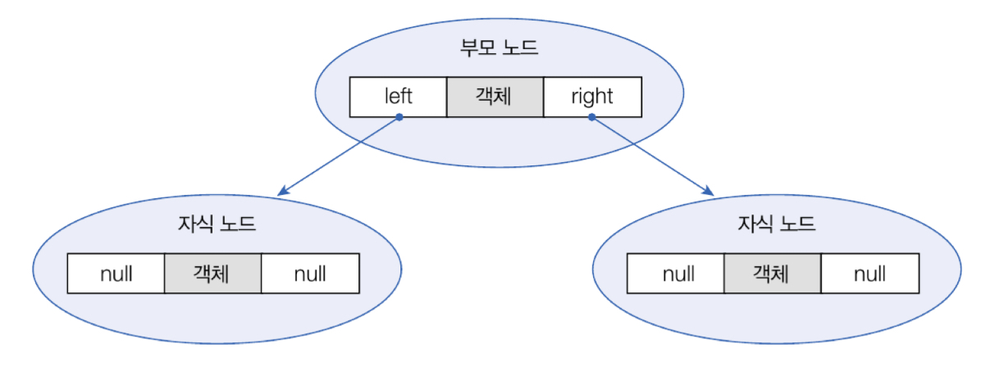
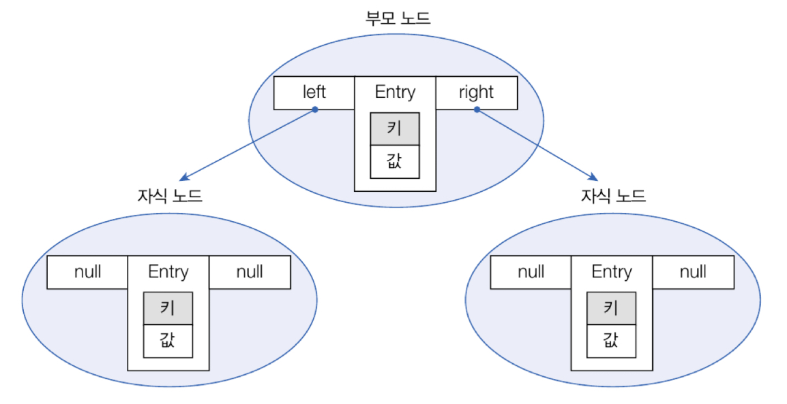
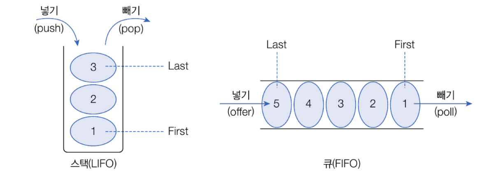

## 컬렉션 프레임워크

> `컬렉션 프레임워크(Collection Framework)`란 자료구조(Data Structure)를 바탕으로 객체들을 효율적으로 추가, 삭제, 검색할 수 있도록 관련된 인터페이스와 클래스들을 말한다. 이들은 java.util 패키지에 포함시켜져 있다.

| 인터페이스 분류          | 특징                                   | 구현 클래스                                  |
| ----------------- | ------------------------------------ | --------------------------------------- |
| Collection - List | - 순서를 유지하고 저장<br>- 중복 저장 가능          | ArrayList, Vector, LinkedList           |
| Collection - Set  | - 순서를 유지하지 않고 저장<br>- 중복 저장 안됨       | HashSet, TreeSet                        |
| Map               | - 키와 값으로 구성된 엔트리 저장<br>- 키는 중복 저장 안됨 | HashMap, Hashtable, TreeMap, Properties |


## List 컬렉션

> List 컬렉션은 객체를 인덱스로 관리하기 때문에 객체를 저장하면 인덱스가 부여되고 인덱스로 객체를 검색, 삭제할 수 있는 기능을 제공한다.

- List는 객체 저장시 객체 자체가 아니라 객체의 번지를 저장한다. 동일 객체도 중복 저장이 가능하고, 이경우에 동일한 번지가 저장된다. `null`도 저장이 가능하다.

| 기능    | 메소드                            | 설명                      |
| ----- | ------------------------------ | ----------------------- |
| 객체 추가 | boolean add(E e)               | 주어진 객체를 맨 끝에 추가         |
|       | void add(int index, E element) | 주어진 인덱스에 객체를 추가         |
|       | set(int index, E element)      | 주어진 인덱스의 객체를 새로운 객체로 바꿈 |
| 객체 검색 | boolean contains(Object o)     | 주어진 객체가 저장되어 있는지 여부     |
|       | E get(int index)               | 주어진 인덱스에 저장된 객체를 리턴     |
|       | isEmpty()                      | 컬렉션이 비어 있는지 조사          |
|       | int size()                     | 저장되어 있는 저체 객체 수를 리턴     |
| 객체 삭제 | void clear()                   | 저장된 모든 객체를 삭제           |
|       | E remove(int index)            | 주어진 인덱스에 저장된 객체를 삭제     |
|       | boolean remove(Object o)       | 주어진 객체를 삭제              |

### ArrayList

- 갯수 제한없이 객체를 추가할 수 있다.
- 타입 파라미터 `E`에는 저장하고 싶은 객체의 타입을 작성하면된다. List에 지정한 객체 타입과 동일하다면 ArrayList<>와 같이 객체 타입을 생략할 수도 있다. 객체 타입을 모두 생략하면 모든 종류의 객체를 저장할 수 있다.
```java
List<E> list = new ArrayList<E>();   // E에 지정된 타입의 객체만 저장
List<E> list = new ArrayList<>();    // E에 지정된 타입의 객체만 저장
List list = new ArrayList();         // 모든 타입의 객체를 저장
```

- ArrayList 컬렉션에 객체를 추가하면 인덱스 0부터 차례대로 추가된다. 특정 인덱스를 제거하거나 추가하면 바로 뒤 인덱스부터 마지막 인덱스까지 모두 아픙로 1씩 당겨진거나 밀려난다.
- 따라서 객체 삭제와 삽입이 빈번한 곳에서는 ArrayList를 사용하는 것이 바람직하지 않다. 이런 경우에는 `LinkedList`를 사용하는 것이 좋다.

- ArrayList로 객체 추가, 검색, 삭제하는 예시
`Board.java`
```java
package collection.arrayListEx1;  
  
import lombok.AllArgsConstructor;  
import lombok.Data;  
  
@Data   
@AllArgsConstructor  
public class Board {  
    private String subject;  
    private String content;  
    private String writer;  
  
}
```
`ArrayListExample.java`
```java
package collection.arrayListEx1;  
  
import java.util.ArrayList;  
import java.util.List;  
  
public class ArrayListExample {  
    public static void main(String[] args) {  
        //ArrayList 컬렉션 생성  
        List<Board> list = new ArrayList<>();  
  
        //객체 추가  
        list.add(new Board("제목1", "내용1", "글쓴이1"));  
        list.add(new Board("제목2", "내용2", "글쓴이2"));  
        list.add(new Board("제목3", "내용3", "글쓴이3"));  
        list.add(new Board("제목4", "내용4", "글쓴이4"));  
        list.add(new Board("제목5", "내용5", "글쓴이5"));  
  
        //저장된 총 객체 수 얻기  
        int size = list.size();  
        System.out.println("총 객체 수 " + size);  
        System.out.println();  
  
        //특정 인데스의 객체 가져오기  
        Board board = list.get(2);  
        System.out.println(board.getSubject() + "\t" + board.getContent() + "\t" + board.getWriter());  
        System.out.println();  
  
        //모든 객체를 하나씩 가져오기  
        for (int i = 0; i < list.size(); i++) {  
            Board b = list.get(i);  
            System.out.println(b.getSubject() + "\t" + b.getContent() + "\t" + b.getWriter());  
        }  
        System.out.println();  
  
        //객체 삭제  
        list.remove(2);  
        list.remove(2);  
  
        //향상된 for 문으로 모든 객체를 하나씩 가져오기  
        for (Board b: list ) {  
            System.out.println(b.getSubject() + "\t" + b.getContent() + "\t" + b.getWriter());  
        }  
    }  
}
```
`[실행결과]`
```
총 객체 수 5

제목3	내용3	글쓴이3

제목1	내용1	글쓴이1
제목2	내용2	글쓴이2
제목3	내용3	글쓴이3
제목4	내용4	글쓴이4
제목5	내용5	글쓴이5

제목1	내용1	글쓴이1
제목2	내용2	글쓴이2
제목5	내용5	글쓴이5

```


### Vector

> ArrayList와 동일한 내부 구조를 가지고 있다. 차이점은 Vector는 동기화된(synchronized) 메소드로 구성되어 있기 때문에 멀티 스레드가 동시에 Vector() 메소드를 실행할 수 없다는 것이다. - 멀티 스레드 환경에서는 안전하게 객체를 추가 또는 삭제할 수 있다.

```java
List<E> list = new Vector<E>();   // E에 지정된 타입의 객체만 저장
List<E> list = new Vector<>();    // E에 지정된 타입의 객체만 저장
List list = new Vector();         // 모든 타입의 객체를 저장
```

- ThreadA와 ThreadB에서 동시에 Board 객체를 Vector에 각각 1000개씩 추가한 후, 전체 저장된 수를 출력하는 예제
`VectorExample.java`
```java
package collection.vectorEx1;  
  
import collection.arrayListEx1.Board;  
  
import java.util.List;  
import java.util.Vector;  
  
public class VecotrExample {  
    public static void main(String[] args) {  
        //Vector 컬렉션 생성  
        List<Board> list = new Vector<>();  
  
        //작업 스레드 객체 생성  
        Thread threadA = new Thread() {  
            @Override  
            public void run(){  
                //객체 1000개 추가  
                for(int i=1; i<=1000; i++){  
                    list.add(new Board("제목" + i, "내용" + i, "글쓴이" + i));  
                }  
            }  
        };  
  
        //작업 스레드 객체 생성  
        Thread threadB = new Thread() {  
            @Override  
            public void run(){  
                //객체 1000개 추가  
                for(int i=1; i<=1000; i++){  
                    list.add(new Board("제목" + i, "내용" + i, "글쓴이" + i));  
                }  
            }  
        };  
  
        //작업 스레드 실행  
        threadA.start();  
        threadB.start();  
  
        //작업 스레드들이 모두 종료될 때까지 메인 스레드를 기다리게 함  
        try{  
            threadA.join();  
            threadB.join();  
        }catch (Exception e){}  
  
        //저장된 총 객체 수 얻기  
        int size = list.size();  
        System.out.println("총 객체 수 : " + size);  
        System.out.println();  
    }  
}
```
`[실행결과]`
```
총 객체 수 : 2000
```

⇒ List 객체를 ArrayList로 바꾸면 에러가 발생한다. 이유는 ArrayList는 두 스레드가 동시에 add() 메소드를 호출할 수 있기 땜누에 경합이 발생해 결국은 하나만 저장되기 때문이다. 반면 Vector의 add()는 동기화 메소드이므로 한 번에 하나의 스레드만 실행할 수 있어 경합니다. 발생하지 않는다.


### LinkedList

LinkedList는 ArrayList와 사용 방법은 동일하지만 내부 구조는 완전히 다르다. ArrayList는 내부 배열에 객체를 저장하지만, LinkedList는 인접 객체를 체인처럼 연결해서 관리한다.

LinkedList는 특정 위치에서 객체를 삽입하거나 삭제하면 바로 앞뒤 링크만 변경하면 되므로 빈번한 객체 삭제와 삽입이 일어나는 곳에서 ArrayList보다 좋은 성능을 발휘한다.

```java
List<E> list = new LinkedList<E>();   // E에 지정된 타입의 객체만 저장
List<E> list = new LinkedList<>();    // E에 지정된 타입의 객체만 저장
List list = new LinkedList();         // 모든 타입의 객체를 저장
```

- 다음 예제는 ArrayList와 LinkedList에 10000개의 객체를 삽입하는데 걸린 시간을 측정한 것이다.
`LinkedListExample.java`
```java
package collection.listEx1;  
  
import java.util.ArrayList;  
import java.util.LinkedList;  
import java.util.List;  
  
public class LinkedListExample {  
    public static void main(String[] args) {  
        //ArrayList 컬렉션 객체 생성  
        List<String> list1 = new ArrayList<>();  
  
        //LinkedList 컬렉션 객체 생성  
        List<String> list2 = new LinkedList<>();  
  
        //시작 시간과 끝 시간을 저장할 변수 선언  
        long startTime;  
        long endTime;  
  
        //ArrayList 컬렉션에 저장하는 시간 측정  
        startTime = System.nanoTime();  
        for (int i = 0; i < 10000; i++) {  
            list1.add(0, String.valueOf(i));  
        }  
  
        endTime = System.nanoTime();  
        System.out.printf("%-17s %8d ns \n", "ArrayList 걸린 시간: ", (endTime - startTime));  
  
  
        //LinkedList 컬렉션에 저장하는 시간 측정  
        startTime = System.nanoTime();  
        for (int i = 0; i < 10000; i++) {  
            list2.add(0, String.valueOf(i));  
        }  
        endTime = System.nanoTime();  
        System.out.printf("%-17s %8d ns \n", "LinkedList 걸린 시간: ", (endTime - startTime));  
  
    }  
}
```
`[실행결과]`
```
ArrayList 걸린 시간:   7973333 ns 
LinkedList 걸린 시간:   1213000 ns 
```
⇒ LinkedList가 훨씬 빠르다. 이유는 ArrayList는 0번 인덱스에 저장하면서 기존 객체의 인덱스를 한 칸씩 뒤로 미는 작업을 하기 때문이다.

<br>

## Set 컬렉션

> List는 순서를 유지하지만, Set 컬렉션은 저장 순서가 유지되지 않는다. 또한 객체를 중복해서 저장할 수 없고, 하나의 null만 저장할 수 있다. - Set 컬렉션은 수학에서 집합과 유사하다. 집합은 순서와 상관없고 중복이 허용되지 않는다.

Set 컬렉션에는 `HashSet`, `LinkedHashSet`, `TreeSet`등이 있다.

| 기능    | 메소드                        | 설명                                              |
| ----- | -------------------------- | ----------------------------------------------- |
| 객체추가  | boolean add(E e)           | 주어진 객체를 성공적으로 저장하면 true를 리턴하고<br>중복 객체면 false리턴 |
| 객체 검색 | boolean contains(Object o) | 주어진 객체가 저장되어 있는지 여부                             |
|       | isEmpty()                  | 컬렉션이 비어 있는지 조사                                  |
|       | Iterator<E> iterator()     | 저장된 객체를 한 번씩 가져오는 반복자 리턴                        |
|       | int size()                 | 저장되어 있는 전체 객체 수 리턴                              |
| 객체 삭제 | void clear()               | 저장된 모든 객체를 삭제                                   |
|       | boolean remove(Object o)   | 주어진 객체를 삭제                                      |

### HashSet

```java
Set<E> set = new HashSet<E>();   //E에 지정된 타입의 객체만 저장
Set<E> set = new HashSet<>();   //E에 지정된 타입의 객체만 저장
Set set = new HashSet();         //모든 타입의 객체를 저장
```

- HashSet은 동일한 객체는 중복 저장하지 않는다. 여기서 동일한 객체는 동등 객체를 말한다.
- 동등 객체는 `hashCode()` 메소드의 리턴값이 같고, `equals()` 메소드가 true를 리턴하면 동일한 객체라고 판단하고 중복 저장하지 않는다.

- 다음은 같은 문자열을 갖는 String  객체는 동등한 객체로 간주하는 HashSet예시이다.
`HashSetExample.java`
```java
package collection.listEx1;  
  
import java.util.HashSet;  
import java.util.Set;  
  
public class HashSetExample {  
    public static void main(String[] args) {  
        //HashSet 컬렉션 생성  
        Set<String> set = new HashSet<>();  
  
        //객체 저장  
        set.add("Java");  
        set.add("JDBC");  
        set.add("JSP");  
        set.add("Java");   // 중복 객체이므로 저장하지 않음  
        set.add("Spring");  
  
        //저장된 객체 수 출력  
        int size = set.size();  
        System.out.println("총 객체 수 = " + size);  
    }  
}
```
`[실행결과]`
```
총 객체 수 = 4
```

- 다음은 이름과 나이가 동일할 경우 Member 객체를 HashSet에 중복 저장하지 않는 예시이다. Member클래스 선언시 이름과 나이가 동일하다면 동일한 해시코드가 리턴되도록 `hashCode()`를 재정의하고, `equals()`메소드가 true를 리턴하도록 재정의했기 때문이다.
`Member.java`
```java
package collection.listEx1;  
  
import lombok.AllArgsConstructor;  
import lombok.Data;  
  
@Data  
@AllArgsConstructor  
public class Member {  
    public String name;  
    public int age;  
      
    //hashCode 재정의  
    @Override  
    public int hashCode(){  
        return name.hashCode() + age;  
    }  
  
    //equals 재정의  
    @Override  
    public boolean equals(Object obj) {  
        if (obj instanceof Member target) {  
            return target.name.equals(name) && (target.age == age);  
        }else{  
            return false;  
        }  
    }  
}
```
`HashSetExample1.java`
```java
package collection.listEx1;  
  
import java.util.HashSet;  
import java.util.Set;  
  
public class HashSetExample1 {  
    public static void main(String[] args) {  
        //HashSet 컬렉션 생성  
        Set<Member> set = new HashSet<>();  
          
        //Member 객체 저장  
        set.add(new Member("홍길동", 30));  
        set.add(new Member("홍길동", 30));  
          
        // 저장된 객체 수 출력  
        System.out.println("총 객체 수: " + set.size());  
    }  
}
```
`[실행결과]`
```
총 객체 수: 1
```


- Set 컬렉션은 인덱스로 객체를 검색해서 가져오는 메소드가 없다. 대신 객체를 한 개씩 반복해서 가져와야하는데 두가지 방법이 있다.
1. for 문 이용
	```java
	Set<E> set = new HashSet<>();
	for(E e : set){
		...
	}
	```
2. iterator() 메소드로 반복자(iterator)를 얻어 객체를 하나씩 가져오는 것.
	```java
	Set<E> set = new HashSet<>();
	Iterator<E> iterator = set.iterator();
	```
	- iterator는 Set 컬렉션의 객체를 가져오거나 제거하기 위해 다음 메소드를 제공한다.

| 리턴 타입   | 메소드명      | 설명                                      |
| ------- | --------- | --------------------------------------- |
| boolean | hasNext() | 가져올 객체가 있으면 true를 리턴하고 없으면 false를 리턴한다. |
| E       | next()    | 컬렉션에서 하나의 객체를 가져온다.                     |
| void    | remove()  | next()로 가져온 객체를 Set 컬렉션에서 제거한다.         |

- `hasNext()`메소드로 가져올 객체가 있는지 먼저 확인하고, true를 리턴할 때만 next() 메소드로 객체를 가져온다. 만약 next()로 가져온 객체를 컬렉션에서 제거하고 싶다면 remove() 메소드를 사용한다.
`HashSetExample2.java`
```java
package collection.listEx1;  
  
import java.util.HashSet;  
import java.util.Iterator;  
import java.util.Set;  
  
public class HashSetExample2 {  
    public static void main(String[] args) {  
        //HashSet 컬렉션 생성  
        Set<String> set = new HashSet<String>();  
  
        //객체 추가  
        set.add("Java");  
        set.add("JDBC");  
        set.add("JSP");  
        set.add("Spring");  
  
        //객체를 하나씩 가져와서 처리  
        Iterator<String> iterator = set.iterator();  
        while (iterator.hasNext()) {  
            //객체를 하나 가져오기  
            String element = iterator.next();  
            System.out.println(element);  
            if (element.equals("JSP")) {  
                //가져온 객체를 컬렉션에서 제거  
                iterator.remove();  
            }  
        }  
        System.out.println();  
  
        //객체 제거  
        set.remove("JDBC");  
  
        //객체를 하나씩 가져와서 처리  
        for (String element:set) {  
            System.out.println(element);  
        }  
    }  
}
```
`[실행결과]`
```
Java
JSP
JDBC
Spring

Java
Spring
```

<br>

## Map 컬렉션

>Map 컬렉션은 키(key)와 값(value)으로 구성된 엔트리(Entry)객체를 저장한다. 여기서 키와 값은 모두 객체이다. 키는 중복 저장할 수 없지만, 값은 중복 저장할 수 있다. 기존에 저장된 키와 동일한 키로 값을 저장하면 기존의 값은 없어지고 새로운 값으로 대치된다. 

Map 컬렉션에는 `HashMap`, `Hashtable`, `LinkedHashMap`, `Properties`, `TreeMap`등이 있다.
K는 키의 타입, V는 값의 타입이다.

| 기능    | 메소드                                 | 설명                                             |
| ----- | ----------------------------------- | ---------------------------------------------- |
| 객체 추가 | V put(K key,V value)                | 주어진 키와 값을 추가, 저장이 되면 값을 리턴                     |
| 객체 검색 | boolean containsKey(Object key)     | 주어진 키가 있는지 여부                                  |
|       | boolean containsValue(Object value) | 주어진 값이 있는지 여부                                  |
|       | Set<Map.Entry<K.V>> entrySet()      | 키와 값의 쌍으로 구성된 모든 Map.Entry 객체를 <br>Set에 담아서 리턴 |
|       | V get(Object key)                   | 주어진 키의 값을 리턴                                   |
|       | boolean isEmpty()                   | 컬렉션이 비어있는지 여부                                  |
|       | Set<K> keySet()                     | 모든 키를 Set 객체에 담아서 리턴                           |
|       | int size()                          | 저장된 키의 총 수를 리턴                                 |
|       | Collection<V> values()              | 저장된 모든 값 Collection에 담아서 리턴                    |
| 객체 삭제 | void clear()                        | 모든 Map.Entry(키와 값)를 삭제                         |
|       | V remove(Object key)                | 주어진 키와 일치하는 Map.Entry 삭제, <br>삭제가 되면 값을 리턴     |


### HashMap

>HashMap은 키로 사용할 객체가 hashCode() 메소드의 리턴값이 같고 equals() 메소드가 true를 리턴할 경우, 동일 키로 보고 중복 저장을 허용하지 않는다.

```java
Map<String, Integer> map = new HashMap<String, Integer>();
Map<String, Integer> map = new HashMap<>();
Map map = new HashMap();    
// 모든 타입의 키와 객체를 저장할 수 있도록 생략 가능하지만 이런 경우는 거의 없다.
```

- 다음은 이름을 키로 점수를 값으로 저장하는 HashMap 예시이다.
`HashMapExample1.java`
```java
package collection.listEx1;  
  
import java.util.HashMap;  
import java.util.Iterator;  
import java.util.Map;  
import java.util.Map.Entry;  
import java.util.Set;  
  
public class HashMapExample1 {  
    public static void main(String[] args) {  
        //Map 컬렉션 생성  
        Map<String, Integer> map = new HashMap<>();  
  
        //객체 저장  
        map.put("가나다", 85);  
        map.put("홍길동", 90);  
        map.put("동장군", 80);  
        map.put("홍길동", 95);  
        System.out.println("총 Entry 수:  " + map.size());  
        System.out.println();  
  
        //키로 값 얻기  
        String key = "홍길동";  
        int value = map.get(key);  
        System.out.println(key + ": " + map.get("홍길동"));  
        System.out.println();  
  
  
        //키 Set 컬렉션을 얻고, 반복해서 키와 값을 얻기  
        Set<String> keySet = map.keySet();  
        Iterator<String> keyIterator = keySet.iterator();  
        while (keyIterator.hasNext()) {  
            String k = keyIterator.next();  
            Integer v = map.get(key);  
            System.out.println(k + " : " + v);  
        }  
        System.out.println();  
  
        //엔트리 Set 컬렉션을 얻고, 반복해서 키와 값을 얻기  
        Set<Entry<String, Integer>> entrySet = map.entrySet();  
        Iterator<Entry<String, Integer>> entryIterator = entrySet.iterator();  
        while (entryIterator.hasNext()) {  
            Entry<String, Integer> entry = entryIterator.next();  
            String k = entry.getKey();  
            Integer v = entry.getValue();  
            System.out.println(k + " :  " + v);  
        }  
        System.out.println();  
  
        //키로 엔트리 삭제  
        map.remove("홍길동");  
        System.out.println("총 Entry 수: " + map.size());  
        System.out.println();  
    }  
}
```
`[실행결과]`
```
총 Entry 수:  3

홍길동: 95

홍길동 : 95
가나다 : 95
동장군 : 95

홍길동 :  95
가나다 :  85
동장군 :  80

총 Entry 수: 2

```


### Hashtable

> HashMap과 동일한 내부 구조를 가지고 있음.
> 동기화된(synchronized) 메소드로 구서되어 있기 때문에 멀티 스레드가 동시에 Hashtable 메소드들을 실행할 수 없어서 멀티 스레드 환경에서도 안전하게 객체를 추가, 삭제 할 수 있다.

- 생성방법
```java
Map<String, Integer> map = new Hashtable<String, Integer>();
Map<String, Integer> map = new Hashtable<>();
Map map = new Hashtable();
```

-  ThreadA와 ThreadB에서 동시에 각각 100개씩 엔트리를 Hashtable에 추가한 후 , 전체 저장된 수를 출력하는 예제
`HashtableExample.java`
```java
package collection.listEx1;  
  
import java.util.HashMap;  
import java.util.Hashtable;  
import java.util.Map;  
  
public class HashtableExample {  
    public static void main(String[] args) {  
        //Hashtable 컬렉션 생성  
        Map<String, Integer> map = new Hashtable<>();  
  
        //작업 스레드 객체 생성  
        Thread threadA = new Thread(){  
            @Override  
            public void run(){  
                //엔트리 1000개 추가  
                for (int i = 1; i <= 1000; i++) {  
                    map.put(String.valueOf(i), i);  
                }  
            }  
        };  
  
        //작업 스레드 객체 생성  
        Thread threadB = new Thread(){  
            @Override  
            public void run(){  
                //엔트리 1000개 추가  
                for (int i = 1001; i <= 2000; i++) {  
                    map.put(String.valueOf(i), i);  
                }  
            }  
        };  
  
        //작업 스레드 실행  
        threadA.start();  
        threadB.start();  
  
        //작업 스레드들이 모두 종료될 때까지 메인 스레드를 기다리게 함  
        try {  
            threadA.join();  
            threadB.join();  
        } catch (Exception e) {  
        }  
  
        //저장된 총 엔트리 수 얻기  
        int size = map.size();  
        System.out.println("총 엔트리 수: " + size);  
        System.out.println();  
    }  
}
```
`[실행결과]`
```
총 엔트리 수: 2000
```

⇒ 위 예제에서 `Hashtable` 대시 `HashMap`을 사용하는 경우 에러가 나거나 2000개가 나오지 않을 수 있다. `HashMap`은 두 스레드가 동시에 `put()` 메소드를 호출할 수 있기 때문에 경합이 발생하고 결국은 하나만 저장되기 때문이다. 반면 `Hashtable`의 `put()`은 동기화 메소드이므로 한 번에 하나의 스레드만 실행할 수 있어 경합이 발생하지 않는다.

### Properties

> `Properties`는 Hashtable의 자식 클래스여서 Hashtable의 특징을 그대로 가지고 있다.
> `Properties`는 키와 값을 `String 타입`으로 제한한 컬렉션이다. `Properties`는 주로 확장자가 `.properties`인 프로퍼티 파일을 읽을 때 사용한다.

- 프로퍼티 파일은 키와 값이 `=` 기호로 연결되어 있는 텍스트 파일을 말한다.
- 일반 텍스트 파일과 다르게 `ISO 8859-1`문자셋으로 저장되며, 한글일 경우 `\u+유니코드`로 표현되어 저장된다.
`database.properties`
```properties
driver=oracle.jdbc.OracleDriver  
url=jdbc:orcle:thin:@localhost:1521:orcl  
username=scott  
password=tiger  
admin=\uD64D\uAE38\uB3D9
```
`Properties`를 사용하면 위와 같은 프로퍼티 파일의 내용을 코드에서 쉽게 읽을 수 있다.
먼저 `Propeties`객체를 생성하고, `load()` 메소드로 프로퍼티 파일의 내용을 메모리로 로드한다.
```java
Properties properties = new Properties();
properties.load(Xxx.class.getResourceAsStream("database.properties"));
```
일반적으로 프로퍼티 파일은 (~.class)들과 함께 저장된다. 따라서 클래스 파일을 기준으로 상대 경로를 이용해서 읽는 것이 편리하다. Class 객체의 `getResourceAsStream()` 메소드는 주어진 상대 경로의 리소스 파일을 읽는 `InputStream`을 리턴한다.

`PropertiesExample.java`
```java
package collection.listEx1;  
  
import java.util.Properties;  
  
public class PropertiesExample {  
    public static void main(String[] args) throws Exception{  
        //Properties 컬렉션 생성  
        Properties properties = new Properties();  
  
        //PropertiesExample.class와 동일한 ClassPath에 있는 database.properties파일 로드  
        properties.load(PropertiesExample.class.getResourceAsStream("database.properties"));  
  
        //주어진 키에 대한 값 읽기  
        String driver = properties.getProperty("driver");  
        String url = properties.getProperty("url");  
        String username = properties.getProperty("username");  
        String password = properties.getProperty("password");  
        String admin = properties.getProperty("admin");  
  
        //값 출력  
        System.out.println("driver = " + driver);  
        System.out.println("url = " + url);  
        System.out.println("username = " + username);  
        System.out.println("password = " + password);  
        System.out.println("admin = " + admin);  
    }  
}
```
`[실행결과]`
```
driver = oracle.jdbc.OracleDriver
url = jdbc:orcle:thin:@localhost:1521:orcl
username = scott
password = tiger
admin = 홍길동
```


<br>

## 검색 기능을 강화시킨 컬렉션

> 컬렉션 프레임워크는 검색 기능을 강화시킨 `TreeSet`과 `TreeMap`을 제공한다. `TreeSet`은 `Set`
컬렉션이고, `TreeMap`은 `Map`컬렉션이다.

### TreeSet

> `TreeSet`은 이진 트리(binary tree)를 기반으로 한 Set 컬렉션이다. 

`이진 트리`는 여러 개의 노드(node)가 트리 형태로 연결된 구조로, 루트 노드(root node)라고 불리는 하나의 노드에서 시작해서 각 노드에 최대 2개의 노드를 연결할  수 있는 구조를 가지고 있다.

`TreeSet`에 객체를 저장하면 부모 노드의 객체와 비교해서 낮은 것은 왼쪽 자식 노드에, 높은 것은 오른쪽 자식 노드에 자동 정렬되어 저장된다.



- TreeSet 컬렉션 생성 방법
```java
TreeSet<E> treeSet = new TreeSet<E>();
TreeSet<E> treeSet = new TreeSet<>();
```

Set 타입 변수에 대입해도 되지만 검색 관련 메소드가 TreeSet에만 정의되어 있다.

- TreeSet이 가지고 있는 검색 관련 메소드

| 리턴타입              | 메소드                                                                                                        | 설명                                                                                            |
| ----------------- | ---------------------------------------------------------------------------------------------------------- | --------------------------------------------------------------------------------------------- |
| E                 | first()                                                                                                    | 제일 낮은 객체를 리턴                                                                                  |
| E                 | last()                                                                                                     | 제일 높은 객체를 리턴                                                                                  |
| E                 | lower(E e)                                                                                                 | 주어진 객체보다 바로 아래 객체를 리턴                                                                         |
| E                 | higher(E e)                                                                                                | 주어진 객체보다 바로 위 객체를 리턴                                                                          |
| E                 | floor(E e)                                                                                                 | 주어진 객체와 동등한 객체가 있으면 리턴, 만약 <br>없다면 주어진 객체의 바로 아래의 객체를 리턴                                      |
| E                 | ceiling(E e)                                                                                               | 주어진 객체와 동등한 객체가 있으면 리턴, 만약 <br>없다면 주어진 객체의 바로 위의 객체를 리턴                                       |
| E                 | pollFirst()                                                                                                | 제일 낮은 객체를 꺼내오고 컬렉션에서 제거함                                                                      |
| E                 | pollLast()                                                                                                 | 제일 높은 객체를 꺼내오고 컬렉션에서 제거함                                                                      |
| Iterator\<E\>     | descendingIterator()                                                                                       | 내림차순으로 정렬된 Iterator를 리턴                                                                       |
| NavigableSet\<E\> | descendingSet()                                                                                            | 내림차순으로 정렬된 NavigableSet을 리턴                                                                   |
| NavigableSet\<E\> | headSet(<br>   E toElement,<br>   boolean inclusive<br>)                                                   | 주어진 객체보다 낮은 객체들은 <br>NavigableSet으로 리턴,<br>주어진 객체 포함 여부는 <br>두 번쨰 매개값에 따라 달라짐                 |
| NavigableSet\<E\> | tailSet(<br>   E fromElement,<br>   boolean inclusive<br>)                                                 | 주어진 객체보다 높은 객체들은 <br>NavigableSet으로 리턴,<br>주어진 객체 포함 여부는 <br>두 번쨰 매개값에 따라 달라짐                 |
| NavigableSet\<E\> | subSet(<br>   E fromElement,<br>   boolean frominclusive,<br>   E toElement,<br>   boolean tonclusive<br>) | 시작과 끝으로 주어진 객체 사이의 <br>객체들을 NavigableSet으로 리턴,<br>시작과 끝 객체의 포함 여부는 두 번째, <br>네 번째 매개값에 따라 달라짐 |
무작위로 저장한 점수 검색하는 방법

`TreeSetExample.java`
```java
package collection.listEx1;  
  
import java.util.NavigableSet;  
import java.util.TreeSet;  
  
public class TreeSetExample {  
    public static void main(String[] args) {  
        //TreeSet 컬렉션 생성  
        TreeSet<Integer> scores = new TreeSet<>();  
  
        //Integer 객체 저장  
        scores.add(87);  
        scores.add(98);  
        scores.add(75);  
        scores.add(95);  
        scores.add(80);  
  
        //정렬된 Integer 객체를 하나씩 가져오기  
        for (Integer s : scores) {  
            System.out.print(s + " ");  
        }  
        System.out.println("\n");  
  
        //특정 Integer 객체를 가져오기  
        System.out.println("가장 낮은 점수 = " + scores.first());  
        System.out.println("가장 높은 점수 = " + scores.last());  
        System.out.println("95점 아래 점수 = " + scores.lower(95));  
        System.out.println("95점 위의 점수 = " + scores.higher(95));  
        System.out.println("95점이거나 바로 아래 점수 = " + scores.floor(95));  
        System.out.println("85점이거나 바로 위의 점수 = " + scores.ceiling(85) + "\n");  
  
        //내림차순으로 정렬하기  
        NavigableSet<Integer> descendingScores = scores.descendingSet();  
        for (Integer s:descendingScores) {  
            System.out.print(s + " ");  
        }  
        System.out.println("\n");  
  
        //범위 검색( 80<=)  
        NavigableSet<Integer> rangeSet = scores.tailSet(80, true);  
        for (Integer s :  
                rangeSet) {  
            System.out.print(s + " ");  
        }  
        System.out.println("\n");  
  
        //범위 검색( 80 <= score <90)  
        rangeSet = scores.subSet(80, true, 90, false);  
        for (Integer s :  
                rangeSet) {  
            System.out.print(s + " ");  
        }  
    }  
}
```
`[실행결과]`
```
75 80 87 95 98 

가장 낮은 점수 = 75
가장 높은 점수 = 98
95점 아래 점수 = 87
95점 위의 점수 = 98
95점이거나 바로 아래 점수 = 95
85점이거나 바로 위의 점수 = 87

98 95 87 80 75 

80 87 95 98 

80 87 
```


### TreeMap

> `TreeMap`은 이진 트리를 기반으로 한 `Map` 컬렉션이다. `TreeSet`과 차이점은 키와 값이 저장된 Entry를 저장한다는 점이다.

`TreeMap`에 엔트리를 저장하면 키를 기준으로 자동 정렬되는데, 부모키 값과 비교해서 낮은 것은 왼쪽, 높은 것은 오른쪽 자식 노드에 Entry 객체를 저장한다.



- `TreeMap` 컬렉션 생성 방법
```java
TreeMap<K, V> = new TreeMap<K, V>();
TreeMap<K, V> = new TreeMap<>();
```

`TreeMap`도 `TreeSet`과 마찬가지로 `Map` 타입 변수에 저장해도 되지만 검색 관련 메소드가 `TreeMap`에만 정의되어 있어서 `TreeMap` 타입 변수에 저장한다.

| 리턴타입              | 메소드                                                                                          | 설명                                                                                                                                                             |
| --------------------- | ----------------------------------------------------------------------------------------------- | ---------------------------------------------------------------------------------------------------------------------------------------------------------------- |
| Map.Entry<K,V>        | firstEntry()                                                                                    | 제일 낮은 Map.Entry를 리턴                                                                                                                                       |
| Map.Entry<K,V><br>    | lastEntry()                                                                                     | 제일 높은 Map.Entry를 리턴                                                                                                                                       |
| Map.Entry<K,V><br>    | lowerEntry(K key)                                                                               | 주어진 키보다 바로 아래 Map.Entry를 리턴                                                                                                                         |
| Map.Entry<K,V><br>    | higherEntry(K key)                                                                              | 주어진 키보다 바로 위 Map.Entry를 리턴                                                                                                                           |
| Map.Entry<K,V><br>    | floorEntry(K key)                                                                               | 주어진 키와 동등한 키가 있으면 해당 <br>Map.Entry를 리턴, 없다면 주어진 키 <br>바로 아래의 Map.Entry를 리턴                                                      |
| Map.Entry<K,V><br>    | ceilingEntry(K key)                                                                             | 주어진 키와 동등한 키가 있으면 해당<br>Map.Entry를 리턴, 없다면 주어진 키<br>바로 위의 Map.Entry를 리턴                                                          |
| Map.Entry<K,V><br>    | pollFirstEnstry()                                                                               | 제일 낮은 Map.Entry를 꺼내오고 컬렉션<br>에서 제거함                                                                                                             |
| Map.Entry<K,V><br>    | pollLastEntry()                                                                                 | 제일 높은 Map.Entry를 꺼내오고 컬렉션<br>에서 제거함                                                                                                             |
| NavigableSet<K>       | descendingKeySet()                                                                              | 내림차순으로 정렬된 키의 NavigableSet을 리턴                                                                                                                     |
| NavigableMap<K,V>     | descendingMap()                                                                                 | 내림차순으로 정렬된 Map.Entry의 <br>NavigableMap을 리턴                                                                                                          |
| NavigableMap<K,V><br> | headMap(<br>  K toKey,<br>  boolean inclusive<br>)                                              | 주어진 키보다 낮은 Map.Entry들을 <br>NavigableMap으로 리턴, 주어진 키의 <br>Map.Entry 포함 여부는 두 번째 매개값에<br>따라 달라짐                                |
| NavigableMap<K,V><br> | tailMap(<br>  K fromKey,<br>  boolean inclusive<br>)                                            | 주어진 객체보다 높은 Map.Entry들을<br>NavigableSet으로 리턴, 주어진 객체 포함<br>여부는 두 번째 매개값에 따라 달라짐                                             |
| NavigableMap<K,V>     | subMap(<br>  K fromKey,<br>  boolean fromInclusive,<br>  K toKey,<br>  boolean toInclusive<br>) | 시작과 끝으로 주어진 키 사이의 Map.Entry<br>들을 NavigableMap컬렉션으로 반환, 시작과<br>끝 키의 Map.Entry 포함 여부는 두 번째, <br>네 번째 매개값에 따라 달라짐. |

영어 단어와 페이지 번호를 무작위로 저장하고 검색하는 방법을 보여주는 예제
`TreeMapExample.java`
```java
package collection.listEx1;  
  
import com.sun.source.doctree.SeeTree;  
  
import java.util.Map;  
import java.util.Map.Entry;  
import java.util.NavigableMap;  
import java.util.Set;  
import java.util.TreeMap;  
  
public class TreeMapExample {  
    public static void main(String[] args) {  
        //TreeMap 컬렉션 생성  
        TreeMap<String, Integer> treeMap = new TreeMap<>();  
  
        //엔트리 저장  
        treeMap.put("apple", 10);  
        treeMap.put("forever", 60);  
        treeMap.put("description", 40);  
        treeMap.put("ever", 50);  
        treeMap.put("zoo", 80);  
        treeMap.put("base", 20);  
        treeMap.put("guess", 70);  
        treeMap.put("cherry", 30);  
  
        //정렬된 엔트리를 하나씩 가져오기  
        Set<Entry<String, Integer>> entrySet = treeMap.entrySet();  
        for (Entry<String, Integer> entry :  
                entrySet) {  
            System.out.println(entry.getKey() + "-" + entry.getValue());  
        }  
        System.out.println();  
  
        //특정 키에 대한 값 가져오기  
        Entry<String, Integer> entry = null;  
        entry = treeMap.firstEntry();  
        System.out.println("제일 앞 단어: " + entry.getKey() + "-" + entry.getValue());  
        entry = treeMap.lastEntry();  
        System.out.println("제일 뒤 단어: " + entry.getKey() + "-" + entry.getValue());  
        entry = treeMap.lowerEntry("ever");  
        System.out.println("ever 앞 단어: " + entry.getKey() + "-" + entry.getValue() + "\n");  
  
        //내림차순으로 정렬하기  
        NavigableMap<String, Integer> descendingMap = treeMap.descendingMap();  
        Set<Entry<String, Integer>> descendingEntrySet = descendingMap.entrySet();  
        for (Entry<String, Integer> e :  
                descendingEntrySet) {  
            System.out.println(e.getKey() + "-" + e.getValue());  
        }  
        System.out.println();  
  
        //범위 검색  
        System.out.println("[c~h 사이의 단어 검색]");  
        NavigableMap<String, Integer> rangeMap = treeMap.subMap("c", true, "h", false);  
        for (Entry<String, Integer> e :  
                rangeMap.entrySet()) {  
            System.out.println(e.getKey() + "-" + e.getValue());  
        }  
    }  
}
```
`[실행결과]`
```
apple-10
base-20
cherry-30
description-40
ever-50
forever-60
guess-70
zoo-80

제일 앞 단어: apple-10
제일 뒤 단어: zoo-80
ever 앞 단어: description-40

zoo-80
guess-70
forever-60
ever-50
description-40
cherry-30
base-20
apple-10

[c~h 사이의 단어 검색]
cherry-30
description-40
ever-50
forever-60
guess-70
```


### Comparable과 Comparator

>`TreeSet`에 저장되는 객체와 `TreeMap`에 저장되는 키 객체는 저장과 동시에 오름차순으로 정렬되는데, 어떤 객체든 정렬될 수 있는 것은 아니고 객체가 `Comparable` 인터페이스를 구현하고 있어야 가능하다.

Integer, Double, String 타입은 모두 `Comparable`을 구현하고 있다.
다만, 사용자 정의 객체를 저장할 때에는 반드시 `Comparable`을 구현하고 있어야 한다.

| 리턴 타입 | 메소드            | 설명                                                             |
| ----- | -------------- | -------------------------------------------------------------- |
| int   | compareTo(T o) | 주어진 객체와 같으면 0을 리턴<br>주어진 객체보다 적으면 음수를 리턴<br>주어진 객체보다 크면 양수를 리턴 |

나이를 기준으로 Person 객체를 오름차순으로 정렬하기 위해 `Comparable` 인터페이스를 구현한 예제이다. 나이가 적으면 -1을, 같으면 0을, 크면 1을 리턴하도록 compareTo() 메소드를 재정의하였다.
`Person.java`
```java
package collection.ex2;  
  
public class Person implements Comparable<Person>{  
    public String name;  
    public int age;  
  
    public Person(String name, int age) {  
        this.name = name;  
        this.age = age;  
    }  
  
  
    @Override  
    public int compareTo(Person o) {  
        if(age<o.age) return -1;  
        else if(age == o.age) return 0;  
        else return 1;  
    }  
}
```
`ComparableExample.java`
```java
package collection.ex2;  
  
import java.util.TreeSet;  
  
public class ComparableExample {  
    public static void main(String[] args) {  
        //TreeSet 컬렉션 생성  
        TreeSet<Person> treeSet = new TreeSet<Person>();  
  
        //객체 저장  
        treeSet.add(new Person("홍길동", 45));  
        treeSet.add(new Person("김자바", 25));  
        treeSet.add(new Person("박지원", 31));  
  
        //객체를 하나씩 가져오기  
        for (Person person :  
                treeSet) {  
            System.out.println(person.name + ":" + person.age);  
        }  
    }  
}
```
`[실행결과]`
```
김자바:25
박지원:31
홍길동:45
```

비교 기능이 있는 `Comparable` 구현 객체를 `TreeSet`에 저장하거나 `TreeMap`의 키로 저장하는 것이 원칙이지만, 비교 기능이 없는 `Comparable` 비구현 객체를 저장하고 싶다면  `TreeSet`과 `TreeMap`을 생성할 때 비교자(`Comparator`)를 같이 제공하면 된다.
```java
TreeSet<E> treeSet = new TreeSet<E>(new ComparatorImpl());
TreeMap<E> treeMap = new TreeMap<K,V>(new ComparatorImpl());
```

비교자(`Comparator`)는 `Comparator` 인터페이스를 구현한 객체를 말한다.
`Comparator` 인터페이스에는 `compare()` 메소드가 정의되어 있다. 이 메소드를 재정의해서 비교 결과를 정수 값으로 리턴하면 된다.

| 리턴타입 | 메소드                 | 설명                                                                            |
| ---- | ------------------- | ----------------------------------------------------------------------------- |
| int  | compare(T o1, T o2) | o1과 o2가 동등하다면 0을 리턴<br>o1과 o2보다 앞에 오게 하려면 음수를 리턴<br>o1이 o2보다 뒤에 오게 하려면 양수를 리턴 |

`Comparable`을 구현하고 있지 않은 Fruit 객체를 TreeSet에 저장하는 예제이다. TreeSet을 생성할 때 비교자가 필요한데, FruitComparator를 비교자로 사용해 가격 기준으로 Fruit 객체를 정렬시킨다.
`Fruit.java`
```java
package collection.ex2;  
  
public class Fruit {  
    public String name;  
    public int price;  
  
    public Fruit(String name, int price) {  
        this.name = name;  
        this.price = price;  
    }  
}
```
`FruitComparator.java`
```java
package collection.ex2;  
  
import java.util.Comparator;  
  
public class FruitComparator implements Comparator<Fruit> {  
  
  
    @Override  
    public int compare(Fruit o1, Fruit o2) {  
        if(o1.price < o2.price) return -1;  
        else if(o1.price == o2.price) return 0;  
        else return 1;  
    }  
}
```
`ComparableExample1.java`
```java
package collection.ex2;  
  
import java.util.TreeSet;  
  
public class ComparableExample1 {  
    public static void main(String[] args) {  
        //비교자를 제공한 TreeSet 컬렉션 생성  
        TreeSet<Fruit> treeSet = new TreeSet<Fruit>(new FruitComparator());  
  
        //객체 저장  
        treeSet.add(new Fruit("포도", 3000));  
        treeSet.add(new Fruit("수박", 10000));  
        treeSet.add(new Fruit("딸기", 6000));  
  
        //객체를 하나씩 가져오기  
        for (Fruit fruit :  
                treeSet) {  
            System.out.println(fruit.name +":"+fruit.price);  
        }  
    }  
}
```
`[실행결과]`
```
포도:3000
딸기:6000
수박:10000
```


<br>

## LIFO와 FIFO 컬렉션

> 후입선출(LIFO, Last In First Out) : 나중에 넣은 객체가 먼저 빠져나가는 구조. - 스택(Stack) : JVM 스택 메모리
> 선입선출(FIFO, First In First Out) : 먼저 넣은 객체가 먼저 빠져나가는 구조. - 큐(Queue) : 스레드풀




### Stack

>`Stack` 클래스는 LIFO 자료구조를 구현한 클래스이다.

```java
Stack<E> stack = new Stack<E>();
Stack<E> stack = new Stack<>();
```

| 리턴타입 | 메소드          | 설명              |
| ---- | ------------ | --------------- |
| E    | push(E item) | 주어진 객체를 스택에 넣는다 |
| E    | pop()        | 스택의 맨 위 객체를 빼낸다 |

동전 케이스를 Stack 클래스로 구현한 예제이다. 동전 케이스는 위에만 오픈되어 있어 스택 구조를 가지고 있다. 먼저 넣은 동전은 제일 밑에 깔리고 나중에 넣은 동전이 위에 쌓여 나중에 넣은 동전부터 빼낼 수 있다.
`Coin.java`
```java
package collection.ex3;  
  
public class Coin {  
    private int value;  
  
    public Coin(int value) {  
        this.value = value;  
    }  
  
    public int getValue() {  
        return value;  
    }  
}
```
`StackExample.java`
```java
package collection.ex3;  
  
import java.util.Stack;  
  
public class StackExample {  
    public static void main(String[] args) {  
        //Stack 컬렉션 생성  
        Stack<Coin> coinBox = new Stack<Coin>();  
          
        //동전 넣기  
        coinBox.push(new Coin(100));  
        coinBox.push(new Coin(50));  
        coinBox.push(new Coin(500));  
        coinBox.push(new Coin(10));  
          
        //동전을 하나씩 꺼내기  
        while (!coinBox.isEmpty()) {  
            Coin coin = coinBox.pop();  
            System.out.println("꺼내온 동전 : " + coin.getValue() + "원");  
        }  
    }  
}
```
`[실행결과]`
```
꺼내온 동전 : 10원
꺼내온 동전 : 500원
꺼내온 동전 : 50원
꺼내온 동전 : 100원
```


### Queue

> `Queue` 인터페이스는 FIFO 자료구조에서 사용되는 메소드를 정의하고 있다.

| 리턴타입    | 메소드        | 설명             |
| ------- | ---------- | -------------- |
| boolean | offer(E e) | 주어진 객체를 큐에 넣는다 |
| E       | poll()     | 큐에서 객체를 빼낸다    |

`Queue` 인터페이스를 구현한 대표적인 클래스는 `LinkenList`이다.
```java
Queue<E> queue = new LinkedList<E>();
Queue<E> queue = new LinkedList<>();
```

`Queue`를 이용해서 간단한 메시지 큐를 구현한 예제이다. 먼저 넣은 메시지가 반대쪽으로 먼저 나오기 때문에 넣은 순서대로 메시지가 처리된다.
`Message.java`
```java
package collection.ex3;  
  
public class Message {  
    public String command;  
    public String to;  
  
    public Message(String command, String to) {  
        this.command = command;  
        this.to = to;  
    }  
}
```
`QueueExample.java`
```java
package collection.ex3;  
  
import java.util.LinkedList;  
import java.util.Queue;  
  
public class QueueExample {  
    public static void main(String[] args) {  
        //Queue 컬렉션 생성  
        Queue<Message> messageQueue = new LinkedList<>();  
          
        //메시지 넣기  
        messageQueue.offer(new Message("sendMail", "홍길동"));  
        messageQueue.offer(new Message("sendSMS", "김자바"));  
        messageQueue.offer(new Message("sendKakaotalk", "파이썬"));  
          
        //메시지를 하나씩 꺼내어 처리  
        while (!messageQueue.isEmpty()) {  
            Message message = messageQueue.poll();  
            switch (message.command) {  
                case "sendMail":  
                    System.out.println(message.to + "님에게 메일을 보냅니다.");  
                    break;  
                case "sendSMS":  
                    System.out.println(message.to + "님에게 SMS을 보냅니다.");  
                    break;  
                case "sendKakaotalk":  
                    System.out.println(message.to + "님에게 카카오톡을 보냅니다.");  
                    break;  
                      
            }  
        }  
    }  
}
```
`[실행결과]`
```
홍길동님에게 메일을 보냅니다.
김자바님에게 SMS을 보냅니다.
파이썬님에게 카카오톡을 보냅니다.

```


<br>

## 동기화된 컬렉션

컬렉션 프레임워크의 대부분의 클래스들은 싱글 스레드 환경에서 사용할 수 있도록 설계되었다.
⇾ 여러 스레드가 동시에 컬렉션에 접근한다면 의도하지 않게 요소가 변경될 수 있는 불안전한 상태가 된다.

> `Vector`, `Hashtable`은 동기화된(synchronized) 메소드로 구성되어 있기 때문에 멀티 스레드 환경에서 안전하게 요소를 처리할 수 있다.
> `ArrayList`, `HashSet`, `HashMap`은 동기화된 메소드로 구성되어 있지 않아 멀티 스레드 환경에서 안전하지 않다.

`ArrayList`, `HashSet`, `HashMap`를 멀티 스레드 환경에서 사용하고 싶을 때는 Collection의 `synchronizedXXX()`메소드를 사용한다. `synchronizedXXX()` 메소드는 비동기화된 메소드를 동기화된 메소드로 래핑해준다.

| 리턴 타입     | 메소드(매개변수)                       | 설명                  |
| --------- | ------------------------------- | ------------------- |
| List\<T>  | synchronizedList(List\<T> list) | List를 동기화된 List로 리턴 |
| Map<K, V> | synchronizedMap(Map<K, V> m)    | Map을 동기화된 Map으로 리턴  |
| Set\<T>   | synchronizedSet(Set\<T> s)      | Set을 동기화된 Set으로 리턴  |

위 메소드들은 매개변수로 비동기화된 컬렉션을 대입하면 동기화된 컬렉션을 리턴한다.

다음 예제는 `ThreadA`와 `ThreadB`에서 동시에 Board 객체를 HashMap에 각각 1000개씩 추가한 후 전체 저장된 수를 출력하는 예제이다.

`SynchronizedMapExample.java`
```java
import java.util.Collections;  
import java.util.HashMap;  
import java.util.Map;  
import java.util.NavigableMap;  
  
public class SynchronizedMapExample {  
    public static void main(String[] args) {  
        //Map컬렉션 생성  
        Map<Integer, String> map = Collections.synchronizedMap(new HashMap<Integer, String>()); //2000개  
//        Map<Integer, String> map = new HashMap<Integer, String>();  // 1997개  
  
        //작업 스레드 객체 생성  
        Thread threadA = new Thread() {  
            @Override  
            public void run() {  
                //객체 1000개 추가  
                for (int i = 1; i <= 1000; i++) {  
                    map.put(i, "내용" + i);  
                }  
            }  
        };  
  
        //작업 스레드 객체 생성  
        Thread threadB = new Thread() {  
            @Override  
            public void run() {  
                //객체 1000개 추가  
                for (int i = 1001; i <= 2000; i++) {  
                    map.put(i, "내용" + i);  
                }  
            }  
        };  
  
        //작업 스레드 실행  
        threadA.start();  
        threadB.start();  
  
        //작업 스레드들이 모두 종료될 때까지 메인 스레드를 기다리게 함  
        try {  
            threadA.join();  
            threadB.join();  
        } catch (Exception e) {  
        }  
  
        //저장된 총 객체 수 얻기  
        int size = map.size();  
        System.out.println("총 객체 수: " + size);  
        System.out.println();  
    }  
}
```

`[실행결과]`
```
총 객체 수: 2000
```

`synchronizedMap()`메소드 없이 `new HashMap<>()`으로 수정하면 실행결과는 2000개가 나오지 않는다. `HashMap`은 두 스레드가 동시에 put()메소드를 호출할 수 있기 때문에 경합이 발생하고 결국 하나만 저장된다. 하지만 동기화된 Map은 한 번에 하나의 스레드만 put()메소드를 호출할 수 있기 때문에 경합이 발생하지 않는다.

<br>

## 수정할 수 없는 컬렉션

> 수정할 수 없는(unmodifiable) 컬렉션이란 요소를 추가, 삭제할 수 없는 컬렉션을 말한다.

**방법1) `List`, `Set`, `Map` 인터페이스의 정적 메소드인 `of()`** 

```java
List<E> immutableList = List.of(E... elements);
Set<E> immutableSet = Set.of(E... elemetns);
Map<K,V> immutableMap = Map.of(K k1, V v1, K k2, V v2, ...);
```

**방법2) `List`, `Set`, `Map` 인터페이스의 정적 메소드인 `copyOf()`를 이용해 기존 컬렉션을 보사 수정할 수 없는 컬렉션으로 만듦**

```java
List<E> immutableList = List.copyOf(Collection<E> coll);
Set<E> immutableSet = Set.copyOf(Collection<E> coll);
Map<K,V> immutableMap = Map.copyOf(Map<K,V> map);
```

**방법3) 배열로부터 수정할 수 없는 `List` 컬렉션 만듦**

```java
String[] arr = {"A", "B", "C"};
List<String> immutableList = Arrays.asList(arr);
```

다음 예제는 수정할 수 없는 컬렉션을 생성하는 다양한 방법을 보여준다.

`ImutableExample.java`
```java
import java.util.*;  
  
public class ImutableExample {  
    public static void main(String[] args) {  
        //List 불변 컬렉션 생성  
        List<String> immutableList1 = List.of("A", "B", "C");  
        //immutableList1.add("D");  
  
        //Set 불변 컬렉션 생성  
        Set<String> immutableSet1 = Set.of("A", "B", "C");  
//        immutableSet1.remove("A");  
        //Map 불변 컬렉션 생성  
        Map<Integer, String> immutableMap1 = Map.of(  
                1, "A",  
                2, "B",  
                3, "C"  
        );  
//        immutableMap1.put(4, "D");  
  
        //List 컬렉션을 불변 컬렉션으로 복사  
        List<String> list = new ArrayList<>();  
        list.add("A");  
        list.add("B");  
        list.add("C");  
        List<String> immutableList2 = List.copyOf(list);  
          
        //Set 컬렉션을 불변 컬렉션으로 복사  
        Set<String> set = new HashSet<>();  
        set.add("A");  
        set.add("B");  
        set.add("C");  
        Set<String> immutableSet2 = Set.copyOf(set);  
          
        //Map 컬렉션을 불변 컬렉션으로 복사  
        Map<Integer, String> map = new HashMap<>();  
        map.put(1, "A");  
        map.put(2, "B");  
        map.put(3, "C");  
        Map<Integer, String> immutableMap2 = Map.copyOf(map);  
          
        //배열로부터 List 불변 컬렉션 생성  
        String[] arr = {"A", "B", "C"};  
        List<String> immutableList3 = Arrays.asList(arr);  
    }  
}
```


