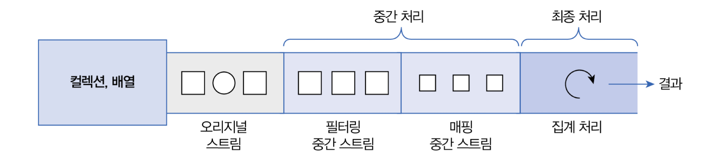
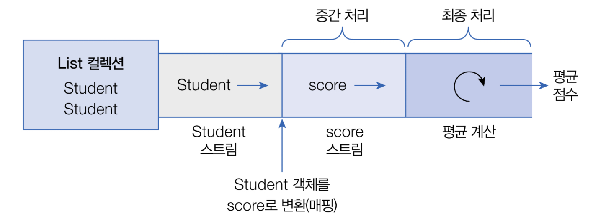
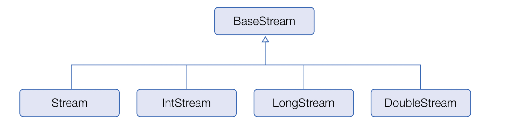

## 스트림이란

> 스트림은 요소들이 하나씩 흘러가면서 처리된다는 의미이다.

Java 8부터는 컬렉션 및 배열의 요소를 반복 처리하기 위해 스트림(Stream)을 사용할 수 있다.

다음은 List컬렉션에서 요소를 반목처리하기 위해 스트림을 사용한 것이다.
```java
Stream<String> stream = list.stream();
stream.forEach( item -> //item 처리);
```
List 컬렉션의 `stream()` 메스드로 Stream 객체를 얻고, `forEach()` 메소드로 요소를 어떻게 처리할지를 람다식으로 제공한다.

다음은 Set 컬렉션의 요소를 하나씩 읽고 출력하기 위해 스트림을 사용한 것이다.
`StreamExample.java`
```java
import java.util.HashSet;  
import java.util.Set;  
import java.util.stream.Stream;  
  
public class StreamExample {  
    public static void main(String[] args) {  
        //Set 컬렉션 생성  
        Set<String> set = new HashSet<>();  
        set.add("홍길동");  
        set.add("감자바");  
        set.add("오인용");  
  
        //Stream을 이용한 요소 반복 처리  
        Stream<String> stream = set.stream();  
        stream.forEach(name -> System.out.println(name));  
    }  
}
```
`[실행결과]`
```java
홍길동
오인용
감자바
```

- `Stream`과 `Iterator`의 차이점
	1) 내부 반복자이므로 처리 속도가 빠르고 병렬 처리에 효율적이다.
	2) 람다식으로 다양한 요소 처리를 정의할 수 있다.
	3) 중간 처리와 최종 처리를 수행하도록 파이프 라인을 형성할 수 있다.

<br>

## 내부 반복자

> for 문과 Iterator는 컬렉션의 요소를 컬렉션 바깥쪽으로 반복해서 가져와 처리하는데, 이것을 외부 반복자라고 한다. 반면 스트림은 요소 처리 방법을 컬렉션 내부로 주입시켜서 요소를 반복 처리하는데, 이것을 내부 반복자라고 부른다.

외부 반복자일 경우, 컬렉션의 요소를 외부로 가져오는 코드와 처리하는 코드를 모두 개발자 코드가 가지고 있어야한다.
반면 내부 반복자일 경우, 개발자 코드에서 제공한 데이터 처리 코드(람다식)를 가지고 컬렉션 내부에서 요소를 반복 처리한다.

내부 반복자는 멀티 코어 CPU를 최대한 활용하기 위해 요소들을 분배시켜 병렬 작업을 할 수 있다. 하나씩 처리하는 순차적 외부 반복자보다는 효율적으로 요소를 반복시킬 수 있는 장점이 있다.

다음은 List컬렉션을 내부 반복자를 이용해서 병렬 처리하는 예제이다. `parallelStream()` 메소드로 병렬 처리 스트림을 얻고, forEach() 메소드를 호출할 때 요소 처리 방법인 람다식을 제공한다.
`ParallelStramExample.java`
```java
import java.util.ArrayList;  
import java.util.List;  
import java.util.stream.Stream;  
  
public class ParallelStramExample {  
    public static void main(String[] args) {  
        //List 컬렉션 생성  
        List<String> list = new ArrayList<>();  
        list.add("홍길동");  
        list.add("김자바");  
        list.add("람다식");  
        list.add("길동아");  
        list.add("스트림");  
  
        //병렬 처리  
        Stream<String> parallelStream = list.parallelStream();  
        parallelStream.forEach(name -> {  
            System.out.println(name + ": " + Thread.currentThread().getName());  
        });  
    }  
}
```
`[실행결과]`
```
김자바: ForkJoinPool.commonPool-worker-1
스트림: ForkJoinPool.commonPool-worker-2
람다식: main
길동아: ForkJoinPool.commonPool-worker-4
홍길동: ForkJoinPool.commonPool-worker-3
```

<br>

## 중간 처리와 최종 처리

스트림은 하나 이상 연결될 수 있다. 컬렉션의 오리지널 스트림 뒤에 필터링 중간 스트림이 연결될 수 있고, 그 뒤에 매핑 중간 스트림이 연결될 수 있다. 이와 같이 스트림이 연결되어 있는 것을 `스트림 파이프라인(pipelines)`이라고 한다.

오리지널 스트림과 집계 처리 사이의 중간 스트림들은 최종 처리를 위해 요소를 걸러내거나(필터링), 요소를 변환시키거나(매핑), 정렬하는 작업을 수행한다. 최종 처리는 중간 처리에서 정제된 요소들을 반복하거나, 집계(카운팅, 총합, 평균) 작업을 수행한다.

다음은 Student 객체를 요소로 가지는 컬렉션에서 Student 스트림을 얻고, 중간 처리를 통해 score 스트림으로 변환한 후 최종 집계 처리로 score 평균을 구하는 과정이다.

이를 코드로 표현하면
```java
//Student 스트림
Stream<Student> studentStream = list.stream();
//score 스트림
IntStream scoreStream = studentStream.mapToInt( student -> student.getScore() );
//평균 계산
double avg = scoreStream.average().getAsDouble();
```
`mapToInt()` 메소드는 객체를 int 값으로 매핑해서 `IntStream`으로 변환시킨다. 어떤 객체를 어떤 int값으로 매핑할 것인지는 람다식으로 제공해야 한다. `IntStream`은 최종 처리를 위해 다양한 메소드를 제공하는데, `average()` 메소드는 요소들의 평균 값을 계산한다.
```java
double avg = list.stream()
	.mapToInt(student -> student.getScore())
	.average()
	.getAsDouble();
```

스트림 파이프라인으로 구성할 때 주의할 점은 파이프라인의 맨 끝에는 반드시 최종 처리 부분이 있어야 한다는 것이다. 최종 처리가 없다면 오리지널 및 중간 처리 스트림은 동작하지 않는다. 즉, 위 코드에서 `average()` 이하를 생략하면 `stream()`, `mapToInt()`는 동작하지 않는다.
`Student.java`
```java
public class Student {  
    private String name;  
    private int score;  
  
    public Student(String name, int score) {  
        this.name = name;  
        this.score = score;  
    }  
  
    public String getName() {  
        return name;  
    }  
  
    public int getScore() {  
        return score;  
    }  
}
```
`StreamPipLineExample.java`
```java
import java.util.Arrays;  
import java.util.List;  
  
public class StreamPipLineExample {  
    public static void main(String[] args) {  
        List<Student> list = Arrays.asList(  
                new Student("홍길동", 10),  
                new Student("김자바", 20),  
                new Student("옥수수", 30)  
        );  
  
        //방법1  
        /*        Stream<Student> studentStream = list.stream();        //중간 처리(학생 객체를 점수로 매핑)  
        IntStream scoreStream = studentStream.mapToInt(student -> student.getScore());        //최종 처리(평균 점수)  
        double avg = scoreStream.average().getAsDouble();         */  
        //방법2  
        double avg = list.stream()  
                .mapToInt(student -> student.getScore())  
                .average()  
                .getAsDouble();  
        System.out.println("평균 점수 = " + avg);  
    }  
}
```
`[실행결과]`
```
평균 점수 = 20.0
```

<br>

## 리소스로부터 스트림 얻기

`java.util.stream` 패키지에는 스트림 인터페이스들이 있다. `BaseStream` 인터페이스를 부모로 한 자식 인터페이스들로 상속 관계를 이루고 있다.

`BaseStream`에는 모든 스트림에서 사용할 수 있는 공통 메소드들이 정의되어 있다. 
`Stream`은 객체 요소를 처리하는 스트림이고, `IntStream`, `LongStream`, `DoubleStream`은 각각 기본 타입인 `int`, `long`, `double` 요소를 처리하는 스트림이다.




