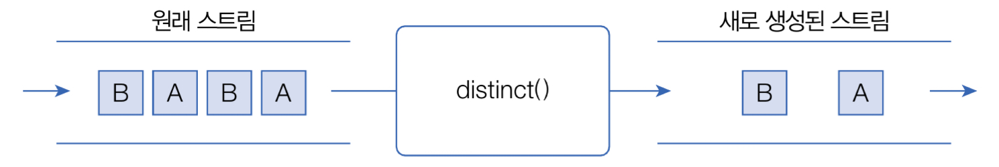
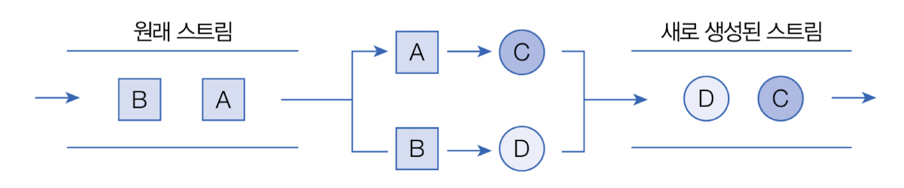

## 스트림이란

> 스트림은 요소들이 하나씩 흘러가면서 처리된다는 의미이다.

Java 8부터는 컬렉션 및 배열의 요소를 반복 처리하기 위해 스트림(Stream)을 사용할 수 있다.

다음은 List컬렉션에서 요소를 반목처리하기 위해 스트림을 사용한 것이다.
```java
Stream<String> stream = list.stream();
stream.forEach( item -> //item 처리);
```
List 컬렉션의 `stream()` 메스드로 Stream 객체를 얻고, `forEach()` 메소드로 요소를 어떻게 처리할지를 람다식으로 제공한다.

다음은 Set 컬렉션의 요소를 하나씩 읽고 출력하기 위해 스트림을 사용한 것이다.
`StreamExample.java`
```java
import java.util.HashSet;  
import java.util.Set;  
import java.util.stream.Stream;  
  
public class StreamExample {  
    public static void main(String[] args) {  
        //Set 컬렉션 생성  
        Set<String> set = new HashSet<>();  
        set.add("홍길동");  
        set.add("감자바");  
        set.add("오인용");  
  
        //Stream을 이용한 요소 반복 처리  
        Stream<String> stream = set.stream();  
        stream.forEach(name -> System.out.println(name));  
    }  
}
```
`[실행결과]`
```java
홍길동
오인용
감자바
```

- `Stream`과 `Iterator`의 차이점
	1) 내부 반복자이므로 처리 속도가 빠르고 병렬 처리에 효율적이다.
	2) 람다식으로 다양한 요소 처리를 정의할 수 있다.
	3) 중간 처리와 최종 처리를 수행하도록 파이프 라인을 형성할 수 있다.


<br>

## 내부 반복자

> for 문과 Iterator는 컬렉션의 요소를 컬렉션 바깥쪽으로 반복해서 가져와 처리하는데, 이것을 외부 반복자라고 한다. 반면 스트림은 요소 처리 방법을 컬렉션 내부로 주입시켜서 요소를 반복 처리하는데, 이것을 내부 반복자라고 부른다.

외부 반복자일 경우, 컬렉션의 요소를 외부로 가져오는 코드와 처리하는 코드를 모두 개발자 코드가 가지고 있어야한다.
반면 내부 반복자일 경우, 개발자 코드에서 제공한 데이터 처리 코드(람다식)를 가지고 컬렉션 내부에서 요소를 반복 처리한다.

내부 반복자는 멀티 코어 CPU를 최대한 활용하기 위해 요소들을 분배시켜 병렬 작업을 할 수 있다. 하나씩 처리하는 순차적 외부 반복자보다는 효율적으로 요소를 반복시킬 수 있는 장점이 있다.

다음은 List컬렉션을 내부 반복자를 이용해서 병렬 처리하는 예제이다. `parallelStream()` 메소드로 병렬 처리 스트림을 얻고, forEach() 메소드를 호출할 때 요소 처리 방법인 람다식을 제공한다.
`ParallelStramExample.java`
```java
import java.util.ArrayList;  
import java.util.List;  
import java.util.stream.Stream;  
  
public class ParallelStramExample {  
    public static void main(String[] args) {  
        //List 컬렉션 생성  
        List<String> list = new ArrayList<>();  
        list.add("홍길동");  
        list.add("김자바");  
        list.add("람다식");  
        list.add("길동아");  
        list.add("스트림");  
  
        //병렬 처리  
        Stream<String> parallelStream = list.parallelStream();  
        parallelStream.forEach(name -> {  
            System.out.println(name + ": " + Thread.currentThread().getName());  
        });  
    }  
}
```
`[실행결과]`
```
김자바: ForkJoinPool.commonPool-worker-1
스트림: ForkJoinPool.commonPool-worker-2
람다식: main
길동아: ForkJoinPool.commonPool-worker-4
홍길동: ForkJoinPool.commonPool-worker-3
```

<br>

## 중간 처리와 최종 처리

스트림은 하나 이상 연결될 수 있다. 컬렉션의 오리지널 스트림 뒤에 필터링 중간 스트림이 연결될 수 있고, 그 뒤에 매핑 중간 스트림이 연결될 수 있다. 이와 같이 스트림이 연결되어 있는 것을 `스트림 파이프라인(pipelines)`이라고 한다.

오리지널 스트림과 집계 처리 사이의 중간 스트림들은 최종 처리를 위해 요소를 걸러내거나(필터링), 요소를 변환시키거나(매핑), 정렬하는 작업을 수행한다. 최종 처리는 중간 처리에서 정제된 요소들을 반복하거나, 집계(카운팅, 총합, 평균) 작업을 수행한다.

다음은 Student 객체를 요소로 가지는 컬렉션에서 Student 스트림을 얻고, 중간 처리를 통해 score 스트림으로 변환한 후 최종 집계 처리로 score 평균을 구하는 과정이다.

이를 코드로 표현하면
```java
//Student 스트림
Stream<Student> studentStream = list.stream();
//score 스트림
IntStream scoreStream = studentStream.mapToInt( student -> student.getScore() );
//평균 계산
double avg = scoreStream.average().getAsDouble();
```
`mapToInt()` 메소드는 객체를 int 값으로 매핑해서 `IntStream`으로 변환시킨다. 어떤 객체를 어떤 int값으로 매핑할 것인지는 람다식으로 제공해야 한다. `IntStream`은 최종 처리를 위해 다양한 메소드를 제공하는데, `average()` 메소드는 요소들의 평균 값을 계산한다.
```java
double avg = list.stream()
	.mapToInt(student -> student.getScore())
	.average()
	.getAsDouble();
```

스트림 파이프라인으로 구성할 때 주의할 점은 파이프라인의 맨 끝에는 반드시 최종 처리 부분이 있어야 한다는 것이다. 최종 처리가 없다면 오리지널 및 중간 처리 스트림은 동작하지 않는다. 즉, 위 코드에서 `average()` 이하를 생략하면 `stream()`, `mapToInt()`는 동작하지 않는다.
`Student.java`
```java
public class Student {  
    private String name;  
    private int score;  
  
    public Student(String name, int score) {  
        this.name = name;  
        this.score = score;  
    }  
  
    public String getName() {  
        return name;  
    }  
  
    public int getScore() {  
        return score;  
    }  
}
```
`StreamPipLineExample.java`
```java
import java.util.Arrays;  
import java.util.List;  
  
public class StreamPipLineExample {  
    public static void main(String[] args) {  
        List<Student> list = Arrays.asList(  
                new Student("홍길동", 10),  
                new Student("김자바", 20),  
                new Student("옥수수", 30)  
        );  
  
        //방법1  
        /*        Stream<Student> studentStream = list.stream();        //중간 처리(학생 객체를 점수로 매핑)  
        IntStream scoreStream = studentStream.mapToInt(student -> student.getScore());        //최종 처리(평균 점수)  
        double avg = scoreStream.average().getAsDouble();         */  
        //방법2  
        double avg = list.stream()  
                .mapToInt(student -> student.getScore())  
                .average()  
                .getAsDouble();  
        System.out.println("평균 점수 = " + avg);  
    }  
}
```
`[실행결과]`
```
평균 점수 = 20.0
```

<br>

## 리소스로부터 스트림 얻기

`java.util.stream` 패키지에는 스트림 인터페이스들이 있다. `BaseStream` 인터페이스를 부모로 한 자식 인터페이스들로 상속 관계를 이루고 있다.

`BaseStream`에는 모든 스트림에서 사용할 수 있는 공통 메소드들이 정의되어 있다. 
`Stream`은 객체 요소를 처리하는 스트림이고, `IntStream`, `LongStream`, `DoubleStream`은 각각 기본 타입인 `int`, `long`, `double` 요소를 처리하는 스트림이다.

| 리턴 타입                                                 | 메소드(매개변수)                                                                                                                                                                                                  | 소스                  |
| ----------------------------------------------------- | ---------------------------------------------------------------------------------------------------------------------------------------------------------------------------------------------------------- | ------------------- |
| Stream\<T>                                            | java.util.Collection.stream()<br>java.util.Collection.parallelStream()                                                                                                                                     | List 컬렉션<br>Set 컬렉션 |
| Stream\<T><br>IntStream<br>LongStream<br>DoubleStream | Arrays.stream(T[ ]),    Stream.of(T[ ])<br>Arrays.stream(int[ ]),     IntStream.of(int[ ])<br>Arrays.stream(long[ ]),    LongStream.of(long[ ])<br>Arrays.stream(double[ ]),    DoubleStream.of(double[ ]) | <br>배열              |
| IntStream                                             | IntStream.range(int, int)<br>IntStream.rangeClosed(int, int)                                                                                                                                               | int 범위              |
| LongStream                                            | LongStream.range(long, long)<br>LongStream.rangeClosed(long, long)                                                                                                                                         | long 범위             |
| Stream\<Path>                                         | Files.list(Path)                                                                                                                                                                                           | 디렉토리                |
| Stream\<String>                                       | Files.lines(Path, Charset)                                                                                                                                                                                 | 텍스트 파일              |
| DoubleStream<br>IntStream<br>LongStream               | Random.doubles(...)<br>Random.ints()<br>Random.longs()                                                                                                                                                     | <br>랜덤 수            |


### 컬렉션으로부터 스트림 얻기

`java.util.Collection`인터페이스는 스트림과 `parallelStream()` 메소드를 가지고 있기 때문에 자식 인터페이스인 List와 Set 인터페이스를 구현한 모든 컬렉션에서 객체 스트림을 얻을 수 있다.
다음은 List\<Product>컬렉션에서 Product 스트림을 얻는 방법이다.


`Product.java`
```java
public class Product {  
    private int pno;  
    private String name;  
    private String company;  
    private int price;  
  
    public Product(int pno, String name, String company, int price) {  
        this.pno = pno;  
        this.name = name;  
        this.company = company;  
        this.price = price;  
    }  
  
    public int getPno() {  
        return pno;  
    }  
  
    public String getName() {  
        return name;  
    }  
  
    public String getCompany() {  
        return company;  
    }  
  
    public int getPrice() {  
        return price;  
    }  
  
    @Override  
    public String toString() {  
        return new StringBuilder()  
                .append("{")  
                .append("pno:" + pno + ", ")  
                .append("name:" + name + ", ")  
                .append("company:" + company + ", ")  
                .append("price:" + price)  
                .append("}")  
                .toString();  
    }  
}
```
`StreamExample.java`
```java
import java.util.ArrayList;  
import java.util.stream.Stream;  
  
public class StreamExample {  
    public static void main(String[] args) {  
        //List 컬렉션 생성  
        ArrayList<Product> list = new ArrayList<>();  
        for (int i = 1; i <= 5; i++) {  
            Product product = new Product(i, "상품" + i, "멋진 회사", (int) (10000 * Math.random()));  
            list.add(product);  
        }  
  
        //객체 스트림 얻기  
        Stream<Product> stream = list.stream();  
        stream.forEach(p -> System.out.println(p));  
    }  
}
```
`[실행결과]`
```
{pno:1, name:상품1, company:멋진 회사, price:511}
{pno:2, name:상품2, company:멋진 회사, price:3418}
{pno:3, name:상품3, company:멋진 회사, price:7800}
{pno:4, name:상품4, company:멋진 회사, price:3086}
{pno:5, name:상품5, company:멋진 회사, price:580}
```


### 배열로부터 스트림 얻기

`java.util.Arrays`클래스를 이용하면 다양한 종류의 배열로부터 스트림을 얻을 수 있다.
다음은 문자열 배열과 정수 배열로부터 스트림을 얻는 방법이다.
`StreamExample.java`
```java
import java.util.Arrays;  
import java.util.stream.IntStream;  
import java.util.stream.Stream;  
  
public class StreamExample {  
    public static void main(String[] args) {  
        String[] strArray = {"홍길동", "가나다", "마바사"};  
        Stream<String> strStream = Arrays.stream(strArray);  
        strStream.forEach(item -> System.out.print(item + ","));  
        System.out.println();  
  
        int[] intArray = {1, 2, 3, 4, 5};  
        IntStream intStream = Arrays.stream(intArray);  
        intStream.forEach(item -> System.out.print(item + ","));  
        System.out.println();  
    }  
}
```
`[실행결과]`
```
홍길동,가나다,마바사,
1,2,3,4,5,
```


### 숫자 범위로부터 스트림 얻기

IntStream 또는 LongStream의 정적 메소드인 range()와 rangeClosed() 메소드를 이용하면 특정 범위의 정수 스트림을 얻을 수 있다. 첫 번째 매개값은 시작 수이고 두 번째 매개값은 끝 수 인데, 끝 수를 포함하지 않으면 `range()`, 포함하면 `rangeClosed()`를 사용한다.
`StreamExample.java`
```java
import java.util.stream.IntStream;  
  
public class StreamExample {  
    public static int sum;  
  
    public static void main(String[] args) {  
        IntStream stream = IntStream.rangeClosed(1, 100);  
        stream.forEach(a -> sum += a);  
        System.out.println("총합: "+ sum);  
    }  
}
```
`[실행결과]`
```
총합: 5050
```


### 파일로부터 스트림 얻기

`java.nio.file.Files`의 lines() 메소드를 이용하면 텍스트 파일의 행 단위 스크림을 얻을 수 있다. 
다음은 `data.txt` 파일을 한 행씩 읽고 상품 정보를 출력하기 위해 Files의 lines()메소드를 이용하는 방법이다. - 같은 패키지에 `data.txt`파일 저장
`StreamExample.java`
```java
import java.nio.charset.Charset;  
import java.nio.file.Files;  
import java.nio.file.Path;  
import java.nio.file.Paths;  
import java.util.stream.Stream;  
  
public class StreamExample {  
    public static void main(String[] args) throws Exception {  
        Path path = Paths.get(StreamExample.class.getResource("data.txt").toURI());  
        Stream<String> stream = Files.lines(path, Charset.defaultCharset());  
        stream.forEach(line -> System.out.println(line));  
        stream.close();  
    }  
}
```
`[실행결과]`
```
{pno:1, name:상품1, company:멋진 회사, price:511}
{pno:2, name:상품2, company:멋진 회사, price:3418}
{pno:3, name:상품3, company:멋진 회사, price:7800}
{pno:4, name:상품4, company:멋진 회사, price:3086}
{pno:5, name:상품5, company:멋진 회사, price:580}
```


<br>

## 요소 걸러내기(필터링)

> 필터링은 요소를 걸러내는 중간 처리 기능이다. 필터링 메소드에는 `distinct()`와 `filter()`가 있다.


| 리턴 타입                                             | 메소드(매개변수)                                                                                                           | 설명                                                                       |
| ------------------------------------------------- | ------------------------------------------------------------------------------------------------------------------- | ------------------------------------------------------------------------ |
| Stream<br>IntStream<br>LongStream<br>DoubleStream | distinct()<br><br>filter(Predicate\<T>)<br>filter(IntPredicate)<br>filter(LongPredicate)<br>filter(DoublePredicate) | - 중복 제거<br><br>- 조건 필터링<br>- 매개 타입은 요소타입에 따른<br>함수형 인터페이스이므로 람다식으로 작성 가능 |

`distinct()` 메서드는 요소의 중복을 제거한다. 객체 스트림(Stream)일 경우, `equals()` 메소드의 리턴값이 true이면 동일한 요소로 판단한다. IntStream, LongStream, DoubleStream은 같은 값일 경우 중복을 제거한다.



`filter()`메소드는 매개값으로 주어진 `Predicate`가 true를 리턴하는 요소만 필터링한다.


`Predicate`는 함수형 인터페이스이다.

| 인터페이스           | 추상 메소드                     | 설명           |
| --------------- | -------------------------- | ------------ |
| Predicate\<T>   | boolean test(T t)          | 객체 T를 조사     |
| IntPredicate    | boolean test(int value)    | int 값을 조사    |
| LongPredicate   | boolean test(long value)   | long 값을 조사   |
| DoublePredicate | boolean test(double value) | double 값을 조사 |

모든 `Predicate`는 매개값을 조사한 후 boolean을 리턴하는 `test()` 메소드를 가지고 있다.

```java
T -> { ... return true}
//또는
T -> true; // return 문만 있을 경우 중괄호와 return 키워드 생략 가능
```

다음은 이름 List에서 중복된 이름을 제거하고 출력하여 특정 성만 필터링해서 출력하는 예제이다.
`FilteringExample.java`
```java
import java.util.ArrayList;  
import java.util.List;  
  
public class FilteringExample {  
    public static void main(String[] args) {  
        //List 컬렉션 생성  
        List<String> list = new ArrayList<>();  
        list.add("홍길동");  
        list.add("홍홍홍");  
        list.add("가나다");  
        list.add("마바사");  
        list.add("홍길동");  
  
        //중복 요소 제거  
        list.stream()  
                .distinct()  
                .forEach(n -> System.out.println(n));  
        System.out.println();  
  
        //홍으로 시작하는 요소만 필터링  
        list.stream()  
                .filter(n -> n.startsWith("홍"))  
                .forEach(n -> System.out.println(n));  
        System.out.println();  
  
        //중복 요소를 먼저 제거하고, 홍으로 시작하는 요소만 필터링  
        list.stream()  
                .distinct()  
                .filter(n -> n.startsWith("홍"))  
                .forEach(n -> System.out.println(n));  
    }  
}
```
`[실행결과]`
```
홍길동
홍홍홍
가나다
마바사

홍길동
홍홍홍
홍길동

홍길동
홍홍홍
```


<br>

## 요소 변환(매핑)

> 매핑(mapping)은 스트림의 요소를 다른 요소로 변환하는 중간 처리 기능이다. 매핑 메소드는 `mapXxx()`, `asDoubleStream()`, `asLongStream()`, `boxed()`, `flatMapXxx()`등이 있다.

### 요소를 다른 요소로 변환

`mapXxx()`메소드는 요소를 다른 요소로 변환한 새로운 스트림을 리턴한다. 
다음 그림처럼 원래 스트림의 A 요소는 C 요소로, B 요소는 D 요소로 변환해서 C, D 요소를 가지는 새로운 스트림이 생성된다.


- `mapXxx()`메소드의 종류

| 리턴 타입                                                   | 메소드(매개변수)                                                                                                                                 | 요소 → 변환요소                                                      |
| ------------------------------------------------------- | ----------------------------------------------------------------------------------------------------------------------------------------- | -------------------------------------------------------------- |
| Stream\<R>                                              | map(Function\<T, R>)                                                                                                                      | T → R                                                          |
| IntStream<br>LongStream<br>DoubleStream                 | mapToInt(ToIntFunction\<T>)<br>mapToLong(ToLongFunction\<T>)<br>mapToDouble(ToDoubleFunction\<T>)                                         | T → int<br>T → long<br>T → double                              |
| <br>Stream\<U><br>                                      | mapToObj(IntFunction\<U>)<br>mapToObj(LongFunction\<U>)<br>mapToObj(DoubleFunction\<U>)                                                   | int → U<br>long → U<br>double → U                              |
| DoubleStream<br>DoubleStream<br>IntStream<br>LongStream | mapToDouble(IntToDoubleFunction)<br>mapToDouble(LongToDoubleFunction)<br>mapToInt(DoubleToIntFunction)<br>mapToLong(DoubleToLongFunction) | int → double<br>long → double<br>double → int<br>double → long |

- 매개타입인 `Function`(함수형 인터페이스) 종류

| 리턴 타입                | 메소드(매개변수)                        | 요소 → 변환 요소    |
| -------------------- | -------------------------------- | ------------- |
| Function\<T, R>      | R apply(T t)                     | T → R         |
| IntFunction\<R>      | R apply(int value)               | int → R       |
| LongFunction\<R>     | R apply(long value)              | long → R      |
| DoubleFunction\<R>   | R apply(double value)            | double → R    |
| ToIntFunction\<T>    | int applyAsInt(T value)          | T → int       |
| ToLongFunction\<T>   | long applyAsLong(T value)        | T → long      |
| ToDubleFunction\<T>  | double applyAsDouble(T value)    | T → double    |
| IntToLongFunction    | long applyAsLong(int value)      | int → long    |
| IntToDoubleFunction  | double applyAsDouble(int value)  | int → double  |
| LongToIntFunction    | int applyAsInt(long value)       | long → int    |
| LongToDoubleFunction | double applyAsDouble(long value) | long → double |
| DoubleToIntFunction  | int applyAsInt(double value)     | double → int  |
| DoubleToLongFunction | long applyAsLong(double value)   | double → long |

모든 `Function`은 매개값을 리턴값으로 매핑(변환)하는 `applyXxx()` 메소드를 가지고 있다.

```java
T -> {... return R;}
//또는
T -> R;  // return 문만 있을 경우 중괄호와 return 키워드 생략 가능
```

다음은 Student 스트림을 score 스트림으로 변환하고 점수를 출력하는 예제이다.
`Student.java`
```java
public class Student {  
    private String name;  
    private int score;  
  
    public Student(String name, int score) {  
        this.name = name;  
        this.score = score;  
    }  
  
    public String getName() {  
        return name;  
    }  
  
    public int getScore() {  
        return score;  
    }  
}
```
`MapExample.java`
```java
import java.util.ArrayList;  
import java.util.List;  
  
public class MapExample {  
    public static void main(String[] args) {  
        //List 컬렉션 생성  
        List<Student> studentList = new ArrayList<>();  
        studentList.add(new Student("홍길동", 85));  
        studentList.add(new Student("홍길동", 92));  
        studentList.add(new Student("홍길동", 87));  
  
        //Student를 score 스트림으로 변환  
        studentList.stream()  
                .mapToInt(s -> s.getScore())  
                .forEach(score -> System.out.println(score));  
    }  
}
```
`[실행결과]`
```
85
92
87
```

기본 타입 간의 변환이거나 기본 타입 요소를 래퍼(Wrapper)객체 요소로 변환하려면 간편 메소드를 사용할 수 있다.

| 리턴 타입                                                | 메소드(매개변수)        | 설명                                              |
| ---------------------------------------------------- | ---------------- | ----------------------------------------------- |
| LongStream                                           | asLongStream()   | int → long                                      |
| DoubleStream                                         | asDoubleStream() | int → double<br>long → double                   |
| Stream\<Integer><br>Stream\<Long><br>Stream\<Double> | <br>boxed()      | int → Integer<br>long → Long<br>double → Double |

다음은 정수 스트림을 실수 스트림으로 변환하고, 기본 타입 스트림을 래퍼 스트림으로 변환하는 예제이다.
`MapExample.java`
```java
import java.util.Arrays;  
import java.util.stream.IntStream;  
  
public class MapExample {  
    public static void main(String[] args) {  
        int[] intArray = {1, 2, 3, 4, 5};  
  
        IntStream intStream = Arrays.stream(intArray);  
        intStream  
                .asDoubleStream()  
                .forEach(d -> System.out.println(d));  
  
        System.out.println();  
  
        intStream = Arrays.stream(intArray);  
        intStream  
                .boxed()  
                .forEach(obj -> System.out.println(obj.intValue()));  
    }  
}
```
`[실행결과]`
```
1.0
2.0
3.0
4.0
5.0

1
2
3
4
5
```


### 요소를 복수 개의 요소로 변환

> `flatMapXxx()` 메소드는 하나의 요소를 복수 개의 요소들로 변환한 새로운 스트림을 리턴한다.

원래 스트림의 A 요소를 A1, A2 요소로 변환하고 B 요소를 B1, B2로 변환하면, A1, A2, B1, B2 요소를 가지는 새로운 스트림이 생성된다.


- `flatMap()`메소드의 종류

| 리턴 타입        | 메소드(매개변수)                                   | 요소 → 변환 요소            |
| ------------ | ------------------------------------------- | --------------------- |
| Stream\<R>   | flatMap(Function\<T, Stream\<R>>)           | T → Stream\<R>        |
| DoubleStream | flatMap(DoubleFunction\<DoubleStream>)      | double → DoubleStream |
| IntStream    | flatMap(IntFunction\<IntStream>)            | int → IntStream       |
| LongStream   | flatMap(LongFunction\<LongStream>)          | long → LongStream     |
| DoubleStream | flatMapToDouble(Function\<T, DoubleStream>) | T → DoubleStream      |
| IntStream    | flatMapToInt(Function\<T, IntStream>)       | T → InputStream       |
| LongStream   | flatMapToLong(Function\<T, LongStream>)     | T → LongStream        |

다음은 문장 스트림을 단어 스트림으로 변환하고, 문자열 숫자 목록 스트림을 숫자 스트림으로 변환하는 예제이다.
`FlatMappingExample.java`
```java
import java.util.ArrayList;  
import java.util.Arrays;  
import java.util.List;  
  
public class FlatMappingExample {  
    public static void main(String[] args) {  
        //문장 스트림을 단어 스트림으로 변환  
        List<String> list1 = new ArrayList<>();  
        list1.add("this is java");  
        list1.add("i am a best developer");  
        list1.stream().  
                flatMap(data -> Arrays.stream(data.split(" ")))  
                .forEach(word -> System.out.println(word));  
  
        System.out.println();  
  
        //문자열 숫자 목록 스트림을 숫자 스트림으로 변환  
        List<String> list2 = Arrays.asList("10, 20, 30", "40, 50");  
        list2.stream()  
                .flatMapToInt(data -> {  
                    String[] strArr = data.split(",");  
                    int[] intArr = new int[strArr.length];  
                    for (int i = 0; i < strArr.length; i++) {  
                        intArr[i] = Integer.parseInt(strArr[i].trim());  
                    }  
                    return Arrays.stream(intArr);  
                })  
                .forEach(number -> System.out.println(number));  
    }  
}
```
`[실행결과]`
```
this
is
java
i
am
a
best
developer

10
20
30
40
50
```


<br>

## 요소 정렬

> 정렬은 요소를 오름차순 또는 내림차순으로 정렬하는 중간 처리 기능이다. 

| 리턴 타입        | 메소드(매개변수)              | 설명                              |
| ------------ | ---------------------- | ------------------------------- |
| Stream\<T>   | sorted()               | Comparable 요소를 정렬한 새로운 스트림 생성   |
| Stream\<T>   | sorted(Comparator\<T>) | 요소를 Comparator에 따라 정렬한 새 스트림 생성 |
| DoubleStream | sorted()               | double 요소를 오름차순으로 정렬            |
| IntStream    | sorted()               | int 요소를 오름차순으로 정렬               |
| LongStream   | sorted()               | long 요소를 오름차순으로 정렬              |


### Comparable 구현 객체의 정렬

스트림의 요소가 객체일 경우 객체가 Comparable을 구현하고 있어야만 sorted() 메소드를 사용하여 정렬할 수 있다. 그렇지 않은 객체에 sorted() 메소드를 사용하면 `ClassCastException`이 발생한다.

```java
public Xxx implemetns Comparable {...}
List<Xxx> list = new ArrayList<>();
Stream<Xxx> stream = list.stream();
Stream<Xxx> orderedStream = stream.sorted();
```

내림차순으로 정렬할 경우 `Comparator.reverseOrder()` 메소드가 리턴하는 Comparator를 매개값으로 제공하면 된다.
```java
Steram<Xxx> reverseOrderedStream = stream.sorted(Comparator.reverseOrder());
```

다음은 Student 스트림을 score 기준으로 오름차순 또는 내림차순으로 정렬한 새로운 Student 스트림을 생성하는 예제이다. 정렬을 위해 Student 클래스가 Comparable을 구현하고 있다.
`Student.java`
```java
public class Student implements Comparable<Student> {  
    private String name;  
    private int score;  
  
    public Student(String name, int score) {  
        this.name = name;  
        this.score = score;  
    }  
  
    public String getName() {  
        return name;  
    }  
  
    public int getScore() {  
        return score;  
    }  
  
    @Override  
    public int compareTo(Student o) {  
        return Integer.compare(score, o.score);  
    }  
}
```
`SortingExample.java`
```java
import java.util.ArrayList;  
import java.util.Comparator;  
import java.util.List;  
  
public class SortingExample {  
    public static void main(String[] args) {  
        //List 컬렉션 생성  
        List<Student> studentList = new ArrayList<>();  
        studentList.add(new Student("홍길동", 30));  
        studentList.add(new Student("가나다", 10));  
        studentList.add(new Student("김자바", 30));  
  
        //점수를 기준으로 오름차순으로 정렬한 새 스트림 얻기  
        studentList.stream()  
                .sorted()  
                .forEach(s -> System.out.println(s.getName() + ": " + s.getScore()));  
        System.out.println();  
  
        //점수를 기준으로 내림차순으로 정렬한 새 스트림 얻기  
        studentList.stream()  
                .sorted(Comparator.reverseOrder())  
                .forEach(s -> System.out.println(s.getName() + ": " + s.getScore()));  
    }  
}
```
`[실행결과]`
```
가나다: 10
홍길동: 30
김자바: 30

홍길동: 30
김자바: 30
가나다: 10
```


### Comparator를 이용한 정렬

요소 객체가 `Comparable`을 구현하고 있지 않다면, 비교자를 제공하면 요소를 정렬시킬 수 있다.
비교자는 `Comparator` 인터페이스를 구현한 객체를 말한다.
```java
sorted((o1, o2) -> { ... })
```
중괄호 안에는 o1이 o2보다 작으면 음수, 같으면 0, 크면 양수를 리턴하도록 작성하면 된다. o1과 o2가 정수일 경우에는 `Integer.compare(o1, o2)`를, 실수일 경우에는 `Double.compare(o1, o2)`를 호출해서 리턴값을 리턴해도 된다.

다음은 Student 클래스가 Comparable을 구현하고 있지 않기에 비교자를 람다식으로 제공한 예제이다.
`Student.java`
```java
public class Student {  
    private String name;  
    private int score;  
  
    public Student(String name, int score) {  
        this.name = name;  
        this.score = score;  
    }  
  
    public String getName() {  
        return name;  
    }  
  
    public int getScore() {  
        return score;  
    }  
}
```
`SortingExample.java`
```java
import java.util.ArrayList;  
import java.util.List;  
  
public class SortingExample {  
    public static void main(String[] args) {  
        //List 컬렉션 생성  
        List<Student> studentList = new ArrayList<>();  
        studentList.add(new Student("홍길동", 40));  
        studentList.add(new Student("가나다", 10));  
        studentList.add(new Student("마바사", 20));  
  
        //점수를 기준으로 오름차순으로 정렬한 새 스트림 얻기  
        studentList.stream()  
                .sorted((s1, s2) -> Integer.compare(s1.getScore(), s2.getScore()))  
                .forEach(s -> System.out.println(s.getName() + ": " + s.getScore()));  
        System.out.println();  
  
        //점수를 기준으로 내림차순으로 정렬한 새 스트림 얻기  
        studentList.stream()  
                .sorted((s1, s2) -> Integer.compare(s2.getScore(), s1.getScore()))  
                .forEach(s -> System.out.println(s.getName() + ": " + s.getScore()));  
  
    }  
}
```
`[실행결과]`
```
가나다: 10
마바사: 20
홍길동: 40

홍길동: 40
마바사: 20
가나다: 10
```


<br>

## 요소를 하나씩 처리(루핑)

> 루핑(looping)은 스트림에서 요소를 하나씩 반복해서 가져와 처리하는 것을 말한다. 루핑 메소드에는 `peek()`과 `forEach()`가 있다.

| 리턴 타입                                   | 메소드(매개변수)                                                                                             | 설명                          |
| --------------------------------------- | ----------------------------------------------------------------------------------------------------- | --------------------------- |
| Stream\<T><br>IntStream<br>DoubleStream | peek(Consumer\<? super T)<br>peek(IntConsumer action)<br>peek(DoubleConsumer action)                  | T 반복<br>int 반복<br>double 반복 |
| <br>void                                | forEach(Consumer\<? super T> action)<br>forEach(IntConsumer action)<br>forEach(DoubleConsumer action) | T 반복<br>int 반복<br>double 반복 |

`peek()`과 `forEach()`는 동일하게 요소를 루핑하지만 `peek()`은 중간 처리 메소드이고, `forEach()`는 최종 처리 메소드이다. 따라서 `peek()`은 최종 처리가 뒤에 붙지 않으면 동작하지 않는다. 

매개 타입인 `Consumer`는 함수형 인터페이스이다.

| 인터페이스명         | 추상 메소드                    | 설명                |
| -------------- | ------------------------- | ----------------- |
| Consumer\<T>   | void accept(T t)          | 매개값 T를 받아 소비      |
| IntConsumer    | void accept(int value)    | 매개값 int를 받아 소비    |
| LongConsumer   | void accept(long value)   | 매개값 long을 받아 소비   |
| DoubleConsumer | void accept(double value) | 매개값 double을 받아 소비 |

모든 `Consumer`는 매개값을 처리(소비)하는 `accept()` 메소드를 가지고 있다.
```java
T -> {...}
또는
T -> 실행문; //하나의 실행문만 있을 경우 중괄호 생략
```

다음은 정수 짝수 스트림에서 요소를 하나씩 반복해서 출력시키는 예시이다.
`LoopingExample.java`
```java
public class LoopingExample {  
    public static void main(String[] args) {  
        int[] intArr = {1, 2, 3, 4, 5};  
  
        //잘못 작성한 경우  
        Arrays.stream(intArr)  
                .filter(a -> a % 2 == 0)  
                .peek(n -> System.out.println(n)); //최종처리가 없으므로 동작하지 않음  
  
        int total = Arrays.stream(intArr)  
                .filter(a -> a % 2 == 0)  
                .peek(n -> System.out.println(n))  
                .sum();//최종처리  
        System.out.println("총합 :  " + total + "\n");  
  
        //최종 처리 메소드 forEach()를 이용해서 반복 처리  
        Arrays.stream(intArr)  
                .filter(a -> a%2==0)  
                .forEach(n -> System.out.println(n)); // 최종 처리이므로 동작함  
    }  
}
```
`[실행결과]`
```
2
4
총합 :  6

2
4
```


<br>

## 요소 조건 만족 여부(매칭)

> 매칭은 요소들이 특정 조건에 마족하는지 여부를 조사하는 최종 처리 기능이다. 

| 리턴 타입       | 메소드(매개변수)                                                                                                                                             | 조사 내용                    |
| ----------- | ----------------------------------------------------------------------------------------------------------------------------------------------------- | ------------------------ |
| <br>boolean | allMatch(Predicate\<T> predicate)<br>allMatch(IntPredicate predicate)<br>allMatch(LongPredicate predicate)<br>allMatch(DoublePredicate predicate)     | <br>모든 요소가 만족하는지 여부      |
| <br>boolean | anyMatch(Predicate\<T> predicate)<br>anyMatch(IntPredicate predicate)<br>anyMatch(LongPredicate predicate)<br>anyMatch(DoublePredicate predicate)     | <br>최소한 하나의 요소가 만족하는지 여부 |
| <br>boolean | noneMatch(Predicate\<T> predicate)<br>noneMatch(IntPredicate predicate)<br>noneMatch(LongPredicate predicate)<br>noneMatch(DoublePredicate predicate) | <br>모든 요소가 만족하지 않는지 여부   |

`allMatch()`, `anyMatch()`, `noneMatch()` 메소드는 매개값으로 주어진 `Predicate`(`Predicate`에 대한 설명은 [`요소 걸러내기(필터링)`](#요소-걸러내기필터링) 파트 참조)가 리턴하는 값에 따라 true 또는 false를 리턴한다. 

다음 예제는 정수 스크림에서 모든 요소가 2의 배수인지, 하나라도 3의 배수가 존재하는지, 또는 모든 요소가 3의 배수가 아닌지를 조사한다.
`MatchingExample.java`
```java
public class MatchingExample {  
    public static void main(String[] args) {  
        int[] intArr = {2, 4, 6};  
  
        boolean result = Arrays.stream(intArr)  
                .allMatch(a -> a % 2 == 0);  
        System.out.println("모두 2의 배수인가? " + result);  
  
        result = Arrays.stream(intArr)  
                .anyMatch(a -> a % 3 == 0);  
        System.out.println("하나라도 3의 배수가 있는가? " + result);  
  
        result = Arrays.stream(intArr)  
                .noneMatch(a -> a % 3 == 0);  
        System.out.println("3의 배수가 없는가? "+result);  
    }  
}
```
`[실행결과]`
```
모두 2의 배수인가? true
하나라도 3의 배수가 있는가? true
3의 배수가 없는가? false
```


<br>

## 요소 기본 집계

> `집계(Aggregate)`는 최종 처리 기능으로 요소들을 처리해서 카운팅, 합계, 평균값, 최대값, 최소값등과 같이 하나의 값으로 산출하는 것을 말한다. 즉, 대량의 데이터를 가공해서 하나의 값으로 축소하는 `리덕션(Reduction)`이라고 볼 수 있다.

### 스트림이 제공하는 기본 집계

> 스트림은 카운팅, 최대, 최소, 평균, 합계 등을 처리하는 최종 처리 메소드를 제공한다.

| 리턴 타입                       | 메소드(매개변수)                    | 설명      |
| --------------------------- | ---------------------------- | ------- |
| long                        | count()                      | 요소 개수   |
| OptionalXXX                 | findFirst()                  | 첫 번째 요소 |
| Optional\<T><br>OptionalXXX | max(Comparator\<T>)<br>max() | 최대 요소   |
| Optional\<T><br>OptionalXXX | min(Comparator\<T>)<br>min() | 최소 요소   |
| OptionalDouble              | average()                    | 요소 평균   |
| int, long, double           | sum()                        | 요소 총합   |

집계 메소드가 리턴하는 `OptionalXXX`는 `Optional`, `OptionalDouble`, `OptionalInt`, `OptionalLong` 클래스를 말한다. 이들은 최종값을 저장하는 객체로 `get()`, `getAsDouble()`, `getAsInt()`, `getAsLong()`을 호출하면 최종값을 얻을 수 있다.
`AggregateExample.java`
```java
public class AggregateExample {  
    public static void main(String[] args) {  
        //정수 배열  
        int[] arr = {1, 2, 3, 4, 5};  
  
        //카운팅  
        long count = Arrays.stream(arr)  
                .filter(n -> n % 2 == 0)  
                .count();  
        System.out.println("2의 배수 개수: " + count);  
  
        //총합  
        long sum = Arrays.stream(arr)  
                .filter(n -> n % 2 == 0)  
                .sum();  
        System.out.println("2의 배수의 합: " + sum);  
  
        //평균  
        double avg = Arrays.stream(arr)  
                .filter(n -> n % 2 == 0)  
                .average()  
                .getAsDouble();  
        System.out.println("2의 배수의 평균: " + avg);  
  
        //최대값  
        int max = Arrays.stream(arr)  
                .filter(n -> n % 2 == 0)  
                .max()  
                .getAsInt();  
        System.out.println("최대값: " + max);  
  
        //최소값  
        int min = Arrays.stream(arr)  
                .filter(n -> n % 2 == 0)  
                .min()  
                .getAsInt();  
        System.out.println("최소값: " + min);  
  
        //첫 번째 요소  
        int first = Arrays.stream(arr)  
                .filter(n -> n % 3 == 0)  
                .findFirst()  
                .getAsInt();  
        System.out.println("첫 번째 3의 배수: " + first);  
    }  
}
```
`[실행결과]`
```
2의 배수 개수: 2
2의 배수의 합: 6
2의 배수의 평균: 3.0
최대값: 4
최소값: 2
첫 번째 3의 배수: 3
```


### Optional 클래스

> `Optional`, `OptionalDouble`, `OptionalInt`, `OptionalLong`클래스는 단순히 집계값만 저장하는 것이 아니라, 집계값이 존재하지 않을 경우 디폴트 값을 설정하거나 집계값을 처리하는 Consumer를 등록할 수 있다. 

다음은 `Optional`에서 제공하는 메소드이다.

| 리턴 타입                      | 메소드(매개변수)                                                                                             | 설명                           |
| -------------------------- | ----------------------------------------------------------------------------------------------------- | ---------------------------- |
| boolean                    | isPresent()                                                                                           | 집계값이 있는지 여부                  |
| T<br>double<br>int<br>long | orElse(T)<br>orElse(double)<br>orElse(int)<br>orElse(long)                                            | <br>집계값이 없을 경우 디폴트 값 설정      |
| <br>void                   | ifPresent(Consumer)<br>ifPresent(DoubleConsumer)<br>ifPresent(IntConsumer)<br>ifPresent(LongConsumer) | <br>집계값이 있을 경우 Consumer에서 처리 |

컬렉션의 요소는 동적으로 추가되는 경우가 많다. 만약 컬렉션에 요소가 존재하지 않으면 집계 값을 산출할 수 없으므로 `NoSuchElementException` 예외가 발생한다. 하지만 위의 메소드를 사용하면 예외 발생을 방지할 수 있다.

 예를 들어 평균을 구하는 `average`를 최종 처리에서 사용할 경우, 다음 3가지 방법으로 요소(집계값)가 없는 경우를 대비할 수 있다.
#### 예시) `average`를 최종 처리에서 사용할 때 요소(집계값)가 없는 경우를 대비하는 3가지 방법
##### 1) `isPresent()` 메소드가 true를 리턴할 때만 집계값을 얻는다.
```java
OptionalDouble optinal = stream
.average();
if(optional.isPresent()){
	System.out.println("평균: " + optional.getAsDouble());
} else {
	System.out.println("평균: 0.0");
}
```

##### 2) `orElse()`메소드로 집계값이 없을 경우를 대비해서 디폴트 값을 정해놓는다.
```java
double avg = stream
.average()
.orElse(0.0);
System.out.println("평균: " + avg);
```

##### 3) `ifPresent()` 메소드로 집계값이 있을 경우에만 동작하는 Consumer람다식을 제공한다.
```java
stream
	.average()
	.ifPresent(a -> System.out.println("평균: " + a));
```


<br>

## 요소 커스텀 집계

> 스트림은 기본 집계 메소드인 sum(), average(), count(), max(), min()을 제공하지만, 다양한 집계 결과물을 만들 수 있도록 `reduce()` 메소드도 제공한다.

| 인터페이스        | 리턴타입                     | 메소드(매개변수)                                                                                    |
| ------------ | ------------------------ | -------------------------------------------------------------------------------------------- |
| Stream       | Optional\<T><br>T        | reduce(BinaryOperator\<T> accumulator)<br>reduce(T identity, BinaryOperator\<T> accumulator) |
| IntStream    | OptionalInt<br>int       | reduce(IntBinaryOperator op)<br>reduce(int identity, IntBinaryOperator op)                   |
| LongStream   | OptionalLong<br>long     | reduce(LongBinaryOperator op)<br>reduce(long identity, LongBinaryOperator op)                |
| DoubleStream | OptionalDouble<br>double | reduce(DoubleBinaryOperator op)<br>reduce(double identity, DoubleBinaryOperator op)          |

매개값인 `BinaryOperator`는 함수형 인터페이스이다. `BinaryOperator`는 두 개의 매개값을 받아 하나의 값을 리턴하는 `apply()`메소드를 가지고 있다.
```java
(a, b) -> {... return 값;}
또는
(a, b) -> 값  //return 문만 있을 경우 중괄호와 return 키워드 생략 가능
```

`reduce()`는 스트림에 요소가 없을 경우 예외가 발생하지만, identity 매개값이 주어지면 이 값을 디폴트 값으로 리턴한다.
```java
int sum = stream
.reduce((ac b) -> a+b)
.getAsInt();  // 스트림 요소가 없을 경우 NoSuchElementException을 발생시킴
```
```java
int sum = stream
.reduce(0, (a, b) -> a+b); 
//스트림 요소가 없을 경우 디폴트 값(identity)인 0을 리턴한다.
```

다음 예제는 기본 집계 메소드 sum()과 동일한 결과를 산출하는 reduce() 메소드 사용 방법을 보여준다.
`Student.java`
```java
public class Student {  
    private String name;  
    private int score;  
  
    public Student(String name, int score) {  
        this.name = name;  
        this.score = score;  
  
    }  
  
    public String getName() {  
        return name;  
    }  
  
    public int getScore() {  
        return score;  
    }  
}
```
`ReductionExample.java`
```java
public class ReductionExample {  
    public static void main(String[] args) {  
        List<Student> studentList = Arrays.asList(  
                new Student("홍길동", 92),  
                new Student("감자바", 95),  
                new Student("가나다", 88)  
        );  
  
        //방법1  
        int sum1 = studentList.stream()  
                .mapToInt(Student::getScore)  
                .sum();  
  
        //방법2  
        Integer sum2 = studentList.stream()  
                .map(Student::getScore)  
                .reduce(0, (a, b) -> (a + b));  
  
        System.out.println("sum1 = " + sum1);  
        System.out.println("sum2 = " + sum2);  
    }  
}
```
`[실행결과]`
```
sum1 = 275
sum2 = 275
```


<br>

## 요소 수집

> 스트림은 요소들을 필터링 또는 매핑한 후 요소들을 수집하는 최종 처리 메소드인 `collect()`를 제공한다. 이 메소드를 이용하면 필요한 요소만 컬렉션에 담을 수 있고, 요소들을 그풉핑한 후에 집계도 할 수 있다.

### 필터링한 요소 수집

> Stream의 `collect(Collector<T, A, R> collector)` 메소드는 필터링 또는 매핑된 요소들을 새로운 컬렉션에 수집하고, 이 컬렉션을 리턴한다. 매개값인 `Collector`는 어떤 요소를 어떤 컬렉션에 수집할 것인지 결정한다.

| 리턴 타입 | 메소드(매개변수)                  | 인터페이스  |
| ----- | -------------------------- | ------ |
| R     | collect(Collector<T,A,R> ) | Stream |
타입 파라미터의 T는 요소, A는 누적기(accumulator) 그리고 R은 요소가 저장될 컬렉션이다.
풀어서 설명하면 T 요소를 A 누적기가 R에 저장한다는 구조이다.

Collector의 구현 객체는 다음과 같이 Collectors 클래스의 정적 메소드로 얻을 수 있다.

| 리턴 타입                       | 메소드                                                                            | 설명                                         |
| --------------------------- | ------------------------------------------------------------------------------ | ------------------------------------------ |
| Collector\<T, ?, List\<T>>  | toList()                                                                       | T를 List에 저장                                |
| Collector\<T, ?, Set\<T>>   | toSet()                                                                        | T를 Set에 저장                                 |
| Collector\<T, ?, Map\<K,U>> | toMap(<br>    Function\<T,K> keyMapper,<br>    Function\<T,U> valueMapper<br>) | <br>T를 K와 U로 매핑하여 K를 키로,<br>U를 값으로 Map에 저장 |
리턴값인 Collector를 보면 A(누적기)가 `?`로 되어 있는데, 이것은 Collector가 List, Set, Map 컬렉션에 요소를 저장하는 방법을 알고 있어 별도의 누적기가 필요 없기 때문이다.

다음 코드는 Student 스트림에서 남학생만 필터링해서 별도의 List로 생성하는 코드이다.
```java
List<Student> maleList = totalList.stream()
	.filter(s->s.getSex().equals("남"))  // 남학생만 필터링
	.collect(Collectors.toList());
```

다음은 Student 스트림에서 이름을 키로, 점수를 값으로 갖는 Map 컬렉션을 생성하는 코드이다.
```java
Map<String, Integer> map = totalList.stream()
	.collect(
		Collectores.toMap(
			s -> s.getName(),  //Student 객체에서 키가 될 부분 리턴
			s -> s.getScore()  //Student 객체에서 값이 될 부분 리턴
		)
	);
```

Java 16부터는 좀 더 편리하게 요소 스트림에서 List컬렉션을 얻을 수 있다. 스트림에서 바로 `toList()`메소드를 사용하면된다.
```java
List<Student> maleList = totalList.stream()
	.filter(s->s.getSex().equals("남"))
	.toList();
```

다음 예제는 Student 스트림에서 필터링하서 List를 만들고 Map을 만드는 예제이다.
`Student.java`
```java
public class Student {  
    private String name;  
    private String sex;  
    private int score;  
  
    public Student(String name, String sex, int score) {  
        this.name = name;  
        this.sex = sex;  
        this.score = score;  
    }  
  
    public String getName() {  
        return name;  
    }  
  
    public String getSex() {  
        return sex;  
    }  
  
    public int getScore() {  
        return score;  
    }  
}
```
`CollectExample.java`
```java
import java.util.ArrayList;  
import java.util.List;  
import java.util.Map;  
import java.util.stream.Collectors;  
  
public class CollectExample {  
    public static void main(String[] args) {  
        List<Student> totalList = new ArrayList<>();  
        totalList.add(new Student("홍길동", "남", 92));  
        totalList.add(new Student("홍길순", "여", 87));  
        totalList.add(new Student("감자바", "남", 95));  
        totalList.add(new Student("오해영", "여", 93));  
  
        //남학생만 묶어 List 생성  
        /*List<Student> maleList = totalList.stream()  
            .filter(s->s.getSex().equals("남"))  
            .collect(Collectors.toList());*/  // Java 16미만 버전  
  
        //Java16 이상 버전  
        List<Student> maleList = totalList.stream()  
                .filter(s -> s.getSex().equals("남"))  
                .toList();  
  
        maleList.stream()  
                .forEach(s -> System.out.println(s.getName()));  
  
        System.out.println();  
  
        //학생 이름을 키, 점수를 값으로 갖는 Map 생성  
        Map<String, Integer> map = totalList.stream()  
                .collect(  
                        Collectors.toMap(  
                                s->s.getName(),  
                                s->s.getScore()  
                        )  
                );  
  
        System.out.println(map);  
  
  
    }  
}
```
`[실행결과]`
```
홍길동
감자바

{오해영=93, 홍길동=92, 감자바=95, 홍길순=87}
```


### 요소 그룹핑

> `collect()` 메소드는 단순히 요소를 수집하는 기능 이외에 컬렉션의 요소들을 그룹핑해서 Map 객체를 생성하는 기능도 제공한다. `Collectors.groupingBy()` 메소드에서 얻은 Collector를 `collect()` 메소드를 호출할 때 제공하면 된다.

| 리턴 타입                          | 메소드                                   |
| ------------------------------ | ------------------------------------- |
| Collector\<T,?,Map<K,List<T>>> | groupingBy(Function\<T,K> classifier) |
`groupingBy()`는 Function을 이용해서 T를 K로 매핑하고, K를 키로 해 List\<T>를 갖는 Map 컬렉션을 생성한다.

다음은 "남", "여"를 키로 설정하고 List\<Student>를 값으로 갖는 Map을 생성하는 코드이다.
`CollectExample1.java`
```java
public class CollectExample1 {  
    public static void main(String[] args) {  
        List<Student> totalList = new ArrayList<>();  
        totalList.add(new Student("홍길동", "남", 92));  
        totalList.add(new Student("김수영", "여", 87));  
        totalList.add(new Student("감자바", "남", 95));  
        totalList.add(new Student("오해영", "여", 93));  
  
        Map<String, List<Student>> map = totalList.stream()  
                .collect(  
                        Collectors.groupingBy(s->s.getSex())  
                );  
  
        List<Student> maleList = map.get("남");  
        maleList.stream().forEach(s -> System.out.println(s.getName()));  
        System.out.println();  
  
        List<Student> femaleList = map.get("여");  
        femaleList.stream().forEach(s-> System.out.println(s.getName()));  
    }  
}
```
`[실행결과]`
```
홍길동
감자바

김수영
오해영
```

`Collectors.groupingBy()` 메소드는


