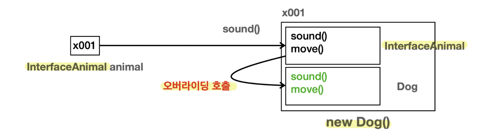

## 다형성 활용

### 예제1

`Cat.java`
```java
public class Cat {  
    public void sound(){  
        System.out.println("냐옹");  
    }  
}
```
`Caw.java`
```java
public class Caw {  
    public void sound(){  
        System.out.println("음메");  
    }  
}
```
`Dog.java`
```java
public class Dog {  
    public void sound(){  
        System.out.println("멍멍");  
    }  
}
```
`AnimalSoundMain.java`
```java
public class AnimalSoundMain {  
    public static void main(String[] args) {  
        Dog dog = new Dog();  
        Cat cat = new Cat();  
        Caw caw = new Caw();  
  
        System.out.println("동물 소리 테스트 시작");  
        dog.sound();  
        System.out.println("동물 소리 테스트 종료");  
  
        System.out.println("동물 소리 테스트 시작");  
        cat.sound();  
        System.out.println("동물 소리 테스트 종료");  
  
//        System.out.println("동물 소리 테스트 시작");  
//        caw.sound();  
//        System.out.println("동물 소리 테스트 종료");  
        soundCaw(caw);  
    }  
  
    private static void soundCaw(Caw caw) {  
        System.out.println("동물 소리 테스트 시작");  
        caw.sound();  
        System.out.println("동물 소리 테스트 종료");  
    }  
}
```

- 타입은 다르지만 중복되는 부분이 생긴다.
- 중복적으로 적용되는 코드의 중복을 제거하고자 `soundCaw`메서드를 만들었지만 타입이 다 달라 적요이 불가하다.
- for문 역시 타입이 달라 적용이 불가하다.
**⇒ 타입이 달라 중복코드를 제거하기 힘들다는 것은 `Dog`, `Cat`, `Caw`를 모두 같은 타입으로 만든다면 중복 코드 제거가 가능하다는 말이다.**


### 예제2

`Animal`이라는 부모 클래스를 만들고 `sound()`메서드를 정의한다.
`Dog`, `Cat`, `Caw`는 `Animal` 클래스를 상속받았다. 그리고 각각 부모의 `sound()` 메서드를 오버라이딩 한다.

`Animal.java`
```java
public class Animal {    
    public void sound(){  
        System.out.println("동물 울음 소리");  
    }  
}
```
`Dog.java`
```java
public class Dog extends Animal {  
    @Override  
    public void sound(){  
        System.out.println("멍멍");  
    }  
}
```
`Cat.java`
```java
public class Cat extends Animal {  
    @Override  
    public void sound(){  
        System.out.println("야용");  
    }  
}
```
`Caw.java`
```java
public class Caw extends Animal {  
    @Override  
    public void sound(){  
        System.out.println("음메");  
    }  
}
```
`AnimalPolyMain1.java`
```java
public class AnimalPolyMain1 {  
    public static void main(String[] args) {  
        Dog dog = new Dog();  
        Caw caw = new Caw();  
        Cat cat = new Cat();  
  
        soundAnimal(dog);  
        soundAnimal(cat);  
        soundAnimal(caw);  
    }  
  // 동물이 추가 되어도 변하지 않는 코드
    private static void soundAnimal(Animal animal) {  
        System.out.println("동물 소리 테스트 시작");  
        animal.sound();  
        System.out.println("동물 소리 테스트 종료");  
    }  
}
```
`[실행결과]`
```
동물 소리 테스트 시작
멍멍
동물 소리 테스트 종료
동물 소리 테스트 시작
야용
동물 소리 테스트 종료
동물 소리 테스트 시작
음메
동물 소리 테스트 종료
```

#### 코드 분석

- `soundAnimal(dog)`를 호출하면 `soundAnimal(Animal animal)`에 `Dog` 인스턴스가 전달된다.
	- `Animal animal = dog`로 부모는 자식을 담을 수 있다. 
- 메서드 안에서 `animal.sound()` 메서드가 호출된다.
	
- 변수 `animal`은 `Animal`타입이므로 `Dog` 인스턴스에 있는 `Animal`클래스 부분을 찾아서 `sound()` 메서드를 실행한다. 그런데 하위 클래스인 `Dog`에서 `sound()`메서드 오버라이딩 하였으므로 오버라이딩한 메서드가 우선권을 가진다.
- `Dog` 클래스에 있는 `sound()` 메서드가 호출된다.
- `다형적 참조` 덕분에 `animal` 변수는 자식인 `Dog`, `Cat`, `Caw`의 인스턴스를 참조할 수 있다.
- `메서드 오버라이딩` 덕분에 `animal.sound()`를 호출해도 `Dog.sound()`, `Cat.sound()`, `Caw.sound()`와 같이 각 인스턴스의 메서드를 호출할 수 있다.
- 새로운 동물을 추가해도 `Animal`을 상속받으면 `soundAnimal()`메서드를 재사용할 수 있다.


### 남아있는 문제

1. `Animal` 클래스를 생성할 수 있는 문제
	- `Animal`은 `Dog`, `Cat`, `Caw` 등을 하나의 타입으로 만들어주기 위한 클래스일 뿐 인스턴스를 생성해서 사용할 일은 없다.
2. `Animal` 클래스를 상속 받는 곳에서 `sound()` 메서드를 오버라이딩 하지 않을 가능성
	- 새로운 동물 클래스를 생성하여 `Animal`을 상속받았지만, `sound()` 메서드를 오버라이딩하는 것을 빠트렸다. 이러한 경우 기대와 다르게  `Animal.sound()`가 호출될 것이다.
**⇒ 추상 클래스와 추상 메서드를 활용하여 해결**

<br>

---
## 추상 클래스 ・ 추상 메서드

### 추상 클래스

> 추상 클래스는 이름 그대로 추상적인 개념을 제공하는 클래스이다. 따라서 실체인 인스턴스가 존재하지 않고 상속을 목적으로 사용되고, 부모 클래스 역할을 담당한다.

```java
abstract class AbstractAnimal {...}
```
- 추상 클래스는 클래스를 선언할 때 앞에 추상이라는 의미의 `abstract` 키워드를 붙여주면 된다.
- 추상 클래스는 기존 클래스와 같지만, `new AbstractAnimal()`와 같이 직접 인스턴스를 생성하지 못하는 제약이 추가된 것이다.

### 추상 메서드

> 추상 메서드는 이름 그대로 추상적인 개념을 제공하는 메서드이다. 실체가 존재하지 않고, 메서드 바디가 없다. 따라서 추상 클래스가 아닌 클래스에서 추상 메서드를 정의할 수 없다.

```java
public abstract void sound();
```
- 추상 메서드는 선언할 때 메서드 앞에 추상이라는 의미의 `abstract` 키워드를 붙여주면 된다.
- 추상 메서드가 하나라도 있는 클래스는 추상 클래스로 선언해야 한다.
	- 그렇지 않을 경우 컴파일 오류 발생
	- 추상 메서드는 메서드 바디가 없다. 따라서 추상 클래스는 작동하지 않는 메서드를 가진 불완전한 클래스로 볼 수 있다. 
- 추상 메서드는 상속 받는 자식 클래스가 반드시 오버라이딩 해서 사용해야 한다.
	- 그렇지 않을 경우 컴파일 오류 발생
	- 추상 메서드는 자식 클래스가 반드시 오버라이딩 해야 하기 때문에 메서드 바디 부분이 없다. 바디 부분을 만들면 컴파일 오류가 생긴다.
	- 만약 오버라이딩 하지 않을 경우 자식도 추상 클래스가 되어야 한다.
- 추상 메서드는 기존 메서드와 같지만, 메서드 바디가 없고, 자식 클래스가 해당 메서드를 반드시 오버라이딩 해야 한다는 제약이 추가된 것이다.


### 예제 3

`AbstractAnimal.java`
```java
public abstract class AbstractAnimal {  
    public abstract void sound();  
    public void move() {  
        System.out.println("동물이 움직입니다.");  
    }  
}
```

- `AbstractAnimal`은 `abstract`가 붙은 추상 클래스이다. 이 클래스는 직접 인스턴스를 생성할 수 없다.
- `sound()`는 `abstract`가 붙은 추상 메서드이다. 이 메서드는 자식이 반드시 오버라이딩 해야한다.
- `move()`는 추상 메서드가 아니므로 자식 클래스가 오버라이딩 하지 않아도 된다.


`Dog.java`
```java
public class Dog extends AbstractAnimal{  
    @Override  
    public void sound() {  
        System.out.println("멍멍");  
    }  
}
```
`Cat.java`
```java
public class Cat extends AbstractAnimal{  
    @Override  
    public void sound() {  
        System.out.println("야옹");  
    }  
}
```
`Caw.java`
```java
public class Caw extends AbstractAnimal{  
    @Override  
    public void sound() {  
        System.out.println("음메");  
    }  
}
```
`AbstractMain.java`
```java
public class AbstractMain {  
    public static void main(String[] args) {  
        //추상 클래스 생성불가  
//        AbstractAnimal animal = new AbstractAnimal();  
  
        Dog dog = new Dog();  
        Cat cat = new Cat();  
        Caw caw = new Caw();  
  
        cat.sound();  
        cat.move();  
  
        soundAnimal(cat);  
        soundAnimal(caw);  
        soundAnimal(dog);  
  
  
    }  
    // 동물이 추가 되어도 변하지 않는 코드
    private static void soundAnimal(AbstractAnimal animal) {  
        System.out.println("동물 소리 테스트 시작");  
        animal.sound();  
        System.out.println("동물 소리 테스트 종료");  
    }  
}
```
`[실행결과]`
```
야옹
동물이 움직입니다.
동물 소리 테스트 시작
야옹
동물 소리 테스트 종료
동물 소리 테스트 시작
음메
동물 소리 테스트 종료
동물 소리 테스트 시작
멍멍
동물 소리 테스트 종료
```


#### 코드 분석

- 추상 클래스는 생성이 불가하다. 인스턴스 생성 시 컴파일 오류가 발생한다.
```java
AbstractAnimal animal = new AbstractAnimal();
```
`[실행결과]`
```
java: poly.ex3.AbstractAnimal is abstract; cannot be instantiated
```

- 추상 메서드는 반드시 오버라이딩 해야 한다. 만약 자식에서 오버라이딩 메서드를 만들지 않으면 컴파일 오류가 발생한다.
- 이외는 모두 일반 클래스와 메서드와 동일하여 메모리 구조, 실행 결과 모두 동일하다.


> **⇒남은 문제 1, 2 해결**
> 1. 추상 클래스 덕분에 `Animal` 인스턴스를 생성할 문제 방지
> 2. 추상 메서드 덕분에 새로운 동물의 자식 클래스 생성시 실수로 `sound()`를 오버라이딩 하지 않을 문제 방지

### 순수 추상 클래스

> 모든 메서드가 추상 메서드인 추상 클래스

`AbstractAnimal.java`
```java
public abstract class AbstractAnimal {  
    public abstract void sound();  
    public abstract void move();  
}
```
`Dog.java`
```java
public class Dog extends AbstractAnimal {  
    @Override  
    public void sound() {  
        System.out.println("멍멍");  
    }  
    @Override  
    public void move() {  
        System.out.println("강아지 이동");  
    }  
}
```
`Cat.java`
```java
public class Cat extends AbstractAnimal {  
    @Override  
    public void sound() {  
        System.out.println("야옹");  
    }  
    @Override  
    public void move() {  
        System.out.println("고양이 이동");  
    }  
}
```
`Caw.java`
```java
public class Caw extends AbstractAnimal {  
    @Override  
    public void sound() {  
        System.out.println("음메");  
    }  
    @Override  
    public void move() {  
        System.out.println("소 이동");  
    }  
}
```
`AbstractMain.java`
```java
public class AbstractMain {  
    public static void main(String[] args) {  
        //추상 클래스 생성불가  
//        AbstractAnimal animal = new AbstractAnimal();  
  
        Dog dog = new Dog();  
        Cat cat = new Cat();  
        Caw caw = new Caw();  
  
        cat.sound();  
        cat.move();  
  
        soundAnimal(cat);  
        soundAnimal(caw);  
        soundAnimal(dog);  
  
        moveAnimal(dog);  
        moveAnimal(cat);  
        moveAnimal(caw);  
  
  
    }  
// 동물이 추가 되어도 변하지 않는 코드
    private static void moveAnimal(AbstractAnimal animal) {  
        System.out.println("동물 이동 테스트 시작");  
        animal.move();  
        System.out.println("동물 이동 테스트 종료");  
    }  
    private static void soundAnimal(AbstractAnimal animal) {  
        System.out.println("동물 소리 테스트 시작");  
        animal.sound();  
        System.out.println("동물 소리 테스트 종료");  
    }  
}
```
`[실행결과]`
```
야옹
고양이 이동
동물 소리 테스트 시작
야옹
동물 소리 테스트 종료
동물 소리 테스트 시작
음메
동물 소리 테스트 종료
동물 소리 테스트 시작
멍멍
동물 소리 테스트 종료
동물 이동 테스트 시작
강아지 이동
동물 이동 테스트 종료
동물 이동 테스트 시작
고양이 이동
동물 이동 테스트 종료
동물 이동 테스트 시작
소 이동
동물 이동 테스트 종료
```


- 모든 메서드가 추상 메서드인 순수 추상 클래스는 코드를 실행할 바디 부분이 전혀 없다.
- 순수 추상 클래스는 실행 로직을 전혀 가지고 있지 않다. 단지 다형성을 위한 부모 타입으로써 껍데기 역할만 제공할 뿐이다.
- 상속하는 클래스는 모든 메서드를 구현해야 한다. → 정해진 규격에 맞추어 구현해야 한다.(일반적인 인터페이스와 비슷)

> **순수 추상 클래스의 특징**
> • 인스턴스를 생성할 수 없다.
> • 상속시 자식은 모든 메서드를 오버라이딩 해야 한다.
> • 주로 다형성을 위해 사용된다.

<br>

---
## 인터페이스

> 순수 추상 클래스를 더 편리하게 사용할 수 있도록 함.

- 인터페이스는 `class`가 아니라 `interface` 키워드를 사용하면 된다.
	```java
	public interface InterfaceAnimal{
		public abstract void sound(); // public abstract 생략 가능
		public abstract void move();
	}
	```
- 인터페이스의 메서드는 모두 `public`, `abstract`이다.
- 메서드에 `public`, `abstract`를 생략할 수 있다. (생략 권장)
- 인터페이스는 다중 구현(다중 상속)을 지원한다.

### 인터페이스와 멤버변수

> 인터페이스에서 멤버 변수는 `public`, `static`, `final`이 모두 포함되어 있다고 간주된다.

```java
public interface InterfaceAnimal{
	public static final double MY_PI = 3.14;
	// public static final 생략 가능
}
```
- `public`, `static`, `final`은 생략 권장

### 예제 4


[클래스 상속 관계는 UML에서 실선을 사용하지만, 인터페이스 구현(상속) 관계는 UML에서 점선을 사용]

`InterfaceAnimal.java`
```java
public interface InterfaceAnimal {  
    void sound();//public abstract  
    void move();//public abstract  
}
```
`Dog.java`
```java
public class Dog implements InterfaceAnimal {  
  
    @Override  
    public void sound() {  
        System.out.println("멍멍");  
    }  
  
    @Override  
    public void move() {  
        System.out.println("강아지 이동");  
    }  
}
```
`Cat.java`
```java
public class Cat implements InterfaceAnimal {  
  
    @Override  
    public void sound() {  
        System.out.println("야옹");  
    }  
  
    @Override  
    public void move() {  
        System.out.println("고양이 이동");  
    }  
}
```
`Caw.java`
```java
public class Caw implements InterfaceAnimal {  
  
    @Override  
    public void sound() {  
        System.out.println("음메");  
    }  
  
    @Override  
    public void move() {  
        System.out.println("소 이동");  
    }  
}
```
`InterfaceMain.java`
```java
public class InterfaceMain {  
    public static void main(String[] args) {  
        //인터페이스 생성 불가  
//        InterfaceAnimal interfaceAnimal = new InterfaceAnimal();  
  
        Dog dog = new Dog();  
        Cat cat = new Cat();  
        Caw caw = new Caw();  
  
        soundAnimal(dog);  
        soundAnimal(cat);  
        soundAnimal(caw);    
    }  
 
    private static void soundAnimal(InterfaceAnimal animal) {  
        System.out.println("동물 소리 테스트 시작");  
        animal.sound();  
        System.out.println("동물 소리 테스트 종료");  
    }  
}
```
`[실행결과]`
```
동물 소리 테스트 시작
멍멍
동물 소리 테스트 종료
동물 소리 테스트 시작
야옹
동물 소리 테스트 종료
동물 소리 테스트 시작
음메
동물 소리 테스트 종료
```



- 클래스, 추상 클래스, 인터페이스는 프로그램 코드, 메모리 구조상 모두 똑같다.

> **상속 vs 구현**
> 부모 클래스의 기능을 자식 클래스가 상속 받을 때, 클래스는 상속 받는다고 표현하지만, 부모 인터페이스의 기능을 자식이 상속 받을 때는 인터페이스를 구현한다고 표현한다.
> 상속은 부모의 기능을 물려 받는 것이 목적이다. 하지만 인터페이스는 모든 메서드가 추상 메서드여서 물려받을 수 있는 기능이 없고, 오히려 인터페이스에 정의한 모든 메서드를 자식이 오버라이딩 해서 기능을 구현해야 한다. 따라서 구현한다고 표현한다.

### 인터페이스를 사용해야하는 이유
- 인터페이스를 만드는 이유는 인터페이스를 구현하는 곳에서 인터페이스의 메서드를 만드시 구현해라는 규약(제약)을 주는 것이다.
- 상속은 부모를 하나만 지정할 수 있다. 반면 인터페이스는 부모를 여러명 두는 다중 구현(다중 상속)이 가능하다.


### 인터페이스 - 다중 구현

> 인터페이스는 모두 추상 메서드로 이루어져 있기 때문에 다중 구현이 가능하다.

- 다중 상속을 지원하지 않는 이유
	- 다중 상속을 사용할 경우 부모 클래스에 같은 메서드가 있는 경우 어떤 부모의 메서드를 사용해야 할지 문제가 발생한다.(`다이아몬드 문제`)
	- 다중 상속을 사용하면 클래스 계층 구조가 매우 복잡해지므로 다중 상속을 지원하지 않는다.

- 인터페이스의 경우 인터페이스 자신은 구현을 가지지 않는다.
	- 인터페이스를 구현하는 곳에서 해당 기능을 모두 구현해야 한다. 따라서 다이몬드 문제가 발생하지 않는다.

### 예제 5

`InterfaceA.java`
```java
public interface InterfaceA {  
    void methodA();  
    void methodCommon();    
}
```
`InterfaceB.java`
```java
public interface InterfaceB {  
    void methodB();  
    void methodCommon();  
}
```
`Child.java`
```java
public class Child implements InterfaceA, InterfaceB{  
    @Override  
    public void methodA() {  
        System.out.println("Child.methodA");  
    }  
    @Override  
    public void methodB() {  
        System.out.println("Child.methodB");  
    }  
    @Override  
    public void methodCommon() {  
        System.out.println("Child.methodCommon");  
    }  
}
```
`DiamondMain.java`
```java
public class DiamondMain {  
    public static void main(String[] args) {  
//        InterfaceA a = new InterfaceA();  
        InterfaceA a = new Child();  
        a.methodA();  
        a.methodCommon();  
  
        InterfaceB b = new Child();  
        b.methodB();  
        b.methodCommon();  
  
        Child c = new Child();  
        c.methodA();  
        c.methodB();  
        c.methodCommon();  
    }  
}
```
`[실행결과]`
```
Child.methodA
Child.methodCommon
Child.methodB
Child.methodCommon
Child.methodA
Child.methodB
Child.methodCommon
```


#### 코드 분석


1. `a.methodCommon()`을 호출하면 먼저 `Child`인스턴스를 찾는다.
2. 변수 `a`가 `InterfaceA` 타입이므로 해당 타입에서 `methodCommon()`을 찾는다.
3. `methodCommon()`은 하위 타입인 `Child`에서 오버라이딩 되어 있다. 따라서 `Child`의 `methodCommon()`이 호출된다.


1. `b.methodCommon()`을 호출하면 먼저 `Child` 인스턴스를 찾는다.
2. 변수 `b`가 `InterfaceB` 타입이므로 해당 타입에서 `methodCommon()`을 찾는다.
3. `methodCommon()`은 하위 타입인 `Child`에서 오버라이딩 되어 있다. 따라서 `Child`의 `methodCommon()`이 호출된다.


## 클래스 상속과 인터페이스 활용


- `AbstractAnimal`은 추상 클래스 이다.
	- 동물 소리를 내기 위한 `sound()` 추상 메서드 제공
	- 동물의 이동을 표현하기 위한 `move()` 메서드 제공. 이 메서드는 추상 메서드가 아닌 상속을 목적으로 사용된다.
- `Fly`는 인터페이스이다.
	- `Bird`, `Chicken`은 날 수 있는 동물이므로 `fly()`메서드를 구현해야 한다.

`AbstractAnimal.java`
```java
public abstract class AbstractAnimal {  
    public abstract void sound();  
    public void move(){  
        System.out.println("동물이 움직인다.");  
    }  
}
```
`Fly.java`
```java
public interface Fly {  
    void fly();  
}
```
`Dog.java`
```java
public class Dog extends AbstractAnimal {   
    @Override  
    public void sound() {  
        System.out.println("멍멍");  
    }  
}
```
`Bird.java`
```java
public class Bird extends AbstractAnimal implements Fly{  
    @Override  
    public void sound() {  
        System.out.println("짹짹");  
    }  
    @Override  
    public void fly() {  
        System.out.println("새 날기");  
    }  
}
```
`Chicken.java`
```java
public class Chicken extends AbstractAnimal implements Fly{  
    @Override  
    public void sound() {  
        System.out.println("꼬끼오");  
    }  
    @Override  
    public void fly() {  
        System.out.println("닭 날기");  
    }  
}
```
`SoundFlyMain.java`
```java
public class SoundFlyMain {  
    public static void main(String[] args) {  
        Dog dog = new Dog();  
        Bird bird = new Bird();  
        Chicken chicken = new Chicken();  
  
        soundAnimal(dog);  
        soundAnimal(bird);  
        soundAnimal(chicken);  
  
        flyAnimal(bird);  
        flyAnimal(chicken);  
    }  
    //AbstractAnimal 사용 가능  
    private static void soundAnimal(AbstractAnimal animal) {  
        System.out.println("동물 소리 테스트 시작");  
        animal.sound();  
        System.out.println("동물 소리 테스트 종료");  
    }  
  
    //Fly 인터페이스가 있으면 사용 가능  
    private static void flyAnimal(Fly fly) {  
        System.out.println("날기 테스트 시작");  
        fly.fly();  
        System.out.println("날기 테스트 종료");  
    }  
}
```
`[실행결과]`
```
동물 소리 테스트 시작
멍멍
동물 소리 테스트 종료
동물 소리 테스트 시작
짹짹
동물 소리 테스트 종료
동물 소리 테스트 시작
꼬끼오
동물 소리 테스트 종료
날기 테스트 시작
새 날기
날기 테스트 종료
날기 테스트 시작
닭 날기
날기 테스트 종료
```

#### 코드 분석


